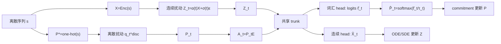

# Coupled Semantic-Lexical Flow 与 Anchored Continuous Diffusion 研究报告

## Executive Summary

这份报告把 **Coupled Semantic-Lexical Flow** 与 **Anchored Continuous Diffusion** 视为一个**尚未定名发表、但有明确文献前驱的统一研究方向**来分析，而不是把它当作既有同名方法。就当前公开文献看，和这一路线最接近的先行工作有两条：一条是 **NeoDiff**，它明确提出“统一连续与离散文本扩散”，通过 Poisson 前向过程和时间预测器让不同 token 具有不同扩散进度；另一条是 **ADLM**，它把“重要 token 作为 anchor、在前向过程中更晚被遮蔽”制度化，从而提升 masked diffusion 的建模质量和样本质量。与此同时，**ELF、LangFlow、FLM** 说明连续/流匹配路线在文本上已经不再天然落后，**MDLM、Duo、TESS** 则说明离散/词汇空间路线在词法约束、并行修正和 few-step 生成上仍然极强。citeturn19search2turn19search0turn0search12turn2search0turn0search3turn0search1turn0search2turn1search2

本报告的核心判断是：**连续与离散文本扩散之间真正需要统一的，不是“选哪一种状态空间”，而是“模型在每个时间点该对词汇做多强的离散承诺”**。ELF 把承诺几乎全部推迟到最后一步，因而保住了连续轨迹的自由度，并自然继承了 classifier-free guidance、SDE 式采样等连续生成技术；但 CoDAR 又指出，连续 DLM 长期落后的一个关键瓶颈恰恰在于**最后的 rounding / token projection**。这意味着“只在最后一步落到 token space”是一个非常强、但未必最优的设计点。citeturn7view0turn17view0turn11view0turn2search3

因此，一个更有研究价值的统一方案是定义耦合状态  
\[
y_t=(P_t,Z_t),
\]
其中 \(P_t\) 是词汇 simplex 上的分布状态，\(Z_t\) 是连续语义嵌入状态；再用一个 anchor embedding 矩阵 \(E\) 把两者联接起来，令 \(A_t=P_tE\) 成为“词汇 belief 的期望语义位置”。这样一来，**ELF 是“\(\,P_t\) 只在最后一步更新”的特例，MDLM/Duo 是“\(\,Z_t\) 被去掉”的特例，TESS/FLM/LangFlow 是“\(\,P_t\) 在全程被强监督”的特例，LD4LG/TEncDM/CoDAR 则是“\(\,Z_t\) 为主、\(P_t\) 主要在 decoder 中出现”的特例**。这种统一方式既承接了 Flow Matching / stochastic interpolants 的连续时间框架，也把 discrete diffusion 的 lexical validity 和 adaptive revision 机制纳入同一视角。citeturn5search0turn5search3turn16view0turn0search1turn0search2turn1search2turn0search3turn2search0turn1search3turn2search4turn2search3

从实验优先级上看，最应该先做的不是立刻与所有 SOTA 大规模模型正面对比，而是验证一个更基础的命题：**final-only discretization 与 per-step discretization 都不是最优点，中间存在更好的 annealed / adaptive lexical commitment schedule**。如果这一点在 100M 量级模型上就能在 **OpenWebText 的 Gen.PPL–Entropy 前沿**、**WMT14/XSum 的任务指标**、以及 **alignment error / entropy-vs-time** 的可解释性诊断中被稳定观察到，那么这条研究路线就成立；再往上扩到 500M 和 2B，才是性价比最高的第二阶段。ELF 在 105M 规模、45.2B 有效训练 token 的配置下已经给出了一个很强的低成本连续基线，而且其附录公开了相当完整的超参数、训练设备和消融细节，这对搭建统一框架非常有利。citeturn10view0turn10view1turn6view1turn0search4

你上传的 ELF 论文正文和附录也是本报告的重要一手材料之一。fileciteturn0file0

## 问题动机与相关工作

扩散语言模型之所以一直吸引人，原因并不复杂：它们天然支持**并行生成**和**双向上下文**，在推理延迟、局部重写和可控生成上有区别于自回归模型的优势；最近两份综述也都把 DLM 的研究重心概括为训练策略、few-step 采样、控制/对齐，以及向多模态和大模型扩展。与此同时，文献又反复显示一个事实：**离散 DLM 在很长一段时间里比连续 DLM 更稳、更强**，直到 2025–2026 年的连续路线方法才开始系统性追上来。citeturn14search0turn14search1turn0search12turn2search0turn0search3

这种张力可以用一个更清晰的设计轴来描述：**状态空间**、**离散承诺时机**、**是否需要单独 decoder**、以及 **guidance/control 在哪条支路上发生**。ELF 在附录中实际上已经把连续/flow-based 文本模型按这些维度做过一次系统分解：embedding-space、simplex、latent、flow-based 四类方法，差别主要就在于中间状态是否需要频繁投回 token-aligned 表示，以及是否需要单独的 latent-to-text decoder。citeturn16view0

| 路线 | 代表方法 | 核心状态 | 词汇承诺策略 | 单独 decoder | guidance / control 特征 | 对统一框架的启示 |
|---|---|---|---|---|---|---|
| 连续 embedding diffusion | Diffusion-LM、CDCD | token embedding / continuous categorical embedding | 多数带有中间 token 对齐、rounding 或 CE 监督 | 通常不需要 | Diffusion-LM 强调连续 latent 便于梯度控制；CDCD 强调时间和输入都连续 | 语义轨迹平滑，但词汇投影常成瓶颈 |
| Masked discrete diffusion | MDLM | token / absorbing mask state | 全程离散，逐步 unmask | 不需要 | 训练目标可化为 masked-LM 风格的混合损失 | 词汇合法性强，易做 revision |
| Uniform-state discrete diffusion | Duo | categorical / uniform state | 全程离散，多轮修正 | 不需要 | 从 Gaussian diffusion 借来 curriculum 与 consistency distillation | 离散状态也能借连续扩散技巧 |
| Simplex diffusion | SSD-LM、TESS、TESS 2 | logit simplex | 全程对词汇分布显式建模 | 不需要 | SSD-LM 可结合外部 classifier guidance；TESS 系列强调 self-conditioning 与 instruction / reward guidance | 显式词汇 belief 很适合 controllability |
| Latent diffusion | LD4LG、PLANNER、TEncDM、CoDAR | 预训练 encoder latent / contextual encoding | 通常不在每步投回 token，但最终需强 decoder | 往往需要 | CoDAR 把 rounding 变成上下文化 AR decoding；PLANNER 做 paragraph-level latent control | 说明“最终离散化”本身就是可单独优化的子问题 |
| Flow over lexical geometry | FLM / FMLM、Categorical Flow Maps、Discrete Flow Maps | one-hot / simplex / categorical flow map | 训练中常保留较强 lexical 监督；可蒸馏到 one-step/few-step | 通常不需要 | Categorical Flow Maps 明确强调现成 guidance/reweighting 技术可复用 | 几何一致的 flow 能桥接 few-step 与 controllability |
| 连续 embedding flow | LangFlow | embedding + Bregman flow | 持续 lexical 监督，但不一定做推理解离散 | 不需要 | 强调 ODE NLL bound 与可学习 scheduler | 连续 flow 也能做更“原则化”的 likelihood 与 scheduling |
| 最终离散化的连续 flow | ELF | frozen contextual embedding | 几乎只在最后一步 decoder 模式离散化 | 不需要 | CFG、self-conditioning、ODE/SDE 直接继承自连续生成 | 给出了 final-only discretization 的强基线 |
| 统一/锚定先行工作 | NeoDiff、ADLM | NeoDiff：连续+离散统一时间；ADLM：离散 anchor token | NeoDiff 按 token 语义自适应扩散进度；ADLM 让 anchor token 更晚被遮蔽 | NeoDiff 未强调单独 decoder；ADLM 不需要 | 都把“词汇重要性/时机”提升为一等公民 | 直接支持 lexical commitment schedule 的研究方向 |

表中属性综合自原论文、官方实现与 ELF 附录中的分类表。citeturn16view0turn1search4turn1search1turn0search1turn0search2turn12search5turn1search2turn12search7turn1search3turn12search2turn2search4turn2search3turn0search3turn2search1turn2search2turn2search0turn0search12turn19search2turn19search0

如果把这个表压缩成一句话，可以得到一个很有用的研究结论：**现有方法的差异，大多不是“连续 or 离散”的二元对立，而是“是否把词汇层面的承诺施加得过早、过晚，还是能随时间和置信度渐进地发生”**。ELF 把承诺推到最后，获得了最流畅的连续轨迹和最自然的 CFG；但 CoDAR 说明最后一步 rounding 会成为主要瓶颈。TESS、FLM、LangFlow 反过来把词汇监督加在中间过程上，获得更强的 lexical pull，却把轨迹更紧地绑在 vocabulary geometry 上。NeoDiff 和 ADLM 则进一步说明：**“什么时候让重要 token 更早稳定下来”本身就是可以设计、可以学习的对象**。citeturn0search12turn2search3turn1search2turn0search3turn2search0turn19search2turn19search0

还有一个和本报告直接相关的旁证是 guidance。原始的 **Classifier-Free Guidance** 是为连续 score / velocity 场设计的；**Analog Bits** 证明连续状态 + self-conditioning 也能很好地服务离散数据；**SED** 进一步在文本上报告了 CFG 的收益；ELF 则明确指出，连续 formulation 让 CFG 几乎可以原样搬进文本，而离散/categorical 设定直到 2026 年才在 Categorical Flow Maps 这类工作中开始系统地吸收这些工具。对耦合状态模型来说，这意味着最佳路线大概率不是“只在连续分支做 guidance”或“只在离散分支做 guidance”，而是让两条支路共同响应 guidance。citeturn4search0turn4search1turn15search10turn7view0turn2search1

## 数学形式化

下面给出一个**基于现有文献抽象出来的统一形式化提案**。它的目标不是替代已有论文中的严密理论，而是给出一个足够清晰的“设计坐标系”，让你能把 ELF、MDLM、Duo、FLM、LangFlow、TESS、LD4LG、CoDAR、NeoDiff 等方法映射到同一个框架里。这个形式化同时继承了 **Flow Matching / rectified flow / stochastic interpolants** 的连续时间视角，以及离散 diffusion 对 categorical geometry 的建模直觉。citeturn5search0turn5search1turn5search3turn12search0turn2search1

设词表大小为 \(|V|\)，序列长度为 \(L\)，嵌入维度为 \(d\)。给定离散序列 \(s=(s_1,\dots,s_L)\)，定义每个位置的干净词汇状态与语义状态为  
\[
P^\star_j = \mathrm{onehot}(s_j)\in \Delta^{|V|-1},\qquad
X = \mathrm{Enc}(s)\in \mathbb{R}^{L\times d}.
\]
再引入 anchor embedding 矩阵  
\[
E\in \mathbb{R}^{|V|\times d},
\]
其最简单的实现是冻结的 token embedding / unembedding 表，更强的实现是“冻结 embedding + 小型 adapter”或“contextual encoder 输出的 anchor 化投影”。统一状态定义为  
\[
Y_t=(P_t,Z_t),
\]
其中每个位置的 \(P_{t,j}\in \Delta^{|V|-1}\)，而 \(Z_t\in \mathbb{R}^{L\times d}\)。同时定义 anchor 诱导的语义位置  
\[
A_t = P_tE \in \mathbb{R}^{L\times d},
\]
以及残差  
\[
R_t = Z_t - A_t.
\]
这里 \(A_t\) 可以理解为“当前词汇 belief 的期望语义位置”，而 \(R_t\) 则是“当前连续表示中、尚未被词汇 belief 解释掉的语义剩余量”。这一分解恰好呼应了 ELF 的 continuous denoising、TESS/SSD-LM 的 simplex belief、和 latent diffusion 中 decoder bottleneck 的问题意识。citeturn0search12turn1search2turn12search5turn1search3turn2search3

连续分支可以用 ELF 所采用的 rectified-flow 风格前向路径：  
\[
Z_t = \alpha(t)X + \sigma(t)\epsilon,\qquad \epsilon\sim \mathcal N(0,I),
\]
最直接的选择是  
\[
\alpha(t)=t,\qquad \sigma(t)=1-t,
\]
于是  
\[
Z_t=tX+(1-t)\epsilon.
\]
如果要与 LangFlow 或更一般的 stochastic interpolant 保持兼容，也可以把 \((\alpha,\sigma)\) 视为更一般的可学习或任务相关调度。离散分支则可有三种候选前向扰动：其一是 **uniform corruption**，令  
\[
P_t^{\text{disc}}=(1-\beta(t))P^\star+\beta(t)U;
\]
其二是 **absorbing-state / mask corruption**，把一部分概率质量推向 [MASK]；其三是 **simplex/logit noise**，在 logits 或 simplex 上做连续扰动。三者分别对应 Duo、MDLM、TESS / Categorical Flow Maps 一类的经典做法。citeturn0search2turn0search1turn1search2turn2search1



给定当前状态 \((P_t,Z_t)\)，共享主干网络输出两类预测：  
\[
(\hat X_t,\hat\ell_t)=f_\theta(Z_t,A_t,\phi(P_t),t,c,m),
\]
其中 \(c\) 是条件信息，\(m\) 是 denoise/decode 或其它模式 token，\(\phi(P_t)\) 是对词汇分布的特征化表示，例如 top-k logits、entropy、或低秩投影。然后定义  
\[
\hat P_t = \mathrm{softmax}\!\left(\frac{\hat\ell_t}{\tau_t}\right).
\]
连续分支沿 x-prediction 走，与 ELF 一致地写成  
\[
v_t=\frac{\hat X_t-Z_t}{1-t},
\qquad
Z_{t+\Delta}=Z_t+\Delta v_t
\]
作为 ODE 更新；若走 SDE/few-step 版本，则可采用 ELF 的 re-injection 近似：先把 \(Z_t\) 按 \(\gamma\Delta\) 注回噪声区，再用 denoiser 给出新的更新方向。citeturn0search12turn11view0turn11view2

离散分支不必一开始就“硬 commit”，更合理的是定义一个**词汇承诺系数**  
\[
\eta_t\in[0,1],
\]
使  
\[
P_{t+\Delta}=(1-\eta_t)P_t+\eta_t\hat P_t.
\]
再令  
\[
\lambda_t = 1-\eta_t,
\]
就得到了一个很直观的解释：\(\lambda_t\) 越大，训练和采样越偏向 continuous branch；\(\lambda_t\) 越小，模型越倾向于把当前连续语义压到显式词汇 belief 上。这一写法能把主要方法都视为特例：ELF 近似对应 \( \eta_t=0 \) 直到最后一步；MDLM/Duo 对应根本不维护 \(Z_t\)；TESS、FLM、LangFlow 对应较大的全程 lexical pull；CoDAR 对应 \(P_t\) 主要在最终 decoder 中显化。citeturn0search12turn0search1turn0search2turn1search2turn0search3turn2search0turn2search3

推荐的损失函数可以写成  
\[
\mathcal L
=
\lambda_t \mathcal L_{\text{cont}}
+
(1-\lambda_t)\mathcal L_{\text{disc}}
+
\beta_t \mathcal L_{\text{align}}.
\]
其中
\[
\mathcal L_{\text{cont}}=\mathbb E_t\|\hat X_t-X\|_F^2
\]
是 x-prediction 风格的连续重建损失；  
\[
\mathcal L_{\text{disc}}
=
\mathbb E_t\left[-\sum_{j=1}^{L}\log \hat P_{t,j}(s_j)\right]
\]
是 token-level cross-entropy；而  
\[
\mathcal L_{\text{align}}
=
\|\mathrm{sg}(\hat X_t)-\hat P_tE\|_F^2
+
\alpha\,
\mathrm{KL}\!\left(\hat P_t \,\middle\|\, \mathrm{softmax}\!\left(\frac{W\hat X_t}{\tau_{\text{align}}}\right)\right)
\]
则是连续-离散一致性项。这里用 stop-gradient 约束 \(\hat X_t\) 的好处，是避免词汇头过早“牵着”连续头走，导致轨迹退化为一种被 vocabulary 简化过头的路径；这一点与 ELF 避免中间离散监督、以及 CoDAR 把 rounding 当作独立难点的经验是一致的。citeturn0search12turn2search3

最关键的可设计对象，就是 \(\lambda_t\) 与 \(\tau_t\) 的时间调度：

| 调度类型 | \(\lambda_t\) | \(\eta_t=1-\lambda_t\) | \(\tau_t\) | 解释 |
|---|---:|---:|---:|---|
| final-only | \(1\) for \(t<1\)，decode 分支单独采样 | \(0\) | 直到终点才使用 | 近似 ELF |
| per-step constant | \(\bar\lambda\) | \(1-\bar\lambda\) | 常数 | 近似全程 lexical pull |
| annealed linear | \(1-t\) | \(t\) | \(\tau_{\min}+(\tau_{\max}-\tau_{\min})(1-t)\) | 早期连续、后期离散 |
| late-sigmoid | \(\sigma(a(b-t))\) | \(1-\sigma(a(b-t))\) | 与 sigmoid 同步下降 | 在 \(t\approx b\) 后才快速词汇收敛 |
| adaptive confidence | \(\frac{H(\hat P_t)}{\log |V|}\) | \(1-\frac{H(\hat P_t)}{\log |V|}\) | \(\tau_{\min}+(\tau_{\max}-\tau_{\min})\frac{H(\hat P_t)}{\log |V|}\) | 由模型自身不确定度决定何时 commit |
| token-wise adaptive | \(\lambda_{t,j}=\frac{H(\hat P_{t,j})}{\log|V|}\) | 逐 token 更新 | 逐 token 温度 | 最接近 NeoDiff / ADLM 的“语义敏感时机” |

这些调度不是凭空想象出来的：**final-only** 的强基线来自 ELF；**全程 lexical pull / per-step supervision** 在 TESS、FLM、LangFlow 等方法中已经被证明可行；而 **token-importance / token-specific time** 则与 ADLM 保留 anchor token、NeoDiff 做 token 语义相关时间调制的思想高度一致。citeturn0search12turn1search2turn0search3turn2search0turn19search0turn19search2

## 架构、训练与采样

从现有结果出发，**最稳妥的默认架构**不是“从零发明一整套新主干”，而是把 ELF 已经验证有效的连续 Flow-Matching 基座向耦合状态扩展。ELF 的附录显示：它使用标准 Diffusion Transformer 主干，并接入 SwiGLU、RMSNorm、RoPE、qk-norm，用 in-context conditioning 替代 adaLN-Zero，从而减少参数；在训练配置上，ELF-B 采用冻结 T5-small encoder、embedding 维度 512、bottleneck 128、模型维度 768、Muon 优化器、学习率 0.002、global batch 512、训练 5 个 epoch，并且在 OWT 上公开了 64×TPU v5p、每 epoch 约 1.5 小时的训练设置。更重要的是，ELF 的消融表明：**预训练 contextual embeddings 优于 scratch / non-contextual embedding；shared-weight denoiser-decoder 不输 separate decoder；few-step 下 SDE 优于 ODE**。这三点几乎可以直接作为耦合模型的默认先验。citeturn10view1turn10view0turn0search4turn0search0

| 组件 | 推荐默认值 | 备选项 | 推荐理由 |
|---|---|---|---|
| Anchor embedding \(E\) | 冻结的预训练 token embedding / unembedding 表 | 冻结表 + LoRA / adapter；完全可学习表 | 先保证 anchor 稳定，再讨论是否学习 |
| 语义 encoder | 冻结 pretrained contextual encoder | scratch encoder；无 encoder 直接 token embedding | ELF 与 TEncDM 都表明 contextual 表示很关键 |
| 主干 trunk | shared-weight Transformer denoiser-decoder | separate decoder；AR contextual decoder | shared trunk 成本最低，先验证 unified schedule |
| 输出头 | 双 head：\(\hat X_t\) + logits \(\hat\ell_t\) | 单 head + 投影；三 head 加 confidence | 明确分离语义恢复和词汇承诺 |
| Self-conditioning | 输入 \([Z_t,\mathrm{sg}(\hat X_{t-\Delta}), \mathrm{sg}(\hat P_{t-\Delta}E)]\) | 只用 \(\hat X\)；只用 lexical anchor | 比 ELF 多一条 lexical self-cond 支路 |
| CFG | 先做双前向 coupled CFG；成熟后改 training-time CFG | GFT / single-pass guidance | 先求可解释，后求效率 |
| Sampler | 32–64 step SDE；8–16 step few-step SDE 试探 | ODE；后续 flow-map distillation | ELF few-step 证据偏向 SDE |

表中默认值主要由 ELF 的主干/超参/消融结论与 TEncDM、CoDAR 的 decoder 经验共同支持；其中“lexical self-conditioning”与“双 head”是本报告的扩展建议。citeturn10view1turn17view0turn2search4turn2search3

在训练策略上，我建议把 **teacher-forcing** 和 **self-conditioning** 明确分成两个阶段而不是纠缠在一起。第一阶段做稳定建模：语义头用 \(\mathcal L_{\text{cont}}\) 学 clean embedding，词汇头用较弱的 \(\mathcal L_{\text{disc}}\) 和中等 \(\mathcal L_{\text{align}}\)；此时 lexical 输入侧更偏向 teacher-forced 的 anchor belief。第二阶段再逐步把输入切换到 self-conditioned 的 \(\hat P_{t-\Delta}E\) 与 \(\hat X_{t-\Delta}\)，并把 \((1-\lambda_t)\) 的晚期权重拉高，让模型适应“自己的中间预测会反馈到自身”的采样分布。这种做法既沿用了 ELF 的 self-conditioning 传统，也在工程上借鉴了 CoDAR 对 rounding 难点的重视。citeturn17view0turn2search3

在 guidance 上，最直接的 coupled CFG 实现是对两条输出同时做 guidance：  
\[
\hat X_t^{\text{cfg}}
=
\hat X_t^{\emptyset}
+
\omega_t(\hat X_t^{c}-\hat X_t^{\emptyset}),
\qquad
\hat \ell_t^{\text{cfg}}
=
\hat \ell_t^{\emptyset}
+
\omega_t(\hat \ell_t^{c}-\hat \ell_t^{\emptyset}),
\]
再令  
\[
\hat P_t^{\text{cfg}}=\mathrm{softmax}\!\left(\hat \ell_t^{\text{cfg}}/\tau_t\right).
\]
如果双前向开销太大，则可以像 ELF 那样把 guidance scale 编成 control token，直接学习 post-combination quantity；更进一步，也可以借视觉生成中的 training-time CFG / GFT 思路，把单步 guidance 做成训练阶段的参数化问题。对于条件生成任务，则可以沿用 ELF 的条件前缀策略：把 source / prompt 的 clean embeddings 放在 control tokens 后方，训练时不加噪，并做小比例的 condition dropout 来构造 conditional/unconditional 配对。citeturn4search0turn17view0turn4search10turn4search6

采样方面，建议把**连续分支**和**词汇承诺分支**解耦处理。连续分支默认走 ODE/SDE；few-step 情况下优先复现 ELF 的 re-injection SDE，因为它在 8/16/32 step 区间明显优于 ODE。词汇分支则不需要额外随机化，只需要让 \(\eta_t\) 和 \(\tau_t\) 随置信度自适应变化。一个非常实用的实现是对每个 token 计算  
\[
c_{t,j}=1-\frac{H(\hat P_{t,j})}{\log |V|},
\]
然后令  
\[
\eta_{t,j}=\eta_{\min}+(\eta_{\max}-\eta_{\min})c_{t,j}^{\rho},
\qquad
\tau_{t,j}=\tau_{\max}-(\tau_{\max}-\tau_{\min})c_{t,j}^{\rho}.
\]
这样，高置信 token 会更早“钉住”，低置信 token 保持更长的连续探索期；这与 ADLM 的“重要 token 更晚被遮蔽”、NeoDiff 的“语义相关时间进度”、以及 InfoDiffusion 的“信息量感知 schedule”在精神上是同一类设计。citeturn11view0turn11view2turn19search0turn19search2turn15search3

就可复现性而言，当前公开生态对这个方向是友好的，但透明度并不完全均匀。ELF、MDLM、Duo、FLM、LangFlow、TESS、LD4LG、TEncDM、ADLM、NeoDiff 都能找到官方项目页或官方代码；不过从本次检索到的公开摘要 / README 片段看，**真正像 ELF 一样把 optimizer、batch、训练设备、time schedule、CFG 范围公开得非常完整的工作并不多**。因此，凡是我无法从原论文摘要、附录片段或官方仓库片段直接确认的训练项，下表一律记为“未指定”。citeturn0search4turn0search17turn0search14turn0search11turn2search10turn1search10turn3search0turn3search1turn19search3turn19search9

| 方法 | 官方实现 | optimizer | batch / device | 备注 |
|---|---|---|---|---|
| ELF | 有 | Muon | global batch 512；TPU v5p × 64 | 公开最完整 |
| MDLM | 有 | 未指定 | 未指定 | 公开 repo，摘要未见完整训练表 |
| Duo | 有 | 未指定 | 未指定 | 公开 repo / 项目页 |
| FLM / FMLM | 有 | 未指定 | 未指定 | 公开 repo |
| LangFlow | 有 | 未指定 | 未指定 | 公开 repo |
| TESS | 有 | 未指定 | 未指定 | 公开 repo |
| LD4LG | 有 | 未指定 | 未指定 | 公开 repo |
| TEncDM | 有 | 未指定 | 未指定 | 公开 repo |
| CoDAR | 本次检索中未见官方代码声明 | 未指定 | 未指定 | 以论文为准 |
| ADLM | 有 | 未指定 | 未指定 | 公开 repo |
| NeoDiff | 有 | 未指定 | 未指定 | 公开 repo |

## 评估、消融与资源预算

评估上，建议把 **OpenWebText / LM1B** 作为无条件生成主战场，把 **WMT14 De-En** 与 **XSum** 作为条件生成主战场。这样做有三个好处。第一，ELF、MDLM、Duo、FLM、LangFlow 在 OWT 或 LM1B 上已经形成一条相对可比的无条件生成谱系；第二，ELF 在 WMT14 与 XSum 上已经给出可复现的 seq2seq 扩散基线；第三，LangFlow 还额外提出了 **ODE-based NLL bound**，这为你的统一模型提供了一个比单纯 Gen.PPL 更“原则化”的 likelihood 评估方向。对于 Gen.PPL，本领域的惯例仍然是像 ELF 那样：用外部 GPT-2 Large 评估 1,000 个生成样本，并配上 unigram entropy 作为多样性指标。citeturn0search12turn0search1turn0search2turn0search3turn2search0turn10view0

除了用户已经点名的 **Gen.PPL、BLEU、ROUGE、perplexity、entropy、diversity、human evaluation**，你的统一模型还应该额外报告三类“耦合专属指标”。第一类是 **alignment metrics**：如 \(\|Z_t-P_tE\|_F^2\) 的时间曲线、\(KL(\hat P_t \parallel softmax(W\hat X_t/\tau_a))\) 的平均值。第二类是 **commitment metrics**：如 \(P_t\) 的 token-level entropy、top-1 confidence 的时间演化，以及“冻结率 / committed token proportion”。第三类是 **calibration metrics**：特别是如果要做 adaptive commitment，就应该测 ECE、Brier score 或 confidence–correctness 曲线，因为不校准的 confidence 会直接把 schedule 学坏。LangFlow 的 ODE NLL、ELF 的 entropy frontier、InfoDiffusion 的 entropy-aware 视角，以及 ADLM / NeoDiff 对 token-specific timing 的强调，都支持把这些指标纳入主指标集。citeturn2search0turn0search12turn15search3turn19search0turn19search2

| 消融主题 | 设定 | 主要指标 | 成功判据 | 预期影响 |
|---|---|---|---|---|
| Discretization schedules | final-only / per-step / annealed-linear / annealed-exp / adaptive-confidence | 32-step 与 16-step 的 Gen.PPL、entropy、alignment error、BLEU/ROUGE | 在 matched entropy band \(H\in[5.1,5.3]\) 上，annealed 或 adaptive 相比 final-only **至少改善 5% Gen.PPL**，且 entropy 下降不超过 0.05 | 这是最关键的命题验证 |
| Encoder | pretrained frozen / scratch encoder / token embedding only | 收敛步数、Gen.PPL、BLEU/ROUGE、alignment error | pretrained frozen 若无法明显优于 scratch，说明 anchor+coupling 已足够强；若明显优于，则保持 frozen encoder 默认 | 验证 contextual prior 是否仍是决定性因素 |
| Shared vs separate decoder | shared trunk+dual head / separate lexical decoder / AR contextual decoder | Gen.PPL、条件任务指标、额外训练成本、推理延迟 | 若 shared 方案在质量上落后不超过 1.0 Gen.PPL 或 0.5 BLEU / 0.3 ROUGE-L，则优先保留简单管线 | 判断是否需要走 CoDAR 式复杂 decoder |
| Sampler | ODE / SDE / few-step SDE | 8/16/32/64-step 的质量-效率曲线 | few-step 下 SDE 若能在相同步数上带来 **>10% 质量改善** 或在同质量下减少一半步数，则固定为默认 | 直接决定统一框架的实际速度 |
| CFG | off / 2-pass coupled CFG / training-time single-pass CFG | Gen.PPL–Entropy 前沿、BLEU/ROUGE、人评 controllability | coupled CFG 若不能把 Pareto 前沿向右下外推，则不值得增加复杂度 | 验证 guidance 是否必须双支路耦合 |
| Consistency loss sweep | \(\beta\in\{0,0.01,0.05,0.1,0.2,0.5\}\) | alignment error、collapse rate、Gen.PPL、entropy | 中等 \(\beta\) 若能把 alignment error 压低 **20% 以上** 且质量几乎不降，则说明耦合有效 | 判断两条支路是否真正互相约束 |

上表的成功判据是**本报告建议的实验门槛**，不是现有论文已经报告的结果。它们之所以这样设定，是因为 ELF 已经为 100M 量级模型给出了相对稳定、低成本的强基线，而 CoDAR、NeoDiff、ADLM 又都暗示“最终离散化时机”和“anchor 机制”确实是有可观收益空间的。citeturn10view0turn2search3turn19search2turn19search0

资源预算方面，我建议明确三档规模：**100M 用于验证 schedule；500M 用于验证是否稳定扩展；2B 用于判断是否值得进入大模型阶段**。下面的 GPU-hours 是 **H100-80GB 等效小时的粗略估算**，做法是把 ELF 的 105M / 45.2B token / TPU v5p×64 的经验作为锚点，再结合 dense transformer 常见的 \(6NT\) 训练 FLOPs 近似和 3–8 倍实现/通信修正系数做区间推算；因此它们更适合作为项目管理预算，而不适合作为论文中的严格算力声明。citeturn10view0turn10view1

| 优先级 | 阶段目标 | 模型规模 | 建议训练 tokens | 设备建议 | H100 等效 GPU-hours 估算 | 是否值得继续放大 |
|---|---|---:|---:|---|---:|---|
| 高 | 证明 annealed / adaptive 优于两端极值 | 100M | 40B–60B | 8–16×H100 / A100 | 200–600 | 若 schedule 无明显收益，则先停 |
| 中 | 检查统一框架在中尺度是否稳定、是否仍保 diversity | 500M | 80B–120B | 32×H100 | 3k–7k | 只有在 100M 阶段达标后再做 |
| 中低 | 检查 scale-up、few-step、instruction / long-context 潜力 | 2B | 150B–250B | 64–128×H100 | 25k–55k | 需要已有清晰正面信号 |
| 高 | 条件生成与 coupled CFG 验证 | 基于 100M checkpoint 微调 | WMT14 全量 + XSum 全量 | 8×H100 | 30–120 | 相比再训无条件大模型更便宜、反馈更快 |

人评设计方面，建议不要只做最终文本偏好投票，而是拆成四个维度：**流畅度、语义充分性、忠实性/可控性、以及非重复性**。无条件生成可以做 200 条样本的盲评，三名标注员，5 分量表；条件生成则更适合 pairwise A/B test，让标注员在“更忠实”“更好读”“信息更完整”“更像人写”四个问题上单独投票。成功判据可以设为：与 final-only 基线相比，**pairwise win-rate 超过 55% 且 95% 置信区间不穿过 50%**。这类人评对你的 unified idea 尤其重要，因为一些词汇承诺策略可能会在自动指标相近时呈现截然不同的“写作感”。相关自动指标的设定则可继续锚定 ELF、WMT14 和 XSum 的公开 protocol。citeturn10view0turn0search12

## 预期结果、可解释性、风险与下一步实验

从已有文献推断，**最可能出现的结果排序**不是“连续一定赢”或“离散一定赢”，而是：在小到中等规模上，**adaptive commitment ≈ late-sigmoid > annealed-linear > final-only ≈ per-step**。理由很直接：ELF 已经证明 final-only 是强基线，但 CoDAR 也指出 final rounding 是持续瓶颈；相反，TESS、FLM、LangFlow 说明中间 lexical supervision 确实能拉住生成质量，却容易把语义轨迹绑定得过早。ADLM 和 NeoDiff 则说明“重要 token 更早稳定、不同 token 不同节奏”本身就是有效信号。因此，如果你的 coupled 模型在 100M 量级上看不到 adaptive / annealed 的优势，通常意味着不是理论方向错了，而是 **confidence calibration、anchor 选择、或 alignment loss 的实现**出了问题。citeturn0search12turn2search3turn1search2turn0search3turn2search0turn19search0turn19search2

下面这张“预期结果表”不是实验事实，而是用于指导解读实验的**诊断模板**：

| 路线 | Gen.PPL | Entropy | Alignment error | 条件可控性 | 预期结论 |
|---|---|---|---|---|---|
| final-only | 低 | 中高 | 中 | 强 | 连续轨迹最自由，但 rounding 风险保留 |
| per-step | 中 | 中 | 低 | 中高 | 词汇更稳，但可能过早收缩 |
| annealed-linear | 更低 | 中高 | 低中 | 强 | 最可能先于 final-only 获益 |
| late-sigmoid | 更低 | 中 | 低 | 强 | 更适合 few-step 和最后阶段 sharpen |
| adaptive-confidence | 最低或接近最低 | 最高或接近最高 | 最低 | 最强 | 最有机会形成 Pareto 最优前沿 |

可解释性分析最好不要停留在“看一眼样例”。对于这个方向，真正有价值的图表至少有下列几类：

| 可视化 | 横轴 / 纵轴 | 目标问题 | 预期现象 |
|---|---|---|---|
| embedding trajectory 图 | 时间 \(t\) 下的 \(Z_t\)、\(A_t=P_tE\) 在 PCA/UMAP 空间中的轨迹 | 语义流与词汇 anchor 是否耦合 | adaptive/annealed 轨迹应比 per-step 更平滑、比 final-only 更早靠近 anchor manifold |
| entropy-vs-time 曲线 | \(t\) / 平均 token entropy | 词汇承诺发生得太早还是太晚 | per-step 曲线过早下坠；final-only 接近水平线；adaptive 在中后段陡降 |
| alignment error-vs-time | \(t\) / \(\|Z_t-P_tE\|_F^2\) | 连续头与词汇头是否说同一种“语言” | 成功模型应在后半段显著下降 |
| commitment heatmap | token 位置 / 时间 | 哪些 token 被早早固定 | content words 与 anchors 往往更早稳定 |
| CFG frontier | entropy / Gen.PPL 或 BLEU/ROUGE | guidance 有没有真的带来 Pareto 改善 | coupled CFG 应把前沿整体外推 |
| ablation result table | schedule / metrics | 工程决策 | 一眼看出哪条 schedule 值得 scale-up |

风险与失败模式也很明确，而且几乎都能在现有文献中找到对应的“警告信号”：

| 失败模式 | 典型症状 | 可能原因 | 优先缓解手段 |
|---|---|---|---|
| 词汇过早塌缩 | entropy 过快下降，文本重复 | \(\tau_t\) 太低、\(\eta_t\) 太大、CFG 过强 | 提高早期 \(\tau_t\)，限制 early commitment |
| 连续漂移 / off-anchor | \(\|Z_t-P_tE\|\) 长期高，最终 tokenization 不稳 | \(\beta_t\) 太小、anchor \(E\) 质量差 | 提高中后期 \(\beta_t\)，冻结更强 anchor |
| 双头冲突 | \(\hat X_t\) 好但 \(\hat P_t\) 差，或反之 | 共享 trunk 表达不足、loss 比例失衡 | 调整 trunk 深度，做 \(\beta\) sweep |
| rounding bottleneck 再现 | 最终一步大幅退化 | 词汇头太弱，或最终 sharpness 不足 | 引入 contextual lexical head，必要时小型 decoder |
| critical interval 采样失稳 | few-step 时质量突然崩 | 连续分支跨入低密度区 | 用 SDE re-injection / q-sampling 风格修正 |
| confidence 失真 | adaptive schedule 反而更差 | 置信度未校准 | 加 ECE/Brier 监控，必要时 temperature calibration |
| 长上下文成本暴涨 | 训练 / 推理显存炸裂 | 扩散步数 × 全注意力 | blockwise / recurrent / long-context attention |
| 多语言迁移差 | 不同语言承诺节奏异常 | anchor 与 tokenizer 语言偏置 | 用 mT5 / multilingual embeddings 重建 anchor |

这些风险分别和 CoDAR 的 rounding 诊断、ELF 的 ODE/SDE 消融、以及 “Why Gaussian Diffusion Models Fail on Discrete Data?” 对 critical interval 的分析形成呼应。citeturn2search3turn11view0turn15search0

后续扩展的优先顺序也已经比较清晰。**scale-up** 的前提是 100M–500M 已经稳定看到了 schedule 优势；**long-context** 需要先解决“步数 × 上下文长度”的双重复杂度问题，DLM survey 已把这列为主要瓶颈之一；**instruction tuning** 最自然的借鉴对象是 TESS 2，它展示了从强 AR 模型继续预训练到 diffusion 模式、再做 instruction tuning 与 reward guidance 的路线；**多语言** 则应该以 multilingual encoder 与 multilingual anchor 表为起点，而不是先动 sampler。citeturn14search0turn12search7

下面给出三项**最值得立刻执行**的实验。为了让它尽可能落地，我把命令写成了 PyTorch/Hydra 风格的伪命令；如果你直接基于 ELF 的官方 JAX 实现改，也只需要把参数名映射过去即可。默认假设你先做 100M 规模。与现有文献的关系是：**实验 A** 验证 ELF 的 final-only 是否真是最优；**实验 B** 检查 CoDAR 式 rounding 问题能否通过 alignment 缓解；**实验 C** 检查 NeoDiff / ADLM 所暗示的“语义敏感时机”和 coupled CFG 在条件任务上是否真的成立。citeturn0search4turn2search3turn19search2turn19search0

**实验 A：在 OWT 子集上做 discretization schedule sweep**

目标是先证明“存在比 final-only 与 per-step 更好的中间点”。训练只用 OWT 子集的 8B token，避免一上来就投入完整 45B–60B token，主指标是 16-step 和 32-step 的 Gen.PPL、entropy 与 alignment error。成功判据设为：在 matched entropy band \(H\in[5.1,5.3]\) 内，annealed / adaptive 至少有一个配置相对 final-only 提升 5% 以上。这个实验最重要，因为只要它失败，后面的大规模训练都没有必要继续。其默认超参直接借 ELF：frozen encoder、bottleneck 128、effective global batch 512、self-conditioning 0.5、Muon 2e-3 或 AdamW 1e-4 fallback、SDE sampler。citeturn10view1turn11view0

```bash
# 伪命令：训练 100M 耦合模型，比较 5 种 schedule
for sched in final_only per_step anneal_linear anneal_exp adaptive_conf; do
  python -m train_cslf \
    data=owt_subset_8B seq_len=1024 \
    model.size=100m model.d_model=768 model.layers=12 model.heads=12 model.bottleneck=128 \
    encoder.name=t5_small encoder.frozen=true \
    anchor.name=token_embed anchor.frozen=true anchor.tie_unembed=true \
    trunk.shared=true heads.dual=true \
    objective.schedule=${sched} \
    objective.beta_align=0.10 objective.tau_min=0.3 objective.tau_max=2.5 \
    diffusion.z_path=rectified diffusion.p_path=uniform \
    sc.prob=0.5 cfg.mode=two_pass cfg.scale=1.5 \
    optim.name=muon optim.lr=2e-3 batch.global=512 train.tokens=8e9 \
    sampler.train_t=logit_normal sampler.eval=sde sampler.gamma=1.0 \
    exp_name=owt100m_${sched}
done

# 伪命令：统一评测
python -m eval_cslf \
  ckpt_glob="outputs/owt100m_*" \
  metrics=gen_ppl,entropy,distinct1,distinct2,align_mse \
  sampler_list=sde \
  steps_list=16,32 \
  eval.num_samples=1000
```

预期耗时：若用 8×H100-80GB，单个 schedule 大致 **50–100 GPU-hours**，五个 schedule 总计 **250–500 GPU-hours**；若用 8×A100-80GB，时间通常再上浮 30%–60%。停止条件很简单：如果 annealed / adaptive 在 8B token 子集上连 2% 的稳定收益都没有，就先不要放大到完整 OWT。

**实验 B：固定最佳 schedule，扫描 \(\beta\) 并做轨迹可视化**

这个实验的目标不是再追分，而是回答“continuous head 与 lexical head 到底有没有真正耦合”。你把实验 A 中最好的 schedule 固定下来，只扫 \(\beta_{\text{align}}\in\{0,0.01,0.05,0.1,0.2,0.5\}\)，训练 4B token 即可。核心指标除了 Gen.PPL / entropy，还要保存若干 batch 的中间状态，画出 \(Z_t\)、\(A_t=P_tE\)、entropy-vs-time、alignment error-vs-time。成功判据设为：某个中等 \(\beta\) 能把 late-stage alignment error 压低 20% 以上，同时 Gen.PPL 恶化不超过 1.0。若 \(\beta=0\) 与 \(\beta>0\) 在质量上几乎完全等价，说明“耦合”只是表面形式；若 \(\beta\) 稍大就塌缩，说明 anchor 质量或 loss 平衡有问题。citeturn2search3turn11view0

```python
# 伪代码：训练步
x = encoder(tokens)                  # [B, L, d]
p_star = one_hot(tokens)             # [B, L, V]

z_t = alpha(t) * x + sigma(t) * eps
p_t = corrupt_discrete(p_star, mode="uniform")  # or initialize from previous step
a_t = p_t @ E

x_hat, logits = model(z_t, a_t, p_t, t, cond=None)
p_hat = softmax(logits / tau_schedule(t, p_hat=None))

loss_cont = mse(x_hat, x)
loss_disc = cross_entropy(logits, tokens)
loss_align = mse(stopgrad(x_hat), p_hat @ E) \
           + kl_div(p_hat, softmax(unembed(x_hat) / tau_align))

loss = lambda_schedule(t) * loss_cont \
     + (1 - lambda_schedule(t)) * loss_disc \
     + beta_align * loss_align
loss.backward()
```

```bash
for beta in 0.0 0.01 0.05 0.1 0.2 0.5; do
  python -m train_cslf \
    from_ckpt=outputs/owt100m_best_schedule/last.ckpt \
    data=owt_subset_4B train.tokens=4e9 \
    objective.beta_align=${beta} \
    save_intermediates=true save_intermediate_steps=0.0,0.1,0.2,0.4,0.6,0.8,1.0 \
    exp_name=align_sweep_beta_${beta}
done

python -m analyze_cslf \
  ckpt_glob="outputs/align_sweep_beta_*" \
  plots=trajectory_umap,entropy_time,align_time,commit_heatmap
```

预期耗时：8×H100 下单个 \(\beta\) 约 **25–50 GPU-hours**，六个点总计 **150–300 GPU-hours**。如果计算紧张，可以先只扫 \(\{0,0.05,0.2\}\) 三点。这个实验特别适合写论文中的可解释性章节，因为它能直接展示 unified state 是否真的在“耦合”。

**实验 C：在 WMT14 / XSum 上验证 coupled CFG 与 adaptive commitment**

前两个实验都是无条件生成；第三个实验要验证统一框架是否真的能在条件任务上发挥作用。训练从实验 A 的最佳无条件 checkpoint 初始化，再在 WMT14 De-En 与 XSum 上微调，沿用 ELF 的条件前缀做法：source embeddings 不加噪，目标端做 coupled denoising；并把 coupled CFG 做成两个版本：双前向 coupled CFG 与 training-time single-pass CFG。成功判据分两层：第一层是自动指标，要求在 best final-only baseline 上至少 **+0.8 BLEU** 或 **+0.5 ROUGE-L**；第二层是人评，要求忠实性 / 可控性 pairwise win-rate 超过 55%。如果 coupled CFG 没有明显帮助，而 adaptive commitment 却有帮助，说明主要矛盾在词汇承诺；如果 CFG 有帮助但 adaptive 没有，则说明语义控制强于词汇时机。citeturn10view0turn10view1turn17view0

```bash
# WMT14 De-En 微调
python -m finetune_cslf \
  task=wmt14_de_en \
  init_ckpt=outputs/owt100m_best_schedule/last.ckpt \
  data.src_max_len=64 data.tgt_max_len=64 \
  cond.prefix_clean=true cond.dropout=0.1 \
  objective.schedule=adaptive_conf \
  objective.beta_align=0.05 \
  cfg.mode=two_pass cfg.scale=1.0,2.0,3.0 \
  sampler.eval=ode steps=64 \
  optim.name=adamw optim.lr=3e-4 optim.betas=0.9,0.95 \
  train.epochs=100 batch.global=512 \
  exp_name=wmt14_coupled_cfg

# XSum 微调
python -m finetune_cslf \
  task=xsum \
  init_ckpt=outputs/owt100m_best_schedule/last.ckpt \
  data.src_max_len=1024 data.tgt_max_len=64 \
  cond.prefix_clean=true cond.dropout=0.1 \
  objective.schedule=adaptive_conf \
  objective.beta_align=0.05 \
  cfg.mode=two_pass cfg.scale=1.0,2.0,3.0 \
  sampler.eval=ode steps=64 \
  optim.name=adamw optim.lr=3e-4 optim.betas=0.9,0.95 \
  train.epochs=100 batch.global=512 \
  exp_name=xsum_coupled_cfg

python -m eval_conditional \
  ckpt_glob="outputs/wmt14_coupled_cfg,outputs/xsum_coupled_cfg" \
  metrics=bleu,rouge,gen_ppl,entropy,human_pref
```

预期耗时：WMT14 大致 **30–80 GPU-hours**，XSum 大致 **10–30 GPU-hours**；如果你已经有无条件 pretrained checkpoint，这个实验的单位信息回报通常比继续扩 OWT 训练更高，因为 coupled CFG 与 adaptive commitment 的效果在条件任务上往往更容易被忠实性和 adequacy 指标放大。若这个实验成功，下一步再考虑 500M 与 2B scale-up、flow-map distillation、instruction tuning 与多语言扩展，才是最稳妥的路径。