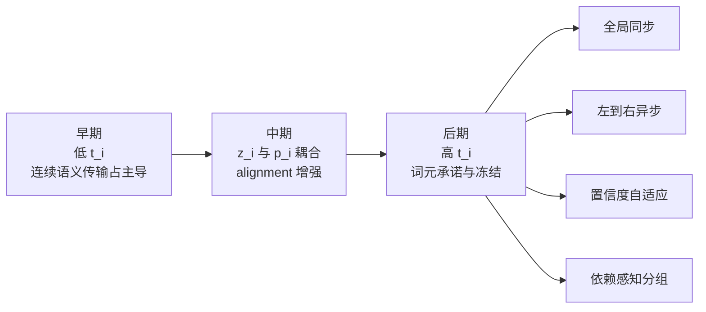

# 统一语言流

## 执行摘要

围绕“连续文本扩散 vs. 离散文本扩散”的分歧，现有文献实际上已经给出了一条清晰线索：问题不只是**状态空间选在 embedding 还是 token/simplex**，更关键的是**模型何时、如何把连续语义状态承诺为离散词元**。ELF 将离散化推迟到最后一步，证明了“几乎全程连续、终点再离散”可以很强；MDLM、D3PM、TESS、SSD-LM、Duo 等则证明了“全程显式离散结构”在语言建模里非常有效；Diffusion Forcing 则进一步表明，序列中不同位置完全可以拥有**独立的噪声水平/扩散时间**，不必共享一个全局时间标量。把这三条线索合在一起，最自然的统一框架就是：**用连续嵌入流表示语义传输，用离散 token belief 表示词汇承诺，并把“离散化”改写成一个随位置、随时间变化的调度问题**。citeturn0search0turn15view2turn11view0turn11view1turn12view4turn13view5turn14view3turn11view2

从形式化上看，一个严谨且可实现的定义是：每个位置维护状态 \(y_i=(z_i,p_i)\)，其中 \(z_i\in\mathbb{R}^d\) 是连续语义状态，\(p_i\in\Delta^{|V|-1}\) 是词表 simplex 上的离散信念；再用锚点矩阵 \(E\in\mathbb{R}^{|V|\times d}\) 把两者耦合，并引入残差 \(r_i\) 使 \(z_i=E^\top p_i+r_i\)。训练时同时优化连续去噪项、离散交叉熵项和对齐项，并用 \(\lambda(t),\mu(t),\beta(t)\) 控制“早期更连续、后期更离散”的**退火式词汇承诺**。这不是某篇现成论文的原始定义，而是对 ELF、LangFlow、FLM/FMLM、CDCD、TEncDM、Diffusion Forcing 等工作的合成性推广。citeturn0search0turn12view0turn12view1turn14view1turn11view7turn11view0

就研究价值而言，这个框架最值得验证的核心假设不是“连续一定优于离散”或“离散一定优于连续”，而是：**最终一步才离散**与**每一步都强离散监督**很可能都不是最优；在二者之间，存在一个更好的、可学习的 **lexical commitment schedule**。如果这个假设成立，那么它会把 ELF、MDLM、Duo、Diffusion Forcing、甚至部分 AR / 半 AR 解码都统一为“同一生成过程上的不同时间调度与几何选择”。不过需要明确的是：直接针对**文本**做“训练期 per-token/异步扩散时间”的主流原始论文仍不多，最强先例主要来自 Diffusion Forcing 的独立 per-token noise，以及近年的 token-level early stopping / discrete diffusion forcing 等推理方法；因此该方向目前仍更像一个**高置信度的研究命题**，而不是已经被完全验证的范式。citeturn11view0turn4search3turn5search2turn15view2turn0search0

我同时核对了你上传的 ELF 预印本：其核心细节——连续 embedding flow、最后一步解码、共享权重 denoiser/decoder、ODE/SDE 采样、以及训练时 MSE/CE 双分支——与公开 arXiv 版本一致。fileciteturn0file0

## 问题定义与研究命题

现有文本扩散文献大致分成三类。第一类是**embedding-space continuous DLM**，例如 Diffusion-LM、SED、CDCD、DiffuSeq、LangFlow、ELF；它们把 token 先映射到连续表示，再在连续空间里做 DDPM、SDE 或 Flow Matching。第二类是**simplex / discrete DLM**，例如 D3PM、SSD-LM、TESS、MDLM、Duo；它们直接在离散 token、mask 状态或 simplex/logit 空间上建模。第三类是**latent / decoder-assisted continuous DLM**，例如 LD4LG、TEncDM、CoDAR；它们承认 continuous path 很有价值，但同时也承认从连续表达到 token 的“rounding / decoding interface”往往是性能瓶颈。citeturn12view4turn14view2turn14view0turn14view1turn13view7turn12view0turn0search0turn13view2turn11view7turn9search2

因此，一个更精确的问题表述不是“文本到底适合连续扩散还是离散扩散”，而是下面这个更细粒度的问题：

\[
\text{何时、以何种几何约束，让每个位置从连续语义状态承诺为离散词元？}
\]

把这个问题写成建模任务：给定长度为 \(L\) 的序列 \(s_{1:L}\)，我们希望学习一个生成过程，使得每个位置 \(i\) 在训练与推理中都可以拥有自己的扩散时间 \(t_i\in[0,1]\)，而不是所有位置共享同一个全局时间 \(t\)。这与 Diffusion Forcing 的核心思想一致：序列模型可以在**独立 per-token noise levels** 下训练，从而兼得 next-token prediction 的可变长度特性与 full-sequence diffusion 的整体优化能力。对文本而言，这意味着 function words、标点、局部确定位置可以较早承诺，而实体、数字、强依赖的 span 可以保留更久的不确定性。citeturn11view0

在这个意义上，“Annealed Lexical Commitment”可以被定义为：模型在早期主要做**连续语义传输**，中期同时维护**连续状态与离散 belief**，后期再逐步提高 token-level commitment。ELF 的 final-step discretization 是这个调度谱系的一端；MDLM/D3PM 式的全程离散结构是另一端；而你提出的 unified language flow 处在中间更一般的位置。Generator Matching 则从更高层次表明：扩散、flow matching 和离散扩散，本质上都可以视为连续时间 Markov 生成过程上的不同实例。citeturn0search0turn11view1turn12view4turn15view2

## 形式化模型与目标函数

下面给出一个适合论文实现的统一建模草案。它综合了 ELF 的 continuous flow、MDLM/Duo/TESS/SSD-LM 的 token/simplex belief、以及 Diffusion Forcing 的 per-token time 机制。其核心状态是

\[
y_i=(z_i,p_i),
\qquad
z_i\in\mathbb{R}^d,\; p_i\in\Delta^{|V|-1}.
\]

这里 \(z_i\) 是位置 \(i\) 的连续语义状态，\(p_i\) 是该位置在词表上的离散信念分布。令 \(E\in\mathbb{R}^{|V|\times d}\) 为词表锚点矩阵，每个 token 对应一个 anchor embedding；再定义残差 \(r_i\)：

\[
z_i = E^\top p_i + r_i.
\]

这一步把“token embedding 是离散流形上的 anchor”形式化了。需要强调的是，“anchor”不是某篇论文的标准命名，而是对 simplex / statistical manifold / encoding-space 系列工作的统一解释：CDCD、Riemannian continuous diffusion、FLM、Categorical Flow Maps、Discrete Flow Maps 都在不同程度上强调，文本的离散几何不能被纯欧氏回归随意忽略。citeturn14view1turn12view5turn12view1turn12view2turn12view3

对干净样本，令 \(q_i^\star=\mathrm{onehot}(s_i)\)，并令 \(x_i\) 为 clean embedding。这里有两种常见做法：若希望最简洁，就取 \(x_i=E^\top q_i^\star\)；若希望更强表示，就像 ELF 与 TEncDM 那样使用 contextual encoder 产生 \(x_i=A_\phi(s)_i\)。无额外约束时，这两个版本都应做实验。前者更“统一”，后者通常更强。citeturn0search0turn11view7

连续分支建议采用 Flow Matching / rectified flow 形式：

\[
z_i(t_i)=\alpha(t_i)x_i+\sigma(t_i)\epsilon_i,\qquad \epsilon_i\sim\mathcal N(0,I),
\]

其中 rectified-flow 特例可取 \(\alpha(t)=t,\ \sigma(t)=1-t\)。如果直接用 \(x\)-prediction，则速度场可写为

\[
v_\theta(z_i,t_i)=\frac{\hat x_i-z_i}{1-t_i}.
\]

这与 ELF 的 \(x\)-prediction 设计一致，也与近年的 “let denoising models denoise” 主张一致：直接预测 clean data 往往更适合高维自然数据流形。citeturn15view0turn15view1turn0search0turn12view7

离散分支可以独立腐化，也可以由连续分支诱导。更稳妥的通用定义是引入一个离散 corruption kernel \(K^{\mathrm{disc}}_{t_i}\)：

\[
\tilde p_i(t_i)\sim K^{\mathrm{disc}}_{t_i}(\cdot \mid q_i^\star).
\]

这里 \(K^{\mathrm{disc}}_{t}\) 可以是 mask/absorbing kernel、uniform kernel，或者它们的插值。这样一来，D3PM/MDLM/Duo 都成为本框架的特例：masked diffusion 对应 absorbing kernel，uniform-state diffusion 对应向均匀分布扩散，interpolating noise 则介于二者之间。citeturn12view4turn11view1turn11view2turn10search2

模型输入是全序列的 \(\{z_i,\tilde p_i,t_i\}_{i=1}^L\)，输出同时给出 \(\hat x_i\) 与 \(\hat p_i\)。推荐的总损失为

\[
\mathcal L
=
\mathbb E\Big[\sum_{i=1}^L
\lambda(t_i)\,\underbrace{\|\hat x_i-x_i\|_2^2}_{\mathcal L_{\text{cont},i}}
+
\mu(t_i)\,\underbrace{\mathrm{CE}(\hat p_i,s_i)}_{\mathcal L_{\text{disc},i}}
+
\beta(t_i)\,\underbrace{\|\hat x_i-E^\top \hat p_i\|_2^2}_{\mathcal L_{\text{align},i}}
\Big].
\]

如果希望显式建模残差，还可以加入
\(\gamma(t_i)\| \hat r_i\|^2\)，其中 \(\hat r_i=\hat x_i-E^\top \hat p_i\)。直觉上，\(\mathcal L_{\text{cont}}\) 负责连续语义恢复，\(\mathcal L_{\text{disc}}\) 负责词元识别，\(\mathcal L_{\text{align}}\) 则是连续—离散接口的几何约束。CoDAR 的结果恰恰提示最终 rounding 是性能瓶颈，因此这个对齐项不应被视为附属正则，而应被当作一等公民。citeturn9search2turn11view7turn12view1turn12view2turn12view3

时间权重最自然的设计是“早连续、晚离散”。一个简单、稳定且易复现的选择是先定义

\[
s(t)=\sigma\!\big(\kappa(t-\tau)\big),
\]

然后设

\[
\lambda(t)=1-s(t),\qquad
\mu(t)=s(t),\qquad
\beta(t)=\beta_0+\beta_1 s(t)^2.
\]

其中 \(\tau\) 控制“从语义传输转向词汇承诺”的拐点，\(\kappa\) 控制过渡陡峭度。若希望更强 late commitment，可把 \(\mu(t)\) 设计成 piecewise 或 cosine ramp；若希望更平滑，可让 \(\beta(t)\) 上升更慢。这个设计吸收了 ELF 的 late decode、LangFlow 的 schedule design、以及 Diffusion Forcing 的 per-token time 思想。citeturn0search0turn12view0turn11view0

```mermaid
flowchart LR
    A[clean tokens s] --> B[clean anchors q* 与 clean embeddings x]
    B --> C1[continuous corruption z_i(t_i)]
    B --> C2[discrete corruption p_i(t_i)]
    C1 --> D[Coupled Transformer f_theta]
    C2 --> D
    D --> E1[x_hat_i]
    D --> E2[p_hat_i]
    E1 --> F1[MSE / flow loss]
    E2 --> F2[CE / KL loss]
    E1 --> F3[alignment to E^T p_hat]
    E2 --> F3
    F1 --> G[annealed lexical commitment]
    F2 --> G
    F3 --> G
```

上图不是对某篇原论文的复述，而是基于 ELF、Diffusion Forcing、MDLM/Duo、TEncDM/CoDAR 的综合模型草案。citeturn0search0turn11view0turn11view1turn11view2turn11view7turn9search2

## 训练、采样与推理策略

训练时最关键的不是“选哪个 loss”，而是**怎么给每个位置采样 \(t_i\)**。最基础的方案是 i.i.d. 采样：\(t_i\sim\mathrm{Uniform}(0,1)\) 或 Beta 分布。这直接对应 Diffusion Forcing 的独立 per-token noise idea。更强的方案是**相关调度**：对 span、子句、实体或 block 使用共享的基础时间，再加小扰动；这样能更好刻画“相关 token 同时变得确定”的语言结构。第三个方案是**课程学习**：先用全局同步时间训练到稳定，再逐步增加 per-token 方差、再加入相关调度，最后再加入 confidence-adaptive 冻结。由于很多文本扩散模型在 few-step 或高噪声区间容易失稳，这种 curriculum 通常比一开始就全异步更安全。citeturn11view0turn9search1turn0search0turn12view0

采样器方面，连续分支建议同时评估 ODE 与带小噪声注入的 SDE 变体。ELF 的经验结果表明，在 few-step regime 下，SDE-like sampling 往往比纯 ODE 更能减少误差累积；Flow Matching、Rectified Flow、Stochastic Interpolants 则提供了这些 ODE/SDE 视角的统一理论背景。对本框架而言，连续分支可用

\[
z_{i}^{k+1}=z_i^k+\Delta t\, v_\theta(z_i^k,p_i^k,t_i^k)+\eta_k\xi_i^k
\]

更新；离散分支则建议采用 simplex-aware 的 logits 更新，而不是把 \(p_i\) 当普通欧氏向量乱回归。一个简单做法是让网络输出 \(g_\theta\) 作为 logits 增量：

\[
\ell_i^{k+1}=\ell_i^k+\Delta t\, g_\theta(\cdot),\qquad
p_i^{k+1}=\mathrm{softmax}(\ell_i^{k+1}).
\]

这与 FLM/FMLM、Categorical Flow Maps、Discrete Flow Maps、Riemannian continuous diffusion 对“simplex 几何”的强调是一致的。citeturn0search0turn15view0turn15view1turn12view6turn12view1turn12view2turn12view3turn12view5

推理策略建议至少比较四类。其一是**全局同步**：所有位置共享 \(t^k\)，这是最接近 ELF / 常规 diffusion 的基线。其二是**左到右异步**：前缀位置更早进入高 \(t_i\) 区间，形成一种半自回归的承诺顺序。其三是**置信度自适应**：若某位置的 \(\max p_i\) 高、熵 \(H(p_i)\) 低、且若干步内预测稳定，则冻结该位置，只继续更新其他位置。其四是**依赖感知**：根据注意力图、外部依存句法、实体 span 或 copy-span，把相关位置绑定为同一更新组。前两类主要测“schedule”本身，后两类主要测“adaptive commitment”是否真的带来更好的质效权衡。Diffusion Forcing 支持 per-token 时间这一训练逻辑，而 token-level early stopping、D2F、APD 等近期工作则说明：**位置级不同步**在推理层面确实能换来效率收益。citeturn11view0turn4search3turn5search2turn5search1

CFG 与 self-conditioning 也应纳入统一框架。连续分支天然适合 CFG，ELF 与图像生成文献都说明了这一点；而 self-conditioning 在 Analog Bits、SED、TESS、ELF 里都反复出现。对于本框架，最自然的做法是：上一步的 \(\hat x,\hat p\) 同时作为下一步条件输入；条件分支与无条件分支共享主干，通过单次或双次前向实现 guidance。需要预期的是，CFG 几乎一定会改善质量、降低熵；因此报告中必须给出 quality–diversity frontier，而不只报单点指标。citeturn13view4turn13view0turn14view0turn13view5turn0search0



## 文献脉络与分类比较

先说结论：在理论层面，Flow Matching、Rectified Flow、Stochastic Interpolants、Generator Matching 已经提供了足够强的统一语法；在文本层面，ELF、LangFlow、FLM/FMLM 代表了“连续路线”的最新推进，MDLM、Duo、TESS、SSD-LM 等代表了“离散/simplex 路线”的成熟经验，Diffusion Forcing 则提供了“异步时间”的最强直接先例。下面两张表按“理论底座”和“文本代表方法”分别整理；每一行都给出简要方法摘要、关键对象、与本框架的关系，以及原文来源。citeturn15view0turn15view1turn12view6turn15view2turn0search0turn12view0turn12view1turn11view1turn11view2turn11view0

| 理论论文 | 方法与关键对象 | 和本框架的关系 | 来源 |
|---|---|---|---|
| Flow Matching | 用固定条件概率路径回归速度场，仿真自由训练 CNF；核心对象是向量场 \(v_\theta(x,t)\)。 | 给连续分支提供最自然的训练原则。 | citeturn15view0 |
| Rectified Flow | 学习尽量接近直线路径的 ODE 传输；强调粗步数也能高质量采样。 | 给 \(z_i(t_i)\) 的线性插值与 few-step 采样提供依据。 | citeturn15view1 |
| Stochastic Interpolants | 把 flow 与 diffusion 统一到同一连续时间随机插值框架，可导出 ODE 与 SDE 两视角。 | 支持同一模型同时比较 ODE / SDE 采样器。 | citeturn12view6 |
| Generator Matching | 用任意连续时间 Markov 生成过程统一 diffusion、flow matching 与 discrete diffusion。 | 为“连续—离散统一”提供更上层的理论语言。 | citeturn15view2 |
| Classifier-Free Guidance | 通过条件/无条件模型线性组合，在质量与多样性之间调节。 | 连续分支与条件生成中的重要控制手段。 | citeturn13view4 |
| Analog Bits | 用连续状态/连续时间去建模离散 bit，并引入 self-conditioning。 | 说明 self-conditioning 与“连续表示离散对象”是可行设计。 | citeturn13view0 |

| 文本方法 | 状态空间 | 离散化调度 | per-token 时间 | 解码器/接口 | 训练损失与采样 | 主要优点 | 主要短板 | 来源 |
|---|---|---|---|---|---|---|---|---|
| D3PM | 离散 token / transition matrix | 全程离散 | 否 | 无专门 decoder | VLB + auxiliary CE；离散马尔可夫链 | 奠定离散扩散基础，可统一吸收态/均匀态 | 与连续流技巧接口较弱 | citeturn12view4 |
| Diffusion-LM | embedding | 每步都要往 token 目标靠拢 | 否 | rounding / decoding 到 token | 连续去噪 + 控制优化 | 可做复杂 controllable generation | 采样慢，离散接口硬 | citeturn14view2 |
| SED | token embeddings | 连续空间中逐步恢复 token | 否 | embedding-to-token | self-conditioning + continuous diffusion | 早期证明连续文本扩散可扩展 | token interface 仍是瓶颈 | citeturn14view0 |
| CDCD | 连续时间 + 连续输入的 categorical 表示 | 连续化离散 | 否 | categorical/continuous bridge | 连续扩散建模 categorical data | 强调保留 continuous diffusion 优势 | 实现与几何较复杂 | citeturn14view1 |
| DiffuSeq | embedding seq2seq | 连续 denoise，输出再离散 | 否 | seq2seq output head | 条件扩散；多任务评测 | 条件生成强、理论连接 AR/NAR | 仍受 embedding route 与步数限制 | citeturn13view7 |
| SSD-LM | simplex + semi-AR blocks | block 级逐步离散 | 部分支持 | 无额外 decoder | simplex diffusion + classifier guidance | 模块化控制强，支持半自回归 | block 设计带来调度复杂度 | citeturn14view3 |
| TESS | logit simplex | 全程 simplex，自条件 | 否 | text-to-text head | simplex diffusion + self-conditioning | 文本到文本任务强，步数可降 | 仍非真正异步 per-token time | citeturn13view5 |
| LD4LG | latent autoencoder latent | 先在 latent 连续建模，再统一解码 | 否 | **单独** pretrained decoder | latent diffusion | 明显减轻原空间建模难度 | 引入额外 decoder 组件 | citeturn13view2turn14view4 |
| TEncDM | contextual encodings | 连续编码空间，最终解码 | 否 | transformer decoder | 编码空间扩散 + contextual decoding | 强调 contextual encodings 的价值 | 仍依赖单独 decoder/interface | citeturn11view7 |
| MDLM | mask-state discrete | 全程离散 | 否 | 无额外 decoder | Rao-Blackwellized masked objective；高效 sampler | 离散文本基线很强 | 很难直接复用连续 flow/CFG 全套技巧 | citeturn11view1 |
| Duo | uniform-state discrete | 全程离散，但从高斯过程解释出发 | 否 | 无额外 decoder | curriculum + discrete consistency distillation | 建立 uniform-state 与 Gaussian diffusion 的联系 | 仍未解决 position-wise 异步承诺 | citeturn11view2 |
| Diffusion Forcing | 独立 per-token noise 的序列状态 | 非固定；过去与未来可处于不同噪声级别 | **是** | 因任务而定 | independent per-token noise；优化子序列似然下界 | 给异步时间最直接的训练范式 | 主要成果先在视频/连续序列场景 | citeturn11view0 |
| LangFlow | embedding + Bregman FM | 连续路线，靠 scheduler 和训练协议弥补 gap | 否 | 常规 token head | Bregman FM、ODE-based NLL bound、learnable scheduler | 首批真正逼近离散 DLM 的连续方法 | 仍是全局时间主导 | citeturn12view0 |
| FLM / FMLM | one-hot / simplex aware continuous flow | 连续 denoising，可蒸馏为 one-step flow map | 否 | CE respecting simplex geometry | continuous flow + flow map distill | few-step/one-step 前景突出 | 仍缺显式 token-wise异步时间机制 | citeturn12view1 |
| Categorical / Discrete Flow Maps | simplex 几何 | few-step / one-step trajectory compression | 否 | flow-map endpoint parameterization | self-distillation / endpoint consistency | 说明 simplex-aware flow 非常适合少步生成 | 目前更偏 few-step compression，而非异步 commitment | citeturn12view2turn12view3 |
| ELF | contextual embeddings | **最后一步**离散化 | 否 | 共享权重 denoiser/decoder | FM + \(x\)-prediction + final CE；ODE/SDE | 证明 continuous DLM 可以很强，CFG 接口自然 | lexical commitment 可能过晚 | citeturn0search0turn0search4turn0file0 |
| CoDAR | continuous embeddings + AR decoder | 连续到最后，但用强 contextual decoder 做 rounding | 否 | **单独** AR rounding decoder | two-stage | 明确指出 rounding 是主瓶颈 | 系统更复杂，仍非异步时间 | citeturn9search2 |
| Why Gaussian Diffusion Fails | 连续高斯扩散视角 | 不是方法，而是机理分析 | 否 | 不适用 | 分析 critical interval 与 multimodality | 解释为什么连续文本扩散会在某些区间失稳 | 主要是问题诊断，不是完整统一方案 | citeturn9search1 |

综合这些文献，一个很清楚的结论是：**你的框架不是在“已有连续模型上加一点离散 supervision”那么简单，而是在做一个新的轴——discretization schedule axis**。沿这个轴，ELF 位于“commit 太晚”的一端，MDLM/D3PM/TESS 位于“commit 太早或全程 commit”的一端，Diffusion Forcing 则告诉我们“时间本身也应按位置拆开”。这正是统一框架最有发表潜力的切入点。citeturn0search0turn11view1turn12view4turn13view5turn11view0

## 实验设计、消融与复现建议

最关键的实验不是先和最大全量模型硬拼，而是先验证一个机制性命题：**final-only discretization 与 per-step discretization 都不是最优；存在一个更好的 annealed / asynchronous commitment schedule**。建议把实验分成三层。第一层做无条件生成，数据集用 OpenWebText 与 LM1B；这是 ELF、LangFlow、FLM/FMLM、MDLM、Duo 的共同主战场。第二层做有条件生成，至少做 WMT14 De-En 与 XSum，因为 ELF、TEncDM、TESS 都在这类任务上有可比先例。第三层做结构化或低熵任务，例如 copy、模板填空、实体受约束生成，用来观察 token accuracy、exact match 与 consistency，而不只看 Gen.PPL 或 ROUGE。citeturn0search0turn12view0turn12view1turn11view1turn11view2turn11view7turn13view5turn13view7

模型规模建议至少做三个点：小型约 100M、中型约 300M、大型约 600M–700M。这样既能与 ELF-B/M/L 的量级有可比性，也能看清 schedule 的缩放趋势。若无特定约束，词表大小与 embedding 维度可按 tokenizer 与算力设定；一个稳妥起点是 BPE 32k、\(d=768/1024/1536\)，并把 \(E\) 与输出 unembedding 绑定。若采用 contextual anchors，可像 ELF 那样先用 frozen encoder 生成 \(x_i\)，再用一个小 bottleneck 投影到 denoiser 空间；若追求最统一，可直接令 \(x_i=E^\top q_i^\star\)。两条路线都建议做。citeturn0search0turn11view7

训练上，建议用三阶段课程。第一阶段先用**全局同步时间**，让模型学会基本连续—离散接口；第二阶段把 50% batch 切换为 i.i.d. per-token \(t_i\)，并加入离散 kernel 的 mask/uniform 插值；第三阶段再加入 25% 的 span-correlated schedules 和 25% 的 confidence-adaptive teacher schedules。一个可复现的初值是：\(\kappa=10,\tau=0.6,\beta_0=0.05,\beta_1=0.25\)；损失按位置加权后再平均。优化器可先用 AdamW 作为通用基线；若资源允许，再复现实作中类似 ELF 的大批量优化配置。由于 2026 年不少结果仍停留在 arXiv/preprint，建议把这些超参标明为“研究起点”，而不是“文献中已证最优”。citeturn0search0turn12view0turn11view1turn11view2

需要重点做的消融可以压缩为六组。其一，比调度：global final-only、all-step CE、late-only CE、annealed CE、i.i.d. per-token、span-correlated、confidence-adaptive、dependency-aware。其二，比离散 kernel：mask、uniform、mask-uniform interpolation。其三，比 anchor：tied token embeddings、frozen contextual encoder、jointly trained encoder。其四，比解码接口：共享头、单独 decoder、CoDAR-style contextual AR rounder。其五，比采样器：ODE、SDE-like、rectified-flow steps、few-step flow-map distillation。其六，比辅助技巧：self-conditioning、CFG、token freezing threshold、alignment loss 强弱。只要这些消融能稳定显示“中后期 commitment / 异步时间”优于两个极端，论文故事就成立了。citeturn0search0turn9search2turn11view0turn13view0turn13view4turn12view1turn12view2turn12view3

指标必须分四类同时报。质量类：Gen.PPL、验证 PPL/NLL bound、BLEU、ROUGE。多样性类：unigram entropy、distinct-n。结构与准确性类：token accuracy、span exact-match、实体一致性、copy accuracy。效率类：sampling steps / NFE、端到端延迟、吞吐、冻结比例。人评建议至少做 fluency、adequacy、constraint satisfaction、global consistency 四维。近期大模型 DLM 论文已经反复提醒：perplexity 在扩散家族内部有用，但跨家族时可能和真实 speed–quality Pareto 不一致，因此报告里一定要画 Pareto 曲线，而不是只报单点最优。citeturn0search0turn12view0turn11view1turn11view2turn10search2

建议图表至少包含以下几类。第一，**Gen.PPL/ROUGE vs. NFE** 曲线，直接看调度是否把 Pareto 前沿推向左下。第二，**per-token commitment time heatmap**，横轴位置、纵轴采样步，颜色为 \(t_i\) 或 \(1-H(p_i)/\log|V|\)。第三，**冻结比例 vs. 质量退化** 曲线，用于证明异步策略不是简单偷步数。第四，**exact-match vs. entropy** 散点图，用于观察是否出现“质量上升但 lexical consistency 下降”的反常区间。第五，**alignment error \(\| \hat x-E^\top\hat p\|\)** 的随步变化曲线，用来直观看接口何时收紧。以上图表比单一 ROUGE / PPL 更能支撑“Annealed Lexical Commitment”这个中心论点。citeturn0search0turn11view0turn9search2turn9search1

## 结论与开放问题

如果把现有工作放在一条连续谱上看，那么最有解释力的统一表述是：**文本扩散不是 continuous 与 discrete 的二选一，而是连续语义传输与离散词汇承诺之间的耦合过程；离散性不是空间选择，而是调度选择。** 在这个视角下，\(y_i=(z_i,p_i)\)、锚点矩阵 \(E\)、残差 \(r_i\)、以及 per-token 扩散时间 \(t_i\) 共同定义了一个既能吸收 ELF / LangFlow / FLM，又能吸收 MDLM / Duo / TESS / D3PM，并能自然接上 Diffusion Forcing 的统一框架。citeturn0search0turn12view0turn12view1turn11view1turn11view2turn13view5turn12view4turn11view0

这个方向最强的研究主张不是“连续更好”，也不是“离散更好”，而是：**存在一个可学习、可异步、依赖位置与置信度的 lexical commitment schedule，比 final-step-only 与 all-step discreteness 都更优**。这是目前文献最缺、但理论与经验都已经在逼近的那块空白。citeturn11view0turn15view2turn0search0turn9search2

需要谨慎的地方也很明确。其一，直接在**文本**上验证训练期异步 per-token times 的原始论文仍不多，现阶段更多是强启发而非定论。其二，\(z_i=E^\top p_i+r_i\) 的分解存在可辨识性问题：如果 \(\beta\) 太弱，模型可能偷懒把一切都塞进 \(r_i\)；如果 \(\beta\) 太强，又可能过早塌缩到 token anchors。其三，连续文本扩散在某些 critical interval 可能因多峰低密度区间而失稳，因而异步时间与 late commitment 不一定天然更稳，必须靠课程学习、合适采样器与几何约束来保驾护航。其四，很多 2026 年新方法仍是预印本，结论应以“趋势判断”而非“已被社区完全定论”的口吻来表述。citeturn9search1turn11view0turn12view0turn12view1turn12view2turn12view3turn0search0

总体上，我的判断是：如果你要把这个想法写成一篇有辨识度的论文，最好的 framing 不是“我们提出一个 hybrid model”，而是**“我们把 discreteness 从空间选择重写为时间调度问题，并给出一个位置级耦合状态与退火式词汇承诺机制。”** 这比单纯把连续和离散拼起来要强得多，也更贴近当前文献真正缺失的那一块。citeturn15view2turn11view0turn0search0turn12view0