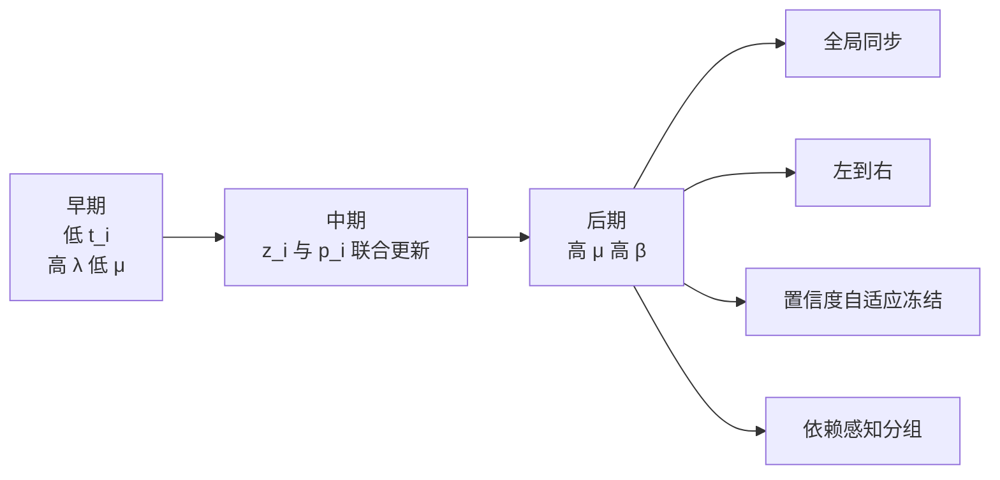

# 统一文本扩散中的退火式词汇承诺

## 执行摘要

当前文本扩散文献真正分裂的，不只是“状态空间在 token / simplex / embedding / latent 中怎么选”，而是**模型何时、如何把连续语义状态承诺为离散词元**。D3PM、MDLM、SSD-LM、TESS、Duo 等方法把词汇结构放在轨迹中心；ELF 则把绝大多数中间过程留在连续 contextual embedding 空间，只在最后一步离散化；CoDAR 进一步指出，连续路线的长期瓶颈之一正是最后的 rounding / token projection。本质上，这些方法都在做同一件事的不同极端：**调度 lexical commitment 的发生时机与强度**。citeturn1search0turn0search3turn8search3turn2search2turn10search1turn9view0turn3search0

因此，一个更自然的统一框架不是简单“混合连续与离散”，而是把离散化重写为**时间/调度问题**：每个位置 \(i\) 同时维护连续状态 \(z_i\) 与离散 belief \(p_i\)，再用锚点矩阵 \(E\) 把两者耦合，并允许每个位置拥有自己的扩散时间 \(t_i\)。ELF 提供了“final-only discretization”的强基线；Diffusion Forcing 提供了“independent per-token noise levels”的直接先例；NeoDiff 与 ADLM 则说明，在文本里做 token-level 异步时间或 anchor-aware noising 是可行且有效的。把这几条线索合并，可得到一个更完整的研究问题：**continuous embedding flow 与 discrete token belief 是否应当按位置、按置信度、按依存结构异步耦合**。citeturn9view0turn0search1turn5search0turn5search1

本文给出的结论是：如果目标是做出一篇既有新意、又有实现概率的研究，最合理的 framing 不是“continuous vs. discrete”，而是**Annealed Lexical Commitment**：早期主要恢复语义与结构，中期联合更新 \(z_i\) 与 \(p_i\)，后期才逐渐把 token-level commitment 拉高，并允许不同位置在不同时间冻结。这个框架能把 ELF、LangFlow、FLM/FMLM、MDLM、D3PM、TESS、CoDAR、Diffusion Forcing、NeoDiff、ADLM 等方法放到同一坐标系中，也能自然解释为什么“全程强离散”与“直到最后才离散”可能都不是最优。citeturn0search2turn3search3turn0search3turn1search0turn2search2turn3search0turn0search1turn5search0turn5search1

更具体地说，最值得优先验证的命题不是“连续方法一定会赢”，而是下面这个更窄、也更可发表的命题：

\[
\text{在文本扩散中，final-only 与 all-step discreteness 都可能次优；存在更好的、可学习的、位置级的 lexical commitment schedule。}
\]

这一定义既保留了 ELF 所证明的连续路径优势，也正面回应了 CoDAR 对最终离散化瓶颈的诊断，同时把 Diffusion Forcing 的 per-token time 机制引入文本扩散的核心设计里。citeturn9view0turn3search0turn0search1

## 问题陈述

把离散化视为“时间/调度”问题，有两个直接理由。第一，现有方法的实证差异，很多并不是来自底层主干网络，而是来自**词汇约束施加得太早还是太晚**。离散扩散与 simplex 扩散通常从一开始就让 token 几何主导轨迹；embedding/latent 路线则要么在训练过程中持续施加 CE，要么像 ELF 那样把离散步骤推迟到终点。第二，Diffusion Forcing 已经证明，在序列建模里，噪声水平不必是一个全局标量；每个 token 可以有自己的 noise level，而训练目标仍然有严格的似然下界解释。文本扩散若仍坚持“全序列共享一个 \(t\)”的同步假设，未必符合语言中不同位置语义确定性的真实演化。citeturn1search0turn0search3turn2search2turn9view0turn0search1

在这个视角下，本文的精确研究命题可以表述为：

> 给定序列 \(s_{1:L}\)，学习一个位置级耦合生成过程 \(\{(z_i(t_i),p_i(t_i))\}_{i=1}^L\)，其中 \(z_i\) 负责连续语义输运，\(p_i\) 负责离散词汇承诺，\(t_i\) 则控制位置 \(i\) 当前处于多“连续”还是多“离散”的阶段；目标是在不破坏连续路径优势的前提下，逐步、异步、可校准地完成 lexical commitment。  

这个命题与 ELF 的“predominantly continuous until final step”、LangFlow 的持续 token posterior matching、MDLM/D3PM/TESS 的全程离散建模、以及 CoDAR 的 final rounding 诊断都构成直接对话。citeturn9view0turn0search2turn0search3turn1search0turn2search2turn3search0

可检验假设建议至少包含四条。其一，**调度假设**：在固定主干与固定 compute 下，late-only 或 annealed 离散监督会优于 final-only 和 all-step 两个极端。其二，**异步假设**：允许 per-token \(t_i\) 的模型，会优于全局同步 \(t\) 的模型，尤其在 exact-match、实体一致性、低熵条件生成任务上。其三，**几何假设**：显式加入 \(z_i \leftrightarrow E^\top p_i\) 对齐项，会减轻 CoDAR 所指的 rounding shock，并降低 final-step projection 的不稳定性。其四，**策略假设**：confidence-adaptive freeze 与 dependency-aware grouping，将优于纯全局同步更新，因为语言中高置信与低置信、局部确定与全局依赖本就不应同步收敛。前两条主要受 ELF、Diffusion Forcing、NeoDiff 启发；后两条主要受 CoDAR、ADLM、simplex/flow-map 系列工作启发。citeturn9view0turn0search1turn5search0turn3search0turn5search1turn4search0turn4search1

## 形式化模型

令词表大小为 \(|V|\)，序列长度为 \(L\)，嵌入维度为 \(d\)。对每个位置 \(i\)，定义状态为

\[
y_i=(z_i,p_i),\qquad z_i\in\mathbb R^d,\quad p_i\in\Delta^{|V|-1}.
\]

这里 \(z_i\) 是连续语义状态，\(p_i\) 是词表 simplex 上的离散 belief。再定义锚点矩阵

\[
E\in\mathbb R^{|V|\times d},
\]

其中第 \(v\) 行 \(E_v\) 对应 token \(v\) 的 anchor embedding。最简单做法是把 \(E\) 设为 tied token embedding / unembedding；更强做法是冻结 pretrained embedding 或加一个小 adapter；若用户未指定 vocab size、embed dim、anchor 类型，则均记为“**无特定约束**”。这个定义与 simplex 路线、Difformer 的 anchor loss、ADLM 的 anchor token 思想，以及 continuous–discrete bridge 的若干工作相兼容。citeturn11search0turn5search1turn6search15

对 clean target，定义

\[
q_i^\star=\mathrm{onehot}(s_i).
\]

clean embedding \(x_i\) 有两种同样合理的选择。基础版取

\[
x_i = E^\top q_i^\star,
\]

即直接使用 token anchor；增强版取

\[
x_i = A_\phi(s)_i,
\]

其中 \(A_\phi\) 是 contextual encoder，例如像 TEncDM 或 ELF 那样使用预训练编码器产生上下文化表示。两种做法都成立；如果用户未指定，则应明确写为“**无特定约束**”，并在实验里同时评测。ELF 与 TEncDM 的经验都表明，contextual encodings 往往更强，但也会让“anchor 对齐”的难度更高。citeturn7search0turn9view0

连续—离散耦合通过残差分解写成

\[
z_i = E^\top p_i + r_i,
\]

其中 \(r_i\in\mathbb R^d\) 是 current continuous state 中尚未被 token belief 解释掉的残差。如果 \(r_i\to 0\)，则说明状态已贴近某个或某些 token anchors；如果 \(r_i\) 较大，则说明该位置仍保留了超出词汇 belief 的连续语义不确定性。这一分解不是直接照搬某篇论文的标准记号，而是把“soft token anchor”“simplex belief”“final rounding bottleneck”三条文献线索统一到一个可训练接口中。citeturn11search0turn3search0turn6search15

### 连续 corruption

对每个位置独立采样时间 \(t_i\in[0,1]\)。连续前向过程写为

\[
z_i(t_i)=\alpha(t_i)\,x_i + \sigma(t_i)\,\epsilon_i,\qquad \epsilon_i\sim \mathcal N(0,I).
\]

rectified-flow 特例可直接取

\[
\alpha(t)=t,\qquad \sigma(t)=1-t,
\]

于是

\[
z_i(t_i)= t_i x_i + (1-t_i)\epsilon_i.
\]

这与 Rectified Flow、Flow Matching 和 ELF 的核心路径形式一致；若要使用 VP/DDPM 或更一般的 stochastic interpolant，只需替换 \(\alpha,\sigma\) 的参数化。citeturn1search1turn1search14turn1search3turn9view0

### 离散 corruption kernel

离散分支可写为一个位置级 kernel：

\[
\tilde p_i(t_i)\sim K^{\mathrm{disc}}_{t_i}(\cdot\mid q_i^\star).
\]

一个统一的实现族可以写成 mixture kernel：

\[
K^{\mathrm{disc}}_{t}(q^\star)
=
(1-\rho_t-\nu_t)\,q^\star
+\rho_t\,u
+\nu_t\,m,
\]

其中 \(u\) 是 uniform 分布，\(m\) 是 mask / absorbing state。这样，D3PM 的 structured transitions、MDLM 的 mask diffusion、Duo 的 uniform-state discrete diffusion 都可视为这一定义下的不同特例。若走 simplex/logit route，则也可以在 logits 上进行连续扰动，再通过 softmax 投回 simplex。citeturn1search0turn0search3turn10search1turn2search2

### 网络与预测头

一个适合实现的主干是共享 Transformer / DiT 风格网络 \(f_\theta\)，输入为 \((z_i,\tilde p_i,t_i)\) 及条件信息 \(c\)，输出为 \(\hat x_i\) 与 logits \(\hat\ell_i\)：

\[
(\hat x_i,\hat\ell_i)=f_\theta(z_i,\tilde p_i,t_i,c).
\]

再定义

\[
\hat p_i = \mathrm{softmax}\!\left(\frac{\hat\ell_i}{\tau(t_i)}\right),
\qquad
\hat r_i = \hat x_i - E^\top \hat p_i.
\]

其中 \(\tau(t)\) 是 temperature schedule，控制后期是否更尖锐地靠近离散顶点。ELF 支持共享权重 denoiser/decoder，这为本框架的共享主干提供了直接先例；TESS、LangFlow、FLM/FMLM 与 flow-map 系列则说明，在训练中同时显式维护 token distribution 是合理的。citeturn9view0turn2search2turn0search2turn3search3turn4search0turn4search1

```mermaid
flowchart LR
    A[clean tokens s] --> B[q* = one-hot]
    A --> C[x_i = E^T q*_i 或 contextual encoder]
    B --> D[离散 corruption K_disc(t_i)]
    C --> E[连续 corruption z_i(t_i)]
    D --> F[tilde p_i]
    E --> G[Coupled Transformer f_theta]
    F --> G
    G --> H[x_hat_i]
    G --> I[logits_hat_i]
    I --> J[p_hat_i = softmax(logits/tau)]
    J --> K[E^T p_hat_i]
    H --> L[alignment / residual]
    K --> L
```

### 损失函数

推荐总损失为

\[
\mathcal L
=
\sum_{i=1}^L
\lambda(t_i)\,\mathcal L_{\text{cont},i}
+
\mu(t_i)\,\mathcal L_{\text{disc},i}
+
\beta(t_i)\,\mathcal L_{\text{align},i}
+
\gamma(t_i)\,\mathcal L_{\text{res},i}.
\]

其中四项分别是：

\[
\mathcal L_{\text{cont},i}
=
\|\hat x_i-x_i\|_2^2,
\]

这是最稳妥的 MSE / \(x\)-prediction 形式；若要更贴近 Flow Matching，也可等价写成 velocity regression。ELF 与 Flow Matching 都为这种 \(x\)-prediction / vector-field 训练提供了直接支持。citeturn9view0turn1search1

\[
\mathcal L_{\text{disc},i}
=
\mathrm{CE}(\hat p_i,s_i)
\quad\text{或}\quad
\mathrm{KL}(q_i^\star\|\hat p_i).
\]

若是 mask/uniform kernel，可继续保持 MDLM / D3PM 风格的 token-level supervised objective；若是 simplex/logit route，则 CE 常常仍是最自然的训练信号。citeturn0search3turn1search0turn2search2turn0search2

\[
\mathcal L_{\text{align},i}
=
\|\hat x_i-E^\top \hat p_i\|_2^2.
\]

这是本文建议的一等公民：它直接约束 continuous prediction 与 token belief 的几何一致性，对减轻 final projection shock 尤其关键。可以进一步用 stop-gradient 双向版本增强稳定性：

\[
\|\hat x_i-\mathrm{sg}(E^\top \hat p_i)\|_2^2
+
\kappa\|\mathrm{sg}(\hat x_i)-E^\top \hat p_i\|_2^2.
\]

这一路线与 Difformer 的 anchor loss、CoDAR 的 rounding 诊断、以及 report B 中“soft anchor + coupling schedule”的逻辑完全一致。citeturn11search0turn3search0turn1file1

\[
\mathcal L_{\text{res},i}
=
\|\hat r_i\|_2^2
\quad\text{或}\quad
\|\hat r_i-r_i^\star\|_2^2.
\]

这项是可选 residual 正则；若只关心简洁实现，可先取 \(\gamma(t)\equiv 0\)。

### 时间依赖权重

建议把 \(\lambda,\mu,\beta\) 明确做成调度，而不是常数。一个好用的参数化是 sigmoid：

\[
s(t;\kappa,\tau)=\sigma(\kappa(t-\tau)),
\]

\[
\lambda(t)=1-s(t;\kappa,\tau),\qquad
\mu(t)=s(t;\kappa,\tau),\qquad
\beta(t)=\beta_0+\beta_1 s(t;\kappa,\tau)^2.
\]

其中 \(\tau\) 控制“开始承诺离散词元”的拐点，\(\kappa\) 控制这一步切换的陡峭程度；\(\beta_0,\beta_1\) 控制早期与后期对齐强度。若没有额外约束，可把 \(\tau\) 作为 0.5–0.8 的研究范围，\(\kappa\) 作为 5–20 的研究范围，\(\beta_0,\beta_1\) 记为“**无特定约束**”并在实验中搜索。这个参数化直接对应“退火式词汇承诺”。citeturn9view0turn0search2

还应同时比较两类常用备选：

\[
\mu_{\text{cos}}(t)
=
\frac{1-\cos(\pi t)}{2},
\qquad
\lambda_{\text{cos}}(t)=1-\mu_{\text{cos}}(t),
\]

以及 piecewise late-only schedule：

\[
\mu_{\text{piece}}(t)=
\begin{cases}
0, & t<\tau_1\\
\frac{t-\tau_1}{\tau_2-\tau_1}, & \tau_1\le t<\tau_2\\
1, & t\ge \tau_2
\end{cases}
\]

这三类足够覆盖“平滑退火”“后期突然承诺”“连续提升”的主要研究空间。若用户未指定具体超参，均应标注为“**无特定约束**”。

## 训练、采样与推理策略

### 训练时的 \(t_i\) 采样

最基础的方案是 i.i.d. 采样：

\[
t_i\sim \mathrm{Uniform}(0,1)
\quad\text{或}\quad
t_i\sim \mathrm{Beta}(a,b).
\]

Uniform 覆盖最均匀；Beta 可以偏向低噪声或高噪声区间。若无先验偏好，建议先用 Uniform；若想更强调中后期 commitment，可尝试 \(a< b\) 的 Beta 家族。这里没有社区公认最优超参，因此应明确记为“**无特定约束**”。Diffusion Forcing 已证明独立 per-token noise levels 是一个严肃、而非投机的训练对象。citeturn0search1

更重要的不是分布本身，而是相关结构。建议至少研究三类 correlated schedules。第一类是 **span-correlated**：对同一子词 span、实体 span、数字 span 共享一个基础时间 \(\bar t_g\)，再加小扰动 \(\delta_i\)。第二类是 **dependency-correlated**：根据依存边或高注意力边，把相关位置放入同一组 \(G\)，令 \(t_i=\bar t_G+\delta_i\)。第三类是 **curriculum**：先做全局同步时间训练，再逐步提高位置间异步方差。NeoDiff 的 non-simultaneous diffusion、ADLM 的 anchor-aware masking、以及 SeqDiffuSeq 的位置相关噪声日程，都说明 token-specific / position-specific schedule 在文本中不是凭空设想。citeturn5search0turn5search1turn8search2

推荐的三阶段课程学习很实用。阶段一，只用全局同步 \(t\)，先把 continuous–discrete 接口训稳。阶段二，在 50% batch 上切换到 i.i.d. per-token \(t_i\)，其余 batch 仍保留同步时间。阶段三，再引入 span/dependency correlated schedules 与 confidence-adaptive freeze teacher。这样做的目的是先稳定主干，再逐步暴露给异步状态分布，减少训练初期“所有位置都处于不同噪声、不同承诺程度”造成的优化震荡。这个建议不是现成论文的固定 recipe，而是结合 ELF 的稳定 continuous backbone、Diffusion Forcing 的异步噪声思想与 ADLM/NeoDiff 的位置差异化 noising 后得到的实现建议。citeturn9view0turn0search1turn5search0turn5search1

### self-conditioning 与 CFG

self-conditioning 建议同时接在两条支路上。上一步的 \(\hat x_i^{(k-1)}\) 与 \(\hat p_i^{(k-1)}\) 都可以 stop-gradient 后拼回输入：

\[
\mathrm{SC}_i^{(k)}
=
\big[\mathrm{sg}(\hat x_i^{(k-1)}),\ \mathrm{sg}(E^\top \hat p_i^{(k-1)})\big].
\]

Analog Bits、TESS、LangFlow 都表明 self-conditioning 往往是强增益项；对本文框架而言，加入 lexical self-conditioning 还额外给了模型“上一轮它自己认为这个位置像哪个 token”的记忆。citeturn2search13turn2search2turn0search2

CFG 则可以对两条输出同时做线性组合：

\[
\hat x^{\mathrm{cfg}} = \hat x^{\emptyset} + \omega(\hat x^c-\hat x^{\emptyset}),
\qquad
\hat \ell^{\mathrm{cfg}} = \hat \ell^{\emptyset} + \omega(\hat \ell^c-\hat \ell^{\emptyset}).
\]

再令 \(\hat p^{\mathrm{cfg}}=\mathrm{softmax}(\hat \ell^{\mathrm{cfg}}/\tau)\)。原始 CFG 论文指出它本质上是通过条件/无条件模型的线性组合来调节 fidelity–diversity trade-off；ELF 强调其 continuous formulation 使 CFG 在文本里更自然地可用。对本框架而言，最稳妥的路线是先做标准双前向 CFG，再探索单前向近似。citeturn2search0turn9view0

### 采样器选择

| 采样器 | 在本框架中的形式 | 优点 | 风险 | 实现要点 |
|---|---|---|---|---|
| ODE | \(z_{i}^{k+1}=z_i^k+\Delta t\,v_\theta\) | 可重复、易分析、易与 likelihood bound 对接 | few-step 时误差累积可能更明显 | 优先与 FM / rectified flow 对齐；便于做 schedule 诊断 |
| SDE | \(z_{i}^{k+1}=z_i^k+\Delta t\,v_\theta+\eta_k\xi_i^k\) | 更鲁棒、保留多样性、往往更适合 few-step | 结果方差更大、重现实验稍难 | 后期噪声应减弱；冻结位置通常不再注噪 |
| Rectified Flow | 线性路径 \(z_t=tx+(1-t)\epsilon\) 与 \(x\)-prediction | 公式最简单、与 ELF 兼容、few-step 表现通常好 | 线性路径未必契合所有离散几何 | 适合作为默认连续分支 |
| Flow Matching | 直接回归速度场 \(v_\theta\) | 理论干净、路径灵活 | 需要谨慎选路径与参数化 | 可与 ODE/SDE 都兼容 |
| Flow-map distillation | 学 \(F_{\Delta}:(z,p)\mapsto(z',p')\) 的少步或一步映射 | 极大降延迟 | 容易牺牲校准与异步策略可控性 | 适合在主模型成熟后做二阶段加速 |

这个表中的理论基础分别来自 Flow Matching、Rectified Flow、Stochastic Interpolants、FLM/FMLM、Categorical / Discrete Flow Maps；而把它们放进同一文本框架中，是本文的综合建议。citeturn1search1turn1search14turn1search3turn3search3turn4search0turn4search1

### 四类推理 policy

**全局同步 policy**

\[
t_i^{(k)} = t^{(k)},\qquad \forall i.
\]

这是最接近 ELF / 常规 diffusion 的基线，也是最有利于做第一轮干净消融的 policy。

**左到右 policy**

令 \(b_i\) 表示位置偏移，则可取

\[
t_i^{(k)} = \min\{1,\ t^{(k)}+\delta b_i\},
\qquad b_1>b_2>\cdots>b_L.
\]

或者反过来，让前缀更早 commitment、后缀更晚 commitment。这个 policy 可以看作 AR 与 diffusion 之间的一条连续谱。搜索并行 masked decoding 的近期文献也表明，token unmasking / decoding order 会显著影响性能。citeturn2search15

**confidence-adaptive freeze policy**

定义

\[
c_i^{(k)}=\max_v \hat p_i^{(k)}(v),
\qquad
h_i^{(k)}=H(\hat p_i^{(k)}),
\qquad
a_i^{(k)}=\|\hat x_i^{(k)}-E^\top \hat p_i^{(k)}\|_2^2.
\]

当

\[
c_i^{(k)}>\theta_c,\quad
h_i^{(k)}<\theta_h,\quad
a_i^{(k)}<\theta_a
\]

持续 \(m\) 步时，将位置 \(i\) 冻结，不再更新 \(z_i,p_i\)。这是一种“只在高置信且连续—离散对齐通过时才冻结”的机制，可避免只看 softmax confidence 导致的误冻。

**dependency-aware grouping policy**

设 \(\mathcal G=\{G_1,\dots,G_M\}\) 是由依存树、实体 span、copy span 或 attention-cluster 得到的分组。对每组 \(G\)，定义

\[
\bar c_G = \frac{1}{|G|}\sum_{i\in G} c_i,\qquad
\bar h_G = \frac{1}{|G|}\sum_{i\in G} h_i,\qquad
\bar a_G = \frac{1}{|G|}\sum_{i\in G} a_i.
\]

仅当组内整体满足阈值时才共同 freeze；否则共同推进 \(\Delta t_G\)。这适合数字、引用、实体名、括号/引号配对等需要结构一致性的局部片段。



### 推理伪代码

```text
Input: condition c, anchor matrix E, steps K, policy π
Init:
    z_i ~ N(0, I),   p_i = Uniform(V),   active = {1,...,L}
    frozen_i = False,   stable_i = 0

for k = 1..K:
    # 1) assign per-position times
    t_i <- π(k, i, p, z, c)

    # 2) forward model with optional self-conditioning
    x_hat_i, logits_hat_i = f_theta(z_i, p_i, t_i, c, sc)
    p_hat_i = softmax(logits_hat_i / tau(t_i))

    # 3) compute diagnostics
    conf_i  = max(p_hat_i)
    entr_i  = H(p_hat_i)
    align_i = ||x_hat_i - E^T p_hat_i||^2

    # 4) freeze / group update rule
    if conf_i > θ_c and entr_i < θ_h and align_i < θ_a:
        stable_i += 1
    else:
        stable_i = 0
    if stable_i >= m:
        frozen_i = True

    # 5) update only active positions
    for i in active:
        z_i <- ODE_or_SDE_update(z_i, x_hat_i, t_i)
        p_i <- (1 - η(t_i)) * p_i + η(t_i) * p_hat_i

    active <- {i | not frozen_i}

return argmax_v p_i(v)  (or final decoder)
```

这个伪代码里，alignment check 是避免“高置信但几何错位”的关键；group update 则是把 dependency-aware policy 纳入统一推理框架的最简单方式。

## 文献综述与方法分类

下面两张表分别覆盖“理论与通用工具”和“文本扩散代表方法”。每篇论文都用一两句给出**方法、关键方程或对象、与本框架的相关性**；表中的“来源”即为可点击原始/官方链接。

| 论文 | 方法与关键对象 | 与本框架的相关性 | 来源 |
|---|---|---|---|
| Flow Matching | 训练目标是回归给定概率路径的速度场 \(v_\theta(x,t)\)，避免仿真式 CNF 训练。 | 为连续分支提供最自然的训练范式。 | OpenReview citeturn1search1 |
| Rectified Flow | 用近似直线路径的 ODE 传输分布，常用线性插值 \(z_t=tx+(1-t)\epsilon\)。 | 为本文的 rectified-flow 特例与 few-step 直觉提供基础。 | OpenReview citeturn1search14 |
| Stochastic Interpolants | 用随机插值统一 ODE 与 SDE 生成模型。 | 支持同一模型同时比较 ODE/SDE 采样器。 | arXiv / JMLR citeturn1search3 |
| Generator Matching | 把 diffusion、flow matching、discrete diffusion 统一为连续时间 Markov 生成过程。 | 为“连续—离散统一”提供更高层理论语言。 | OpenReview citeturn1search13 |
| Classifier-Free Guidance | 用条件/无条件模型线性组合调节质量与多样性。 | 对 coupled continuous/discrete guidance 很关键。 | OpenReview citeturn2search0 |
| Analog Bits | 连续扩散建模离散 bit，并用 self-conditioning 显著改善效果。 | 说明“连续状态 + 离散对象 + self-conditioning”是可行范式。 | OpenReview / arXiv citeturn2search13 |
| Fisher Flow Matching | 在离散数据上通过连续 reparameterization 做 flow matching。 | 支持 simplex / statistical-manifold 几何不是可有可无。 | OpenReview citeturn4search2 |
| Categorical Flow Matching on Statistical Manifolds | 在 categorical 分布流形上做严格的统计流匹配。 | 为 \(p_i\) 分支的几何选择提供理论旁证。 | OpenReview citeturn4search8 |

| 论文 | 方法与关键对象 | 与本框架的相关性 | 来源 |
|---|---|---|---|
| D3PM | 用离散马尔可夫链与结构化转移矩阵 \(Q_t\) 推广离散扩散，并加入 auxiliary CE。 | 是“全程离散 / kernel 设计”路线的基础。 | arXiv / NeurIPS citeturn1search0 |
| Diffusion-LM | 在连续 embedding 上做高斯扩散，强调 controllable generation。 | 是最早的大规模连续文本扩散代表。 | arXiv / OpenReview citeturn8search15turn8search7 |
| SSD-LM | 在 vocabulary simplex 上做半自回归扩散，并可接 classifier guidance。 | 证明 simplex-space 很适合 controllability 与模块化控制。 | arXiv / ACL citeturn8search3 |
| DiffuSeq | 把连续扩散扩展到 seq2seq 文本生成，并建立与 AR/NAR 的理论联系。 | 是条件生成基线与 classifier-free 条件训练的重要先例。 | arXiv citeturn8search1 |
| SeqDiffuSeq | 用 encoder-decoder Transformer 做文本扩散，并引入自条件与位置相关自适应噪声。 | 是“部分 per-position schedule”在文本中的早期证据。 | arXiv citeturn8search2 |
| TESS | 在 logit simplex 上做 fully NAR text-to-text diffusion，并强调 self-conditioning。 | 是显式 \(p_i\) 分支的强代表。 | arXiv / ACL Anthology citeturn2search2turn2search6 |
| Difformer | 指出 embedding diffusion 会发生 space collapse，提出 anchor loss 与 noise rescaling。 | 直接支持“anchor 要当一等公民”的观点。 | arXiv / ACL Anthology citeturn11search0turn11search18 |
| LD4LG | 在 autoencoder latent 上做 diffusion，再用预训练 decoder 还原文本。 | 说明把离散化推迟到 latent decoder 是有效路线。 | OpenReview citeturn3search1 |
| TEncDM | 在 contextual encodings 上做 diffusion，并使用 context-aware Transformer decoder。 | 支持 clean embedding 使用 contextual encoder。 | arXiv / AAAI citeturn7search0turn7search2 |
| MDLM | 把 masked diffusion 目标化简为更高效的 masked-LM 风格目标。 | 是当前 masked discrete 路线的重要强基线。 | OpenReview citeturn0search3 |
| Duo | 从 Gaussian diffusion 解释 uniform-state discrete diffusion，并引入 curriculum 与 discrete consistency distillation。 | 说明连续技巧可以迁移到离散文本扩散。 | arXiv / OpenReview citeturn10search1turn10search8 |
| Diffusion Forcing | 训练模型去处理独立 per-token noise levels，并优化所有子序列的 VLB。 | 是本文“异步 \(t_i\)”最直接的理论先例。 | arXiv / OpenReview citeturn0search1turn0search17 |
| NeoDiff | 在文本里显式引入 per-token intrinsic time 与非同时扩散过程。 | 是本文最相关的文本级异步时间先行工作。 | arXiv / ACL Anthology citeturn5search0turn5search16 |
| ADLM | 通过 anchor network 让重要 token 更晚被 mask、更早在逆过程被锁定。 | 是“词汇重要性驱动 schedule”的最直接文本先例。 | arXiv citeturn5search1 |
| LangFlow | 用 Bregman divergence 把 embedding DLM 与 Flow Matching 连接起来，并引入 ODE-based NLL bound、信息均匀噪声与 self-conditioning。 | 证明连续路线可与离散路线竞争。 | arXiv citeturn0search2 |
| FLM / FMLM | 在 one-hot 连续化表示上做 continuous denoising，并可 distill 为 few-step / one-step flow map。 | 是 few-step 加速与 simplex-aware 连续流的关键代表。 | arXiv citeturn3search3 |
| Categorical Flow Maps | 学习通向 simplex 的 flow map，并能复用 guidance / reweighting。 | 支持把 \(p_i\) 分支也纳入 continuous-time 生成控制。 | arXiv citeturn4search0 |
| Discrete Flow Maps | 以 simplex 几何为中心重写 flow-map 训练，强调 CE/KL 而非欧氏回归。 | 说明 few-step 轨迹压缩必须尊重离散几何。 | arXiv / project page citeturn4search1turn4search9 |
| CoDAR | 识别最终 rounding 为连续 DLM 瓶颈，并引入 cross-attentive AR decoder 进行 contextualized rounding。 | 为本文的 alignment / late commitment 提供最强动机。 | arXiv citeturn3search0 |
| Continuous Diffusion Model for Language Modeling | 在 categorical/statistical manifold 上建立连续扩散与离散几何之间的严格联系。 | 支持“token geometry 不应只在最后一步出现”的观点。 | arXiv / OpenReview citeturn6search15turn3search17 |
| Why Gaussian Diffusion Models Fail on Discrete Data | 指出离散数据连续化后会出现 critical interval 与多峰低密度区间。 | 提醒本文：异步时间与晚离散并不天然稳定。 | arXiv citeturn6search3 |
| Lookahead Unmasking | 研究 masked diffusion 中 inference-time order 的重要性。 | 支持 left-to-right / adaptive freeze 这类 policy 的价值。 | OpenReview citeturn2search15 |

下面给出代表方法的 taxonomy，对比维度严格按你要求的轴来组织。

| 方法 | State space | Discretization schedule | Per-token time 支持 | Decoder 设计 | 训练损失 | 采样步数 / 效率 | 优点 | 缺点 | 来源 |
|---|---|---|---|---|---|---|---|---|---|
| D3PM | token | 全程离散 | 否 | 无专门 decoder | VLB + aux CE | 多步 | 离散建模严谨 | few-step 差、连续技巧复用弱 | arXiv citeturn1search0 |
| MDLM | token / mask | 全程离散 | 否 | 无专门 decoder | 加权 masked CE | 多步，可优化 | 强基线、简单 | 连续 guidance 不自然 | OpenReview citeturn0search3 |
| Duo | token / uniform state | 全程离散 | 否 | 无专门 decoder | 离散 diffusion + consistency distill | 可 few-step | 迁移连续技巧成功 | 仍是离散主导 | arXiv citeturn10search1 |
| SSD-LM | simplex | 全程 soft lexical | 否 | 无专门 decoder | simplex diffusion + control loss | 多步 / block | 控制强、几何清楚 | 高维 simplex 成本高 | arXiv citeturn8search3 |
| TESS | logit simplex | 全程 soft lexical | 否 | text-to-text head | self-cond + simplex loss | 多步，可减步 | NAR 条件生成强 | 仍非异步时间 | ACL Anthology citeturn2search6 |
| Diffusion-LM | embedding | 中间多有 token coupling | 否 | rounding / projection | DDPM-style + token interface | 多步 | controllability 强 | rounding 重、步数大 | arXiv citeturn8search15 |
| Difformer | embedding | 全程 anchor/CE 约束 | 否 | 常规输出头 | diffusion + anchor loss | 多步 | 训练更稳 | 仍靠持续锚定 | arXiv citeturn11search0 |
| LD4LG | latent | 末端离散 | 否 | **单独** decoder | latent diffusion | 多步 | 轨迹自由 | 额外 decoder 成本 | OpenReview citeturn3search1 |
| TEncDM | contextual encoding | 末端离散 | 否 | **单独** Transformer decoder | encoding-space diffusion | 多步 | contextual 表示强 | 系统更复杂 | AAAI citeturn7search2 |
| CoDAR | embedding + AR discretizer | 连续到底，末端强离散 | 否 | **单独** AR decoder | two-stage | 多步 | 诊断 rounding 很清楚 | 最重、最复杂 | arXiv citeturn3search0 |
| LangFlow | embedding + FM | 全程中高 lexical pull | 否 | 常规 token head | Bregman FM + CE | 多步 | 连续路线首次逼近离散 | 仍偏全局同步 | arXiv citeturn0search2 |
| FLM / FMLM | one-hot 连续化 / simplex-aware | 全程 lexical | 否 | 常规 head，可蒸馏 flow map | CE + flow distill | 1–few step | 速度极强 | 不直接解决异步策略 | arXiv citeturn3search3 |
| Categorical Flow Maps | simplex | 全程 flow-to-simplex | 否 | 无单独 decoder | endpoint consistency / distill | few / one step | guidance、few-step 强 | 重点在压缩，不在异步时间 | arXiv citeturn4search0 |
| Discrete Flow Maps | simplex | 全程 simplex-aligned | 否 | 无单独 decoder | CE/KL-centric flow-map | few / one step | 几何更严格 | 仍非 per-token \(t_i\) | arXiv citeturn4search1 |
| ELF | contextual embedding | **最后一步**离散 | 否 | 共享权重 decoder mode | FM + MSE，终点 CE | 少步表现强 | 连续轨迹最自由，CFG 自然 | 结尾承诺可能过晚 | arXiv / 上传论文 citeturn9view0 fileciteturn0file0 |
| NeoDiff | continuous + token-specific time | 非同时离散/连续 | **是** | 常规头 | Poisson noising + time predictor | 多步 | 最接近异步文本扩散 | 文本验证仍较新 | arXiv citeturn5search0 |
| ADLM | masked discrete + anchors | anchor token 更晚 mask | **部分支持** | anchor net + denoiser | ANELBO / anchored objective | 多步 | 词汇重要性建模强 | 仍以离散 mask 为主 | arXiv citeturn5search1 |
| 本文建议框架 | coupled \((z_i,p_i)\) | annealed / asynchronous | **是** | 共享主干，双 head，可选 decoder | MSE/CE/align + schedule | 多步起步，后续可 distill | 统一度最高、解释力最强 | 实现最复杂、变量最多 | 本文综合提案 |

## 实验设计与可复现实现

先说最重要的实验逻辑：**不要一上来就做“大而全”的全异步模型与所有 SOTA 对打**。更稳妥的路线是，先在一个统一 backbone 上证明“schedule 本身”有价值，再逐步引入 per-token time、freeze 与 grouping。OpenWebText 与 LM1B 适合验证无条件生成和 Gen.PPL–entropy 前沿；WMT14 De-En 与 XSum 适合验证条件生成；再额外加入一组 synthetic exact-match 任务，例如复制、模板填充、数字/日期 normalization、实体一致性构造任务，用来专门检验异步 commitment 是否真的改进 exact-match 与 consistency。ELF、LangFlow、MDLM、Duo、TEncDM、DiffuSeq 都在这些数据或相邻数据上建立了强可比基线。citeturn9view0turn0search2turn0search3turn10search1turn7search0turn8search1

模型规模建议至少做 100M、300M、700M 三档。这样既能与 ELF-B / 近期中小模型连续 DLM 的量级对齐，也足以观察 schedule 随规模是否改变。若用户未指定 vocab size、embed dim、训练 tokens，则统一标注为“**无特定约束**”；一个实际可跑的起点可以是 BPE 32k、\(d=768/1024/1536\)，训练 token 量级分别设为 30–50B、80–120B、200–400B，作为**建议起点**而非文献既定标准。由于 2025–2026 年很多相关方法仍是 arXiv / OpenReview 阶段，公开的最优训练 recipe 并不统一。citeturn9view0turn0search2turn10search1

建议的核心消融如下。

| 消融轴 | 设定 | 判断重点 |
|---|---|---|
| 离散监督时序 | final-only CE、all-step CE、late-only CE、annealed CE | 是否存在显著更优的中间区间 |
| 时间采样 | global \(t\)、i.i.d. per-token \(t_i\)、Beta \(t_i\) | 异步时间是否带来收益 |
| 结构相关 schedule | span-correlated、dependency-correlated | 结构耦合是否优于独立异步 |
| 推理 policy | global、left-to-right、confidence-adaptive、dependency-aware | 位置级策略是否改善 exact-match / consistency |
| 对齐项 | 无 \(L_\text{align}\)、固定 \(\beta\)、annealed \(\beta(t)\) | rounding shock 是否被缓解 |
| clean embedding | \(E^\top\) one-hot、frozen contextual encoder | contextual target 是否必要 |
| self-conditioning | 无、仅 \(x\)-SC、\(x+p\)-SC | 双分支自条件是否更稳 |
| sampler | ODE、SDE、few-step distill | 质速 Pareto 是否明显移动 |

你要求涵盖的八类消融——final-only CE、all-step CE、late-only CE、annealed CE、i.i.d. per-token、span-correlated、confidence-adaptive、dependency-aware——都应该被放进第一轮主实验，而不是只做附录。citeturn9view0turn0search1turn5search0turn5search1

指标建议必须同时覆盖质量、多样性、结构一致性与效率四类。质量类：Gen.PPL、BLEU、ROUGE、验证 NLL / ODE-bound。多样性类：unigram entropy、distinct-1/2/3。结构准确性类：token accuracy、span exact-match、entity consistency、copy accuracy。效率类：sampling steps、NFE、latency、吞吐、冻结比例。人评建议至少包含流畅性、内容充分性、约束满足度、全局一致性四维。ELF、LangFlow、MDLM、SSD-LM、DiffuSeq 的经验都说明，只看单一 PPL 或单一 ROUGE 容易误判；特别是 CFG 和 late commitment 往往会改善质量同时降低熵，因此最好画 Pareto 曲线。citeturn9view0turn0search2turn0search3turn8search3turn8search1turn2search0

实现上，最建议的基线架构是：**ELF 式 shared trunk + 双 head + 可插拔 \(p_i\) 分支**。也就是说，先不要上 CoDAR 式单独强 AR decoder，除非你已经证明 shared trunk 的 rounding 仍是瓶颈。一个实用起点是：Transformer/DiT 主干、RoPE 或相近时间编码、tied \(E\) / output matrix、输入拼接 \([z_i, E^\top \tilde p_i, \mathrm{emb}(t_i)]\)，再加一个可选的 stop-gradient self-conditioning 分支。若无特定约束，batch、LR、warmup 可作为建议值写为：总 batch 0.5M–2M tokens，学习率 \(1\times10^{-4}\) 到 \(3\times10^{-4}\)，warmup 2k–10k steps；\(\tau\)、\(\kappa\)、\(\beta_0,\beta_1\) 均应单列 sweep。这里不主张把这些参数伪装成“文献最优”，而应明确写作“建议默认值，**无特定约束**”。citeturn9view0turn7search0turn3search0

baseline 列表建议分三层。基础层：ELF、MDLM、Duo、TESS、Diffusion-LM。连续强化层：LangFlow、FLM/FMLM、TEncDM、LD4LG、CoDAR。异步/锚定相邻层：NeoDiff、ADLM；若算力紧，可把这两者至少纳入文献对比与小规模复现，而不必一开始就全量重训。citeturn9view0turn0search3turn10search1turn2search2turn8search15turn0search2turn3search3turn7search0turn3search1turn3search0turn5search0turn5search1

可复现性必须单独当作 deliverable 管理。至少要固定并记录：tokenizer 版本、vocab size、embed dim、所有 schedule 超参、active/frozen token 比例、每一步平均 entropy、alignment error 曲线、随机种子、checkpoint 频率、评测脚本 commit hash。很多 2025–2026 文本扩散论文在“主结论可复现”与“工程细节完全可复现”之间仍有差距，因此你如果把 schedule 研究做成“日志和诊断先于漂亮单点指标”，反而更容易说服评审。citeturn12search2turn12search1

建议的可视化应至少包含以下五类。其一，**Gen.PPL vs. NFE** 曲线，直接看质速前沿。其二，**per-token commitment heatmap**，横轴位置、纵轴步数、颜色为 \(t_i\) 或 \(1-H(p_i)/\log|V|\)。其三，**alignment error 曲线**，展示 \(\|\hat x-E^\top\hat p\|^2\) 随时间变化。其四，**exact-match vs. entropy** 散点图，用来观察是否存在“质量高但词汇不稳定”的伪改进。其五，**Pareto 曲线**，联合展示质量、多样性与延迟。最后，可另加 attention/dependency grouping 可视化，看看冻结是否沿实体 span 或依存子树成组发生。以上图表比只报单点 Gen.PPL 或 BLEU 更能支持“退火式词汇承诺”这个中心命题。citeturn3search0turn0search1turn5search1turn5search0

## 三份报告的思路比较与推荐路线

用户上传的两份报告已经形成了两个很清楚的研究方向。第一份报告《Coupled Semantic-Lexical Flow 与 Anchored Continuous Diffusion 研究报告》把问题中心放在**耦合状态 \(Y_t=(P_t,Z_t)\)** 与 **lexical commitment schedule** 上，并明确把 NeoDiff 和 ADLM 视为最接近的先驱之一。它的优点是文献地图完整、统一视角强，而且很早就把“final-only 与 per-step 都可能次优”说清楚了。fileciteturn1file0 第二份报告《文本扩散统一框架中的渐进锚定》则把重心进一步收缩到**soft anchor \(E^\top p_t\)** 与 **耦合强度 \(\alpha(t)\)**，把研究对象明确写成“同一个连续状态何时、多强地感受到 token anchors”。它的优点是故事最干净、数学接口最直观，也最容易先做出一个可检验的 global-time 版本。fileciteturn1file1

而本文这份报告的新增部分，在于把这两条线再往前推进一步：**把离散承诺不仅看成“强度 schedule”，还看成“位置级时间 schedule”**。也就是说，report A 偏重 coupled state 与广义统一，report B 偏重 global anchoring strength，而本文主张引入 per-token \(t_i\)、freeze、group update 和 alignment-aware policy，把 Diffusion Forcing / NeoDiff 的异步时间思想真正纳入文本扩散的核心定义。这个扩展的理论野心更大，但实现难度也最高。citeturn0search1turn5search0

三种思路的比较可以压缩成下表。

| 思路 | 核心假设 | 优点 | 风险 / 弱点 | 实现难度 | 最关键验证实验 |
|---|---|---|---|---|---|
| 报告 A | continuous 与 discrete 可用 coupled state \(Y_t=(P_t,Z_t)\) 统一；核心变量是 lexical commitment schedule | 文献整合最好，理论统一性强，易吸收 NeoDiff / ADLM | per-token 异步时间不是中心变量；方法空间较大，容易显得“什么都想做” | 中高 | final-only vs all-step vs annealed/adaptive schedule，在固定 backbone 上比较 |
| 报告 B | 关键不是 state choice，而是 \(z_t\) 与 token anchors 的耦合强度 \(\alpha(t)\) | 故事最清楚，最容易在 ELF backbone 上落地，解释性强 | 更像“ELF + alignment + CE schedule”；若不扩展到异步，创新边界可能偏窄 | 中 | 比较不同 \(\alpha(t)\) 家族，并画 alignment / entropy / quality 曲线 |
| 本报告 | lexical commitment 同时是“强度问题”和“per-token 时间问题”；\(y_i=(z_i,p_i), t_i\) 才是完整定义 | 统一度最高，最贴近 Diffusion Forcing，能自然引入 freeze/group policies | 变量最多，训练最难稳定，贡献归因更容易混杂 | 高 | global vs per-token \(t_i\)，外加 freeze / grouping 的 exact-match 与 consistency 改善 |

综合研究性价比，我的推荐路线是分三阶段推进，而不是一口气做满。

**短期最优先路线**：先做 report B 风格的 **global Progressive Anchoring**。也就是在 ELF 类 backbone 上加入 \(p_i\) 分支、\(L_\text{align}\)、和 \(\alpha(t)\) / \(\mu(t)\) 的 schedule，对比 final-only、all-step、late-only、annealed 四种设计。原因很简单：这是最容易证明“discretization is a scheduling problem”这条核心论点的版本，而且最容易让实验因果归因清楚。它也最贴近你当前最成熟的叙事。fileciteturn1file1 citeturn9view0turn3search0

**中期扩展路线**：把 report A 的 coupled-state 形式化完整接入，也就是显式维护 \(z_i,p_i,r_i\)，并加入 ADLM / NeoDiff 风格的 token importance 或异步 noising 先验，但仍然先保持全局 \(t\) 或弱异步。这个阶段的目标不是再发明更多 policy，而是把“coupled state + anchoring schedule”做成一个有清晰 ablation 的稳定模型。fileciteturn1file0 citeturn5search0turn5search1

**长期规模化路线**：在前两阶段已经证明 schedule 价值的前提下，再上本文的 **Diffusion-Forced Unified Language Flow**：per-token \(t_i\)、confidence-adaptive freeze、dependency-aware grouping，再视效率需求决定是否做 flow-map distillation。原因是异步时间与 few-step 压缩都很有发表潜力，但如果在第一个版本里全部叠上去，极容易让评审怀疑收益来自 sampler、来自 decoder、来自 self-conditioning，还是来自真正的 lexical commitment 机制。citeturn0search1turn3search3turn4search0turn4search1

最后要明确三点开放问题。其一，per-token 异步时间在**文本**上的直接成功先例仍少于图像/视频，因此需要更谨慎地做机制验证。其二，\(z_i=E^\top p_i+r_i\) 存在可辨识性风险：\(\beta\) 太小会让一切都躲到 \(r_i\)，太大又会过早塌缩到 anchors。其三，Why Gaussian Diffusion Fails 说明连续化离散数据会出现 critical interval，多峰和低密度区间会让 sampling 失稳；这意味着“更连续”“更异步”都不自动等于更好，必须用对齐项、课程学习和可信的 policy 控制来共同约束。citeturn6search3turn3search0turn0search1

如果只用一句话概括推荐，我会给出这个版本：

> **先做全局的 Progressive Anchoring，证明离散化是 schedule 问题；再升级到 per-token 的 Diffusion-Forced Unified Language Flow。**

这条路线风险最低、故事最完整，也最符合现有文献真正留下的空白。