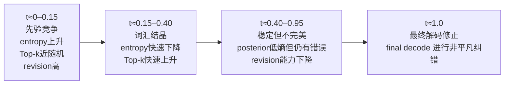
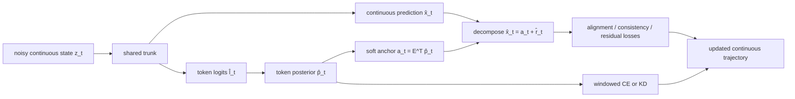
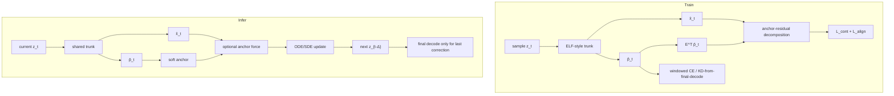

# 连续文本扩散中的词级承诺

## 执行摘要

直接回答你的核心问题：**token-level commitment 这件事，在连续文本扩散文献里已经被“间接讨论过”、被“局部测量过”、也被“部分控制过”，但还没有被当作一个统一、系统、针对 ELF-style continuous flow 轨迹本身的中心研究对象来做。** 现有论文更常用的词不是 *commitment*，而是 *token recovery*、*token rounding*、*anchor tokens*、*endpoint posterior*、*soft token evolution*、*hidden-state recovery* 或 *per-token noise schedule*。最接近你当前问题的直接先行工作有三类：一类是 **CoDAR** 对“最终 token rounding / final projection”瓶颈的诊断；一类是 **LangFlow** 对连续模型在不同噪声水平下 token posterior 演化的可视化；另一类是 **ADLM / NeoDiff / Diffusion Forcing / EvoToken-DLM / CCDD** 这类把 token 重要性、per-token 调度、soft token 演化或连续–离散联合状态显式纳入建模的工作。citeturn5view0turn25view0turn5view5turn5view4turn17academia0turn16view1turn16view0

这意味着：**如果论文主张只是“我们把 continuous 和 discrete 统一”“我们加了 anchors”“我们做 per-token schedule”——新颖性会很弱。** 因为 **NeoDiff** 已把“统一连续与离散文本扩散”写进标题；**CCDD** 已显式在连续表示空间与离散 token 空间的并集上做联合扩散；**ADLM** 已把“anchor”提升为核心机制；**Diffusion Forcing**、**SeqDiffuSeq**、**InfoDiffusion** 已明确表明 sequence diffusion 的时间/噪声不需要全局同步；**EvoToken-DLM** 甚至已经把“从 soft token distributions 渐进过渡到离散输出、支持 revisable decoding”摆到中心位置。citeturn5view4turn16view0turn5view5turn17academia0turn18view2turn16view4turn16view1

但反过来，**如果你把问题收缩到 ELF-style continuous trajectories 本身：先测量其中 emergent lexical commitment 的发生时机、稳定性与可修正性，再控制这件事，而不是简单地把更多 CE 或更多 discrete state 硬塞回去——这条路依然很有机会是新的。** 截至目前的公开文献里，**ELF** 强调的是“几乎全程连续、只在最终时刻离散化”；**LangFlow** 虽然在附录里可视化了 token posterior 随噪声水平的变化，但并没有把它系统上升为 *commitment phases*；**CoDAR** 证明了 final rounding 是瓶颈，但解决手段是加一个更强的 AR discretizer；**DiHAL** 则说明连续–离散接口的几何选择很重要，但它绕开的方式是改“扩散进入 LM 的层位”，而不是研究连续轨迹内部何时、如何产生可修正的词级承诺。citeturn4view0turn25view0turn5view0turn21view0

因此，我认为最稳妥也最有力的 framing 不是“progressive anchoring”本身，而是：

> **Measuring and Controlling Revisable Lexical Commitment in ELF-style Continuous Diffusion Language Models**

也就是说，先把 **“ELF 何时 commit、commit 得是否过早过硬、final decode 到底纠正了什么”** 这件事做成一个扎实的诊断故事，再提出 **revisable lexical anchoring**：不是让模型“更早 commit”，而是让它“**更准地 commit，且 commit 之后仍有 revision ability**”。你上传的两份中文内部报告已经很准确地抓到了“schedule 比 state-space 二元对立更关键”“anchor / residual 值得分开谈”这两点；在补上这轮一手文献核查后，最重要的修正只是：**novelty 必须从“统一 continuous/discrete”收缩到“可测、可控、可修正的 commitment dynamics”**。fileciteturn0file0 fileciteturn0file1

## 术语与问题形式化

为了避免和现有论文各说各话，我建议把你要研究的对象先形式化。对于任意连续文本扩散模型，设在时间 \(t\) 的连续状态为 \(z_t\)，再通过一个 probe head、共享 LM head、或最终 decoder 的轻量版本诱导出每个位置 \(j\) 的 token posterior：
\[
p_{t,j} \in \Delta^{|V|-1}.
\]
在这个写法里，**“discretization”** 是把 \(p_{t,j}\) 变成离散 token；而 **“commitment”** 则是 \(p_{t,j}\) 的质量和稳定性属性，和是否已经执行 argmax 不是一回事。这个区分正是 ELF / CoDAR / LangFlow 三篇文献合起来最清楚地暗示出来的：ELF 明确把显式离散化推迟到最后；CoDAR 说明最终 token projection 是一个单独瓶颈；LangFlow 则直接画出了连续模型的 posterior 会随着噪声水平而改变。citeturn4view0turn5view0turn25view0

在这个框架下，我建议把 **commitment** 定义成“低熵 + 后续稳定”的二元事件，而不是“当前 top-1 看起来像个词”。一种可操作定义是：
\[
C_{t,j}(\tau,\delta)=
\mathbf 1\!\left[
H(p_{t,j})<\tau
\ \land\
\mathrm{JSD}(p_{t,j},p_{t+\Delta,j})<\delta
\right].
\]
这里 \(\tau\) 控制“posterior 是否已经足够尖锐”，\(\delta\) 控制“它在后续去噪中是否基本不再变化”。如果你要比较不同模型，最好再区分 **correct commitment** 与 **wrong commitment**：前者满足 \(\arg\max p_{t,j}=y_j\)，后者不满足。这种把“commitment”从“one-shot argmax”拆成“posterior concentration + temporal persistence”的定义，在现有论文里还没有成标准术语，但和 CoDAR 的 token recovery、LangFlow 的 posterior evolution、EvoToken-DLM 的 revisable soft token states，以及离散 DLM 中 latent tokens / joint prediction 的解释是对齐的。citeturn5view0turn25view0turn16view1turn21view2

**Anchoring** 则建议定义为：连续状态相对于词表 anchor manifold 的对齐程度。给定 anchor 矩阵 \(E\in\mathbb R^{|V|\times d}\)，定义 soft anchor
\[
a_{t,j}=E^\top p_{t,j},
\]
则某位置的 anchoring distance 可以写成
\[
D^{\text{anchor}}_{t,j}=\|x_{t,j}-a_{t,j}\|_2,
\]
其中 \(x_{t,j}\) 是连续分支预测的 clean representation。这个定义和文献里的两个“anchor”传统都兼容，但又更严格：**ADLM** 的 anchoring 指的是“重要 token 不应太早被 mask”；**Difformer** 的 anchor loss 指的是“embedding space 不能 collapse”；而你这里的 anchoring 是“**continuous state 与 token manifold 的几何对齐**”。三者相关，但不是同一件事。citeturn5view5turn24academia2

**Residual** 在你的语境里最好定义成“当前连续表示中无法由 soft lexical anchor 解释的那部分上下文语义”：
\[
r_{t,j}=x_{t,j}-E^\top p_{t,j}.
\]
于是可以把连续预测写成
\[
x_{t,j}=E^\top p_{t,j}+r_{t,j}.
\]
这个定义非常重要，因为它让“靠近 token anchor”与“保留连续语义自由度”不再互相排斥。需要特别说明的是，这里说的 residual **不是** 2026 年 **Residual Context Diffusion** 里的 residual——后者指的是把离散 dLLM 中被丢弃 token 的上下文表征回收回来；它并没有做“lexical anchor + contextual residual”的分解。就目前检索到的核心连续文本扩散文献看，我**没有发现**有论文把这种 anchor-residual decomposition 明确作为 continuous text DLM 的主要建模接口，这反而是你最有希望成为真正新增点的部分之一。citeturn22academia2turn5view0turn18view0

**Revision ability** 可以定义成：在一个位置已经出现低熵 posterior 之后，模型后续仍能否在必要时修正它。最直接的 operationalization 是
\[
R_{t,j} = \mathrm{JSD}(p_{t,j}, p^{\mathrm{final}}_{1,j}),
\]
或更离散地看 top-1 是否发生变化：
\[
\Delta^{\text{top1}}_{t,j}
=
\mathbf 1\!\left[
\arg\max p_{t,j}\neq \arg\max p^{\mathrm{final}}_{1,j}
\right].
\]
如果一个位置在 \(t\) 已经 commitment 很强，但 \(R_{t,j}\) 依然显著，则说明这个 commitment 其实是不成熟、可被最终 decoder 改写的。**EvoToken-DLM** 把“hard masks and discrete assignments hinder the revision of early decisions”说得很直接；你要做的是把这种 revision 概念搬到 ELF-style continuous trajectories 上，并把它量化。citeturn16view1

最后，**final projection burden** 我建议定义成“最终离散接口额外承担的纠错量”。如果 \(p_{t}^{\mathrm{probe}}\) 是终点前连续状态的 probe posterior，而 \(p_{1}^{\mathrm{decode}}\) 是真正最终 decode branch 的 posterior，那么可以定义
\[
\mathrm{FPB}
=
\mathbb E\!\left[
\mathrm{CE}(y,p_{t^-}^{\mathrm{probe}})
-
\mathrm{CE}(y,p_{1}^{\mathrm{decode}})
\right],
\]
也可以直接用 final revision rate 度量。这个概念本质上是把 **CoDAR** 的 *token rounding bottleneck* 和 **DiHAL** 的 *continuous-to-discrete recovery problem* 重新写成一个可度量指标。它不是现成术语，但和当前文献的问题意识完全一致。citeturn5view0turn21view0

## 核心文献与比较表

现有文献大体可以沿两条轴组织。第一条轴是**状态空间**：离散 token、simplex/logit simplex、embedding、latent/contextual encoding、joint continuous–discrete。第二条轴是**离散承诺时序**：全程 token-level、沿 trajectory 持续 soft token supervision、final-only decoder、或 per-token/non-simultaneous schedules。把这两条轴合起来看，你的问题就不再是“continuous vs. discrete”，而是“**模型在何时、以多强的方式，用 token manifold 约束 continuous state**”。这也是你上传的两份中文报告一直在强调、而这次一手文献核查进一步确认的关键点。fileciteturn0file0 fileciteturn0file1

下面这张表只保留和你问题最相关的主干论文。表中的 “CE schedule” 一栏按**token-level supervision 在轨迹中的进入方式**来写；其中“摘要未明确”表示公开摘要没有足够细节，若论文写作要更严格，建议后续逐篇核实正文实现。

| paper | year | state-space | CE schedule | per-token time? | residual? | probes? | main finding re: commitment |
|---|---:|---|---|---|---|---|---|
| D3PM, DOI 10.48550/arXiv.2107.03006 citeturn12view1 | 2021 | discrete token / CTMC | VLB + auxiliary CE，全程离散 | 否 | 否 | 无直接 commitment probe | 离散 forward kernel 的设计会直接改变 reverse 难度；本质上从一开始就在 token space 中承诺。 |
| Diffusion-LM, DOI 10.48550/arXiv.2205.14217 citeturn12view0turn30academia3 | 2022 | continuous embedding | 摘要未强调 per-step token CE；主线是连续 denoising 到 word vectors | 否 | 否 | 无直接 probe | 连续 latent 使复杂 controllable generation 更自然，但 commitment / rounding 不是主研究对象。 |
| CDCD, DOI 10.48550/arXiv.2211.15089 citeturn5view3turn23academia2turn9view0 | 2022 | continuous time + continuous input for categorical data | 连续 categorical posterior / CE-like 家族 | 否 | 否 | 无直接 probe | 尝试保留 continuous diffusion 的优势而不放弃 categorical data；更像“沿程 soft token 对齐”，不是 final-only。 |
| TESS, DOI 10.48550/arXiv.2305.08379 citeturn5view2turn9view3turn9view4turn9view5 | 2023/2024 | logit simplex | per-step CE | 否 | 否 | self-conditioning ablation | 在 simplex 上做 fully NAR text diffusion，本质上是高耦合 lexical supervision。 |
| LD4LG, DOI 10.48550/arXiv.2212.09462 citeturn18view1 | 2022/2023 | latent autoencoder space | final decoder-centric | 否 | 否 | 无直接 probe | 把词级承诺推迟到 latent-to-text decoder，说明 final-only discretization 是一条清晰路线。 |
| TEncDM, DOI 10.48550/arXiv.2402.19097 citeturn18view0 | 2024/2025 | contextual encodings + decoder | final/decoder-centric | 否 | 否 | encoder/decoder/scheduler/self-conditioning ablation | contextual encodings 与 context-aware decoder 很重要，但未显式分析 mid-trajectory token commitment。 |
| MDLM, DOI 10.48550/arXiv.2406.07524 citeturn11view0turn26view1 | 2024 | masked discrete tokens | per-step weighted masked CE / MLM mixture | 否 | 否 | 无 direct timewise probe | 全程 token-level supervision 可以非常强，说明“持续 commitment”并非天然坏设计。 |
| Diffusion Forcing, DOI 10.48550/arXiv.2407.01392 citeturn17academia0 | 2024 | scheduler paradigm over sequences | 依 base model 而定 | **是**，独立 per-token noise levels | 否 | 无 direct commitment probe | 关键启发不是 state-space，而是 sequence diffusion 的噪声/条件接口可以是 token-wise、非同步的。 |
| ADLM, DOI 10.48550/arXiv.2505.18456 citeturn5view5turn22academia0 | 2025 | discrete masked DLM + anchor network | 两阶段离散 likelihood / anchor prediction | **是**，重要 token 得到特殊对待 | 否 | 无 direct timewise probe | “重要 token 过早被 mask 会伤害重建”，anchoring 直接改善 likelihood 与 sample quality。 |
| NeoDiff, DOI 10.48550/arXiv.2505.22165 citeturn5view4 | 2025 | hybrid continuous–discrete perspective | 摘要未明确 | **是**，time predictor 按 token semantics 调节 denoising progress | 否 | 无 direct probe | 公开地把“统一连续与离散文本扩散”作为目标，但核心控制杠杆是 non-simultaneous / per-token timing。 |
| CCDD, DOI 10.48550/arXiv.2510.03206 citeturn16view0 | 2025/2026 | joint continuous + discrete spaces | 联合 denoising | 否 | 否 | 无 direct probe | 最接近“joint state”思想的先行工作之一，但重心是 expressivity / trainability 与 latent reasoning。 |
| FLM/FMLM, DOI 10.48550/arXiv.2602.16813 citeturn10view0turn10view1turn10view2turn10view4 | 2026 | continuous flows over one-hot / simplex geometry | per-step CE；再做 flow-map distillation | 否 | 否 | few-step / distillation comparisons | 说明 continuous flow 不必等于 embedding diffusion；只要尊重 simplex geometry，也能把 token-level commitment 做得很强。 |
| LangFlow, DOI 10.48550/arXiv.2604.11748 citeturn8view1turn9view0turn9view2turn25view0 | 2026 | embedding-space continuous flow | per-step token CE，且被解释为 endpoint posterior / Bregman objective | 否（global learnable scheduler） | 否 | **有**：posterior-vs-noise、NND、entropy/NFE、SC dynamics | 连续 DLM 可以追平离散 DLM；但 lexical supervision 仍是沿 trajectory 常开，而不是专门研究 commitment timing。 |
| CoDAR, DOI 10.48550/arXiv.2603.02547 citeturn5view0turn22academia3 | 2026 | continuous embedding + contextual AR decoder | final strong decoder / contextualized rounding | 否 | 否 | **有**：controlled token-recovery study | final token rounding 是连续 DLM 的主要瓶颈之一；最终离散器的能力直接决定文本质量。 |
| ELF, DOI 10.48550/arXiv.2605.10938 citeturn4view0turn26view0turn0file0 | 2026 | frozen contextual embedding flow | **final-only decode CE**，主体是 continuous denoising / flow loss | 否 | 否 | 未报告 direct intermediate token-belief probe | 明确把显式离散承诺推迟到最终时刻，并利用 shared-weight network + CFG 等连续生成工具。 |
| EvoToken-DLM, DOI 10.48550/arXiv.2601.07351 citeturn16view1 | 2026 | soft token distributions in discrete DLM | continuous trajectory supervision + progressive soft-to-hard tokens | 否 | 否 | revisable decoding mechanism | 把“soft intermediate token states 支持 revisable decoding”写成了核心卖点，但它仍属于 discrete DLM 侧。 |

这张表最重要的结论是：**文献里已经存在三种非常接近你想法的“半步相邻物”**。第一种是 **时间调度型**，如 Diffusion Forcing、NeoDiff、ADLM、InfoDiffusion、SeqDiffuSeq；第二种是 **离散接口型**，如 CoDAR、DiHAL、LD4LG、TEncDM；第三种是 **soft token evolution / joint state 型**，如 EvoToken-DLM、CCDD。也正因为如此，你的 novelty 不能停留在“我们也做 schedule / anchor / 联合 continuous-discrete”。真正还比较空的是：**在 ELF-style final-only continuous trajectory 内部，系统测量并控制 emergent token commitment 本身。** citeturn17academia0turn5view4turn5view5turn16view4turn18view2turn5view0turn21view0turn18view1turn18view0turn16view1turn16view0

## 文献中已有的探针与实证发现

如果只问“有没有人直接测量 continuous DLM 里 token commitment 的形成过程”，答案是：**有一点，但很不系统。** 在我检索到的公开文献里，最接近这个问题的直接探针其实来自 **LangFlow** 的附录，而不是 ELF。LangFlow 在附录 D.1 里画出了一个代表性 token 的 posterior 随噪声水平变化：随着噪声增大，posterior 会从 ground-truth token 转向语义相近的候选，再转向高频功能词；作者把这解释为从 semantic uncertainty 向 frequency-dominated uncertainty 的过渡。这个结果非常重要，因为它至少说明了：**连续 embedding DLM 的中间状态并不是“纯连续而不可读”的，它们可以诱导出可解释的 token posterior dynamics。** 但同时也要看到，它只是为分析 self-conditioning 服务的 exemplar-level 图，不是系统性的 commitment probe。citeturn25view0

第二类直接相关的 probe 来自 **CoDAR**。CoDAR 不是沿时间画 posterior，而是做了一个 **controlled token-recovery study**，并由此得出一个清晰结论：连续 DLM 的主要瓶颈之一是**最终从 denoised embeddings 到 tokens 的 rounding**。这和你现在定义的 **final projection burden** 几乎是一回事，只是 CoDAR 用的是“最终投影瓶颈”而非“最终修正负担”的语言。这个结果的启发是：如果你后续的 probe 发现 ELF 在中间已经形成较强 lexical belief，但 final decode 还要大幅修正，那你其实是在把 CoDAR 的结论进一步细化成“**final correction 究竟什么地方在工作**”。citeturn5view0

第三类 probe 更偏几何与稳定性，而不是 token belief。**Difformer** 和 **LangFlow** 都关注 continuous text DLM 的表示空间是否塌缩。Difformer 直接提出 **anchor loss** 来缓解 embedding-space collapse；LangFlow 则在附录里用 vocabulary embeddings 的 **nearest-neighbor distance** 分布来比较不同连续/离散模型，并报告用 MSE 直接回归 denoised embeddings 会导致 embeddings 聚在一起，NND 异常偏小。LangFlow 还指出，Plaid 这类 likelihood-based continuous 模型虽然也带 decoder CE，但若主体目标沿用 embedding MSE，仍可能造成 token embeddings 不可分。对 commitment 研究而言，这类结果的意义在于：**若 continuous state 本身几何已经塌缩，那么你后来观察到的“commitment”可能只是 collapse 的副作用，而不是语义正确的 lexical crystallization。** 因此，几何探针是 commitment probe 的前置健康检查。citeturn24academia2turn25view0turn28view0

第四类 probe 关注**采样区间**而非 token posterior。**Why Gaussian Diffusion Models Fail on Discrete Data?** 用 toy Random Hierarchy Model 指出了一个 **critical sampling interval**：在这个区间里，noisified density 变成多峰，DDPM 容易跑到模式之间的低密度区，导致 out-of-distribution inputs 和样本质量下降；作者还发现 self-conditioning 与 q-sampling 尤其在这个关键区间内有帮助。这个思路和你现在关心的“某一段时间窗口里 commitment dynamics 发生了什么”高度同构，只不过他们看的是多峰密度与 solver 失效，而你要看的是 lexical crystallization、plateau 与 final correction。citeturn16view3

第五类 probe 来自 **Language Diffusion Models are Associative Memories**。这篇工作不研究 continuous embedding flow，但它给了一个极有价值的测量范式：作者通过比较训练集与测试集的 **token recovery**，再用 **conditional entropy of predicted token sequences** 检测从 memorization regime 到 generalization regime 的转变。它说明，**conditional entropy 不是一个只能用在整体样本级别的粗指标，它还可以作为检测“模型当前处于哪种恢复/吸引 basin”的诊断信号。** 如果你把这个思路搬到 continuous DLM 的时间轴上，conditional entropy 就非常自然地变成 commitment probe 的主指标之一。citeturn21view1

第六类 probe 更偏 “接口位置是否适合 diffusion”。**DiHAL** 不直接测 token commitment，但它用 **geometry-based proxies** 来选 diffusion 应该插入到预训练 Transformer 的哪一层 hidden state，并在 diagnostic comparison 中比较 hidden-state recovery。它的核心信息是：**不是任何连续接口都 equally diffusion-friendly。** 对你来说，这意味着 probe head 也会影响你测到的 commitment：如果你用 final LM head、auxiliary probe head、或 mid-layer hidden-state head，得到的 \(p_t\) 可能不同。因此，你的 first paper 最好把 probe-head robustness 做成一个必要控制实验。citeturn21view0

把这些文献中的 probe 汇总起来，可以得到下表。

| metric / proxy | used in literature | what it measures | typical finding | relevance to commitment |
|---|---|---|---|---|
| controlled token recovery | CoDAR；Associative Memories citeturn5view0turn21view1 | 最终 token 恢复能力 / basin behavior | Continuous DLM 的最终 rounding 是瓶颈；conditional entropy 可区分 memorization vs generalization | **强相关**，但主要看 final interface，不看全文时间轴 |
| token posterior vs noise level | LangFlow Appendix D.1 citeturn25view0 | 单个 token 的 posterior 演化 | 从 ground-truth → 语义近邻 → 高频语法 token 的过渡 | **最接近中间 commitment probe**，但仍是 exemplar-level |
| nearest-neighbor distance of embeddings | LangFlow；Difformer；RePlaid citeturn25view0turn24academia2turn28view0 | embedding geometry 是否 collapse | MSE-style continuous objectives 容易压缩 token embedding geometry；anchor/likelihood 可改善 | 是 commitment probe 的前置几何健康检查 |
| critical interval / off-manifold regime | Why Gaussian Diffusion Models Fail… citeturn16view3 | 某些采样时段是否特别脆弱 | 多峰区间会把 solver 推入低密度区域；SC 和 q-sampling 有缓解作用 | 启发你不要只看全局平均，而要定位“关键 commitment window” |
| conditional entropy | Associative Memories；LangFlow 的 sample entropy 分析 citeturn21view1turn25view0 | token uncertainty / regime detection | vanishing entropy 对应 memorization；entropy 也可能混入 global frequency bias | 可作为 commitment 指标，但必须配合 top-k / revision 看 |
| hidden-state recovery geometry | DiHAL citeturn21view0 | 连续–离散接口是否选对 | 某些 LM hidden states 更适合作为 diffusion bridge | 提醒 probe head / state interface 本身就是变量 |
| information-aware / keyinfo-first schedules | InfoDiffusion；ADLM；NeoDiff；Diffusion Forcing；SeqDiffuSeq citeturn16view4turn5view5turn5view4turn17academia0turn18view2 | 重要 token 是否应有不同时间节奏 | 关键词/重要 token 往往不应与普通 token 同步 noising / denoising | 这是**控制 commitment** 而不是**测量 commitment**的主要现有路线 |

真正关键的空白，是下面这四个 metric 在连续文本扩散文献里**几乎还没有被标准地报告**：  
\[
\text{top-}k \text{ recovery vs } t,\quad
\|x_t-E^\top p_t\| \text{ vs } t,\quad
\|r_t\| \text{ vs } t,\quad
\Delta^{\text{top1}}(t,1)\ \text{或}\ \mathrm{JSD}(p_t,p_1^{decode}).
\]
换句话说，**top-k correctness、anchor distance、residual norm、revision delta** 这四条时间曲线，恰恰是你的 probe 最可能形成论文增量的地方。现有论文要么诊断 final rounding，要么诊断 geometry collapse，要么诊断 schedule；很少有人把“中间时间的 lexical belief 到底何时形成、何时冻结、何时又被最终 decode 改写”做成主问题。citeturn5view0turn25view0turn24academia2turn16view3turn21view1

## 空白、重叠与新颖性判断

如果现在就判断“我们的思路 novel 吗”，最诚实的结论是：**大方向不新，具体切口仍然可能新。** 这不是坏消息，反而是好事，因为它会迫使你把 claim 收得更准。基于当前公开文献，下面这些说法我都不建议作为主 claim：

| 可能的 claim | closest prior | verdict |
|---|---|---|
| “我们统一 continuous 和 discrete text diffusion” | NeoDiff；CCDD citeturn5view4turn16view0 | **不新** |
| “我们提出 anchored diffusion / anchor tokens” | ADLM；Difformer citeturn5view5turn24academia2 | **不新** |
| “我们做 per-token / non-simultaneous schedule” | Diffusion Forcing；NeoDiff；SeqDiffuSeq；InfoDiffusion citeturn17academia0turn5view4turn18view2turn16view4 | **不新** |
| “我们支持 revisable decoding through soft token states” | EvoToken-DLM citeturn16view1 | **在离散 DLM 上已不新** |
| “我们发现 final projection / rounding 是瓶颈” | CoDAR；DiHAL citeturn5view0turn21view0 | **不新** |

但下面这些更窄的 claim，仍然很有机会是新的，或者至少是“当前文献中没有被系统做过”的：

首先，**在 ELF-style final-only continuous flow 中，系统地测量 emergent token commitment 的时间结构**。这里的“系统”有三层含义：一是全模型、全数据、全时间轴，而不是一个示例 token；二是同时报告 entropy、top-k recovery、anchor distance、revision delta、final projection burden，而不是只画一个 posterior 图；三是 probe-head robustness 做齐，说明现象不是某个 readout 的 artifact。**LangFlow** 最接近这件事，但它做的是一个附录里的 self-conditioning dynamics 小分析；**ELF** 自己没有报道；**CoDAR** 也主要盯终点 recovery。只要你把这套 probe 做扎实，分析维度就已经明显比现有工作更系统。citeturn25view0turn4view0turn5view0

其次，**把“stable-but-imperfect plateau”与“final decode correction”明确识别出来，并证明这不是 discrete DLM 的旧现象在 continuous DLM 上的翻版，而是 ELF-style final-only design 的特定 failure mode。** 现有文献当然都知道 diffusion 会迭代修正，但“模型在中期已经 lexicalized，却仍然有一块 correction burden 被终点分支独占”这个叙事，目前最接近的是 CoDAR 的 rounding bottleneck。也就是说，如果你能展示：continuous trajectory 其实早已形成低熵 posterior，但它在后半程 revision ability 明显变差，而 final decode 在做非平凡纠错，这会是对 CoDAR 的实证细化，而不是简单重复。citeturn5view0

再次，**在不放弃 ELF 主体结构的前提下，把 final decoder 的纠错能力“蒸馏回轨迹中”**。目前我没有在检索到的核心工作里看到直接等价的方案。最接近的是：**EvoToken-DLM** 用 soft token evolution 让 discrete DLM 更可修正；**CCDD** 让 continuous 与 discrete 联合 denoise；**CoDAR** 直接上一个更强的 AR decoder；**LangFlow** 则用沿轨迹的 posterior/CE 监督。但 **“以 ELF 为底座，直接用 final decode distribution 去监督 plateau 区间的 intermediate posterior”** 这件事，我没有找到直接对应的一手论文。这意味着 **KD-from-final-decode** 很可能是个好增量。citeturn16view1turn16view0turn5view0turn9view0

最后，**anchor-residual decomposition** 是目前最值得推进的潜在新增点。就我检索到的核心 continuous text-DLM 论文而言，没有论文把
\[
x_t = E^\top p_t + r_t
\]
作为“词级承诺与连续语义自由度之间的结构分工”来建模。Difformer 的 anchor loss 是防 collapse；ADLM 的 anchor 是重要 token；RCD 的 residual 是回收离散 dLLM 的 discarded context；都不等于这个分解。如果你能证明这种分解可以同时降低 final projection burden、保住 sample diversity，并提高 plateau 区间的可修正性，那么它会比单纯加个 CE schedule 更新。citeturn24academia2turn5view5turn22academia2

因此，我的判断是：**“Revisable Lexical Anchoring” 作为研究 framing 是可以成立的，但前提是你把 novelty 放在 diagnostics + correction dynamics + anchor-residual decomposition 上，而不是放在“统一 continuous/discrete”本身。** 你上传的两份中文报告已经非常接近这个结论；加入这轮一手文献后，主要只是进一步收紧了边界。fileciteturn0file0 fileciteturn0file1

## 可控承诺的方法图谱

从现有文献看，**控制 commitment** 的机制可以分成七类，其中前五类已有明确先行工作，后两类是我认为你最值得做的扩展。

第一类是 **final-only discretization**。这是 ELF 的核心极值设计：主体轨迹几乎完全在连续 embedding space / contextual encoding space 上走，直到终点才映射到 token。它的优点是最大程度保留连续轨迹自由度，也最自然地继承 CFG、SDE、trajectory editing 等连续生成工具；缺点是如果终点分支承担了太多 lexical correction，最终离散接口就会变成系统 bottleneck。CoDAR 之所以要引入 contextual AR discretizer，本质上就是在修这个问题。citeturn4view0turn5view0

第二类是 **always-on lexical supervision**，也就是沿 trajectory 常开 token-level CE 或 simplex/token posterior loss。TESS、FLM/FMLM、LangFlow、MDLM 的主干都可以归在这类，只是状态空间不同：TESS 在 logit simplex，FLM 在 one-hot 连续化，LangFlow 在 embedding flow，MDLM 在 masked discrete tokens。它们的共同特点是：**词级承诺从来不是“最后才发生”的，而是沿程持续存在。** 这类方法很强，但如果你的目标是保持 ELF-style continuous freedom，就不能直接照搬；否则你其实是在向 LangFlow/TESS/FLM 那一侧移动。citeturn9view5turn10view0turn9view0turn26view1

第三类是 **per-token / non-simultaneous schedules**。Diffusion Forcing 用 independent per-token noise levels 明确证明 sequence diffusion 的噪声接口可以是 token-wise 的；NeoDiff 进一步在文本扩散里引入 Poisson forward process 与 time predictor，让不同 token 的 denoising progress 按语义适配；ADLM 则从离散 masked DLM 角度说明“重要 token 不应该过早丢失”；InfoDiffusion 与 SeqDiffuSeq 也都已经尝试过 keyinfo-first 或 token-position-specific schedules。换句话说，**“时机是变量”这件事本身已经被文献接受。** 真正还有空间的，是把这个 token-wise scheduling 从“noising schedule”推进到“**lexical coupling schedule**”。citeturn17academia0turn5view4turn5view5turn16view4turn18view2

第四类是 **anchor / alignment mechanisms**。ADLM 在离散 DLM 里用 anchor network 预测重要 token；Difformer 在 embedding diffusion 里用 anchor loss 防止 embedding collapse；DiHAL 则用 geometry-based proxies 选更“适合被 diffusion 替换”的 hidden-state interface。这些工作共同说明：**连续与离散之间的接口几何可以且应该被显式建模。** 但它们还没有把这个接口写成“时间可调度的 lexical anchoring coefficient \(\alpha(t)\)”这种形式。citeturn5view5turn24academia2turn21view0

第五类是 **joint continuous–discrete denoising**。CCDD 是这条线的代表：直接在连续表示空间与离散 token 空间的并集上定义联合扩散过程，让一个模型同时在联合空间 denoise。它和你的想法最像，但 focus 不一样：CCDD 的核心是表达能力与 latent reasoning，而不是测量/控制 ELF-style trajectory 中连续到离散承诺的形成节奏。citeturn16view0

第六类是 **soft intermediate token states for revisability**。EvoToken-DLM 显式指出 hard masks 与 early discrete assignments 会妨碍 revision，并用 evolving soft token distributions 取代它们。它说明 “revisable decoding” 不是异想天开，而是已经进入 diffusion LM 的 vocabulary。这对你很重要，因为它允许你更安全地把论文 framing 改成 **revisable lexical commitment**。但它仍然主要站在 discrete DLM 一侧，因此它不是你的直接竞争对象，而更像是“离散侧已经承认 revisability 值得研究”的证据。citeturn16view1

第七类就是我建议你重点推进的两项新机制：**decode distillation** 与 **anchor-residual decomposition**。它们不是从零开始发明的，而是把已有文献中的两个洞补在一起。

第一项可以写成：
\[
\mathcal L_{KD}(t)=w(t)\,\mathrm{KL}\!\left(p^{\text{decode}}_{1}\,\|\,p^{\text{probe}}_{t}\right).
\]
这里 teacher 是终点 decode branch 或 CoDAR-style 强 discretizer，student 是中后期 trajectory 的 probe posterior。直觉很简单：既然 CoDAR 已证明终点 decoder 学到了连续轨迹本身不具备的 rounding / correction ability，那最自然的下一步就是**把这份能力往前蒸馏回去**，而不是一味加更多 per-step CE。它的优点是直接针对 final projection burden；缺点是 teacher 太尖锐时可能造成过硬 coupling，尤其在 early phase。可通过只在 plateau window 开启、或配合 temperature-softening 缓解。这个机制的直接 antecedent 不是某篇“同题目”论文，而是 CoDAR 的 final discretizer 诊断与 LangFlow 的 trajectory posterior 一起给出的空间。citeturn5view0turn25view0

第二项是：
\[
x_t = E^\top p_t + r_t,
\qquad
\mathcal L_{\text{align}}=\|x_t-E^\top p_t-r_t\|_2^2.
\]
它的核心不是逼 \(x_t\) 完全等于 anchor，而是承认 continuous contextual states 本来就不应塌缩成静态 token embedding；真正要做的是把 **lexical identity** 放进 \(E^\top p_t\)，把 **contextual semantics / revision capacity** 放进 \(r_t\)。这类分解的优点，是它比“直接 decode / 直接 soft projection”更能保住 continuous flow 的表达力；缺点，是会带来 identifiability 问题，模型可能把所有东西都塞给 residual。为此，可以在后期只对 residual norm 做温和约束，而不是暴力压零。就当前检索到的连续文本扩散文献而言，这一结构是我认为最有希望成为真正论文新增点的部分。citeturn18view0turn24academia2turn22academia2

把这些机制整理成一个“控制承诺”的工作表，可以写成下面这样：

| mechanism | status | closest antecedents | pros | cons |
|---|---|---|---|---|
| final-only decode | existing | ELF；LD4LG；TEncDM；CoDAR citeturn4view0turn18view1turn18view0turn5view0 | 保留 continuous freedom；便于 CFG/SDE | final projection burden 可能过大 |
| always-on token CE | existing | TESS；FLM/FMLM；LangFlow；MDLM citeturn9view5turn10view0turn9view0turn26view1 | lexical validity 强；few-step/one-step 友好 | 容易过早硬化 trajectory |
| per-token schedule | existing | Diffusion Forcing；NeoDiff；SeqDiffuSeq；ADLM；InfoDiffusion citeturn17academia0turn5view4turn18view2turn5view5turn16view4 | 明确控制“何时 denoise 哪些 token” | 多数仍在控制 noising，而非 commitment |
| anchor / geometry loss | existing | Difformer；ADLM；DiHAL citeturn24academia2turn5view5turn21view0 | 接口稳定；防 collapse | 不等于可修正的 lexical commitment |
| joint continuous-discrete denoising | existing | CCDD citeturn16view0 | 概念上最统一 | 改动 backbone 大；不再是 ELF-style 最小改动 |
| soft token evolution | existing | EvoToken-DLM citeturn16view1 | revisability 明确 | 主要在 discrete DLM 侧 |
| KD from final decode to intermediate states | **proposed** | motivated by CoDAR + LangFlow citeturn5view0turn25view0 | 直接降低 final projection burden | teacher sharpness / calibration 风险 |
| revision-aware loss | **proposed** | motivated by EvoToken-DLM + CoDAR citeturn16view1turn5view0 | 专门攻击 stable-but-imperfect plateau | 需要定义 revision set，训练逻辑更复杂 |
| anchor-residual decomposition | **proposed** | nearest related: Difformer / TEncDM / RCD citeturn24academia2turn18view0turn22academia2 | 同时保留 lexical grounding 与 semantic freedom | identifiability 难题 |
| inference-time anchor force | **proposed** | analogous to guidance / schedule control citeturn4view0turn17academia0 | 尤其可能帮助 few-step | 若 anchor 置信度不足，会把轨迹拉偏 |

## 建议的实验设计与图示

最小可发表证据链，其实只需要三步。第一步，**把 commitment dynamics 测清楚**；第二步，**证明 final-only 与 always-on 不是最优的两端极值**；第三步，**证明一种“可修正的中间策略”能降低 final projection burden 而不牺牲多样性**。这一顺序很重要，因为如果你在第一步还没有把 ELF 里的 commitment 是否已经自发出现、何时冻结、何时被 final decode 改写说清楚，后面的任何 schedule 都会显得像拍脑袋。现有文献已经分别证明了 final rounding、per-token schedule、soft token evolution、joint state 都值得研究；你真正缺的是把它们对到同一个 probe protocol 上。citeturn5view0turn17academia0turn16view1turn16view0

我建议的标准 probe protocol 如下。对每个时间 \(t\)，至少保留三种读出：其一是**probe LM head**（最接近你真正想研究的“continuous state 已包含多少 token belief”）；其二是**final decode branch 的兼容读出**（如果 ELF/CoDAR 有单独 decode mode，这个最能对应 final correction）；其三是**纯 unembedding probe**（简洁但容易有几何失配）。对每种读出，都记录  
\[
H_t,\quad \text{Top-}k\text{ recovery}_t,\quad
\mathrm{JSD}(p_t,p_1^{decode}),\quad
\|x_t-E^\top p_t\|,\quad
\|r_t\|.
\]
同时做 temperature sweep，避免“posterior 很尖只是 probe 温度太低”的伪现象。这个 protocol 的直接灵感来自 LangFlow 的 posterior dynamics、CoDAR 的 token recovery、Associative Memories 的 conditional entropy，以及 DiHAL 的“接口选择本身值得诊断”。citeturn25view0turn5view0turn21view1turn21view0

下面这张时间相图，是我认为最该做成 PPT 首页的图。它不是现成文献结果，而是你们应当以统一 probe 去验证、并用于组织结果章节的“phase map”。

只要这四阶段图能在 ELF checkpoint 上稳定复现，后续方法就有了非常清楚的 intervention target：**不是让模型更早开始 lexicalization，而是改善 B 阶段的 commitment quality、并保住 C 阶段的 revisability。**

对于模型干预，我建议先做最小两项，再做可选两项。第一项是 **windowed plateau KD**：
\[
\mathcal L_{KD}(t)=w(t)\,\mathrm{KL}(p^{decode}_1\|p_t),
\]
其中 \(w(t)\) 只在 你通过 probe 找到的 crystallization 后与 final decode 前窗口内启用。指标上看三件事：**final revision spike 是否下降、plateau 阶段 top-k recovery 是否上升、最终 Gen.PPL / PPL / entropy 是否不恶化**。如果这项干预有效，它几乎可以单独支撑“revisable lexical anchoring”这个故事。citeturn5view0turn25view0

第二项是 **anchor-residual branch**：
\[
x_t = E^\top p_t + r_t.
\]
这个实验的核心不是“最后分更高多少”，而是看三个机制指标：其一，\(\|x_t-E^\top p_t\|\) 是否下降；其二，\(\|r_t\|\) 是否在早期保留、后期自然变小，而不是从头到尾吸走一切；其三，final projection burden 是否下降。如果这套分解在 plateau 上能把 wrong commitment 纠到更少，而 diversity 没有像 always-on CE 一样明显塌缩，那它会比单纯 schedule 更有新意。它的最大风险是 identifiability，所以要做控制：比如 residual 停梯度版本、norm penalty 版本、late-only regularization 版本。citeturn18view0turn24academia2turn22academia2

可选的第三项是 **per-token coupling coefficient**，把 Diffusion Forcing / NeoDiff 的 token-wise timing 思想直接挪到 lexical coupling 上：
\[
\alpha_{t,j}
=
\alpha_{\max}
\left(1-\frac{H(p_{t,j})}{\log |V|}\right)^\gamma.
\]
这不是简单复制 Diffusion Forcing，因为你调度的不是 *noise level*，而是 *coupling strength*。如果你资源足够，这会是很漂亮的 extension；但如果首稿资源紧张，我反而建议把它放到第二篇或 appendix。citeturn17academia0turn5view4

可选的第四项是 **inference-time anchor force**，即在 few-step 采样时把
\[
\tilde x_t=(1-\alpha_t)x_t+\alpha_tE^\top p_t
\]
送回 velocity field。它最可能在 8–16 step regime 里有效，因为 few-step 下 final projection burden 会更尖锐；但它的风险也最大，因为一旦 \(p_t\) 早期不准，就会直接把 trajectory 拉离高密度区，这恰好会撞上 Why Gaussian Diffusion… 里说的 critical interval 风险。citeturn16view3

建议的实验表如下。

| experiment | metrics | expected outcome | risk |
|---|---|---|---|
| ELF trajectory probe | \(H_t\)、Top-k recovery、JSD\((p_t,p_1^{decode})\)、anchor distance、FPB | 找到 crystallization window、plateau 与 final correction | probe head / temperature artifact |
| probe-head robustness | 不同读出头之间的一致性、calibration、ECE | 若模式稳定，说明 commitment 是模型内部现象而非 readout 偏差 | 头之间几何差异太大，结论难对齐 |
| windowed CE / schedule sweep | PPL、Gen.PPL、entropy、Top-k at phase boundaries | late-window supervision 优于 all-step 与 final-only 两端 | 过强 CE 造成 diversity collapse |
| final-decode KD | revision spike、FPB、plateau top-k、最终质量 | 减少终点纠错负担，把 correction 提前学进轨迹 | teacher 过尖导致过硬 commitment |
| anchor-residual branch | anchor distance、residual norm、FPB、entropy | 更好地兼顾 lexical grounding 与 semantic freedom | residual 吸收一切，失去可解释性 |
| per-token \(\alpha_{t,j}\) | token-group metrics、rare/common token 分层结果 | 重要/低熵 token 更早稳定，不重要 token 更晚 commit | 校准差会让 schedule 学坏 |
| inference-time anchor force | 8/16-step sample quality、diversity、failure cases | few-step 质量改善 | critical interval 中 trajectory 被拉偏 |

下面这张图适合做模型总览页，它把“anchor-residual + revisable commitment”讲清楚。

最后，再给一张训练 / 推理干预的 pipeline 图。它最适合在方法页把 “为什么我们的改动不是 LangFlow/TESS 式全程 CE，也不是 CoDAR 式重 decoder” 讲清楚。

## 推荐的 framing 与下一步

我最推荐的 framing，不是“我们发明了一种 unified continuous-discrete text diffusion”，而是：

> **现有文献已经分别发现了 anchor tokens、per-token time schedules、soft token evolution、joint continuous-discrete states、以及 final token rounding bottlenecks；但对于 ELF-style final-only continuous trajectories，缺少对 token-level commitment 何时形成、何时冻结、以及终点 decoder 究竟在纠正什么的系统测量。我们提出一套 commitment diagnostics，并在此基础上设计 revisable lexical anchoring，在不放弃 continuous flow 自由度的前提下，把最终离散纠错能力蒸馏回中后期轨迹。**

这个 framing 的好处，是它同时避开了 **NeoDiff/CCDD/ADLM/EvoToken-DLM/CoDAR** 已经占住的 claim，又能把你真正想做的实验非常自然地组织起来。citeturn5view4turn16view0turn5view5turn16view1turn5view0

如果只能做最少的下一步，我建议就是这四件事。第一，**把 ELF 的 commitment probe 做成一个可复现脚本**，并且加上 probe-head robustness 与 temperature sweep。第二，**把 final projection burden 明确定义出来**，至少用 final revision rate 与 CE gap 两种口径都报。第三，先不要一上来做大而全的 joint model，只做两个最小干预：**plateau-window KD** 和 **anchor-residual decomposition**。第四，论文叙事从现在起统一改成 **revisable lexical anchoring**，不要再用 “ELF only commits at \(t=1\)” 当主前提；更安全的说法应该是“ELF postpones explicit discretization, but latent lexical commitment may emerge earlier and become prematurely rigid.” 这和你上传的两份报告在方向上是一致的，只是比原来的表述更符合现在的公开文献边界。fileciteturn0file0 fileciteturn0file1

如果你后面真要写 paper title，我会优先考虑下面三个版本，按稳妥程度排序：

**Measuring and Controlling Lexical Commitment in Continuous Diffusion Language Models**  
**Revisable Lexical Anchoring for Embedded Language Flows**  
**From Early Crystallization to Revisable Commitment in Continuous Language Diffusion**

这三种标题里，第二个最贴近你现在的直觉，第三个最有故事性，第一个最稳。综合目前文献图景，我最建议你走第一或第三种。