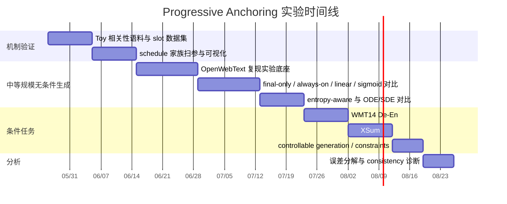

# 文本扩散统一框架中的渐进锚定

## 执行摘要

过去几年，文本扩散模型大致沿两条路线演化。第一条是**原生离散**路线，直接在 token 空间或其等价的离散马尔可夫链上做扩散，代表是 D3PM、DiffusionBERT、MDLM、Duo 与 E2D2；第二条是**连续表示**路线，把文本放到 embedding、simplex、one-hot 连续化或 latent/contextual encoding 空间里，再做 DDPM、SDE、ODE 或 Flow Matching，代表是 Diffusion-LM、CDCD、Difformer、DiffuSeq、SeqDiffuSeq、LD4LG、FLM/FMLM、LangFlow 与 ELF。到 2026 年，最强的离散 DLM 依然很强，但连续路线已经不再只是“概念上优雅、实证上偏弱”的配角：LangFlow 把 embedding-space continuous diffusion 拉到可与离散 DLM 相抗衡的水平，FLM/FMLM 在 few-step/one-step 上展示了连续 flow 的速度优势，而 ELF 则把“几乎全程连续、只在最后一步离散化”的设计做到非常有竞争力。citeturn13view6turn14view2turn14view0turn13view1turn15view0turn15view1turn25view0turn16view1turn10view1turn10view0turn9view0

把这些工作放到同一坐标系里，真正关键的变量并不只是“状态空间选 token / simplex / embedding / latent 哪一个”，而是**连续状态在多大程度、在什么时间节奏上，被 token manifold 或 vocabulary simplex 约束**。D3PM/MDLM 这一端的设计，本质上是让 token 结构在整个轨迹中都强势存在；LangFlow、FLM、CDCD、DiffuSeq 这类方法虽然在连续空间中演化，但通常仍在训练时沿轨迹持续施加 token-level cross-entropy 或 token posterior 约束；ELF 则把这件事推到另一个极端——几乎整条轨迹都保持连续，只在 \(t=1\) 时做离散化；而 CoDAR 进一步指出，单次 final projection 本身就可能成为连续 DLM 的主要瓶颈。citeturn20view0turn18view0turn10view0turn21view0turn20view3turn15view2turn15view3turn6view0turn8view1turn22view0

基于这条观察，本报告的核心判断是：**“continuous vs. discrete” 更像是一个表象；更本质的研究对象应当是 continuous embedding flows 与 discrete token anchors 之间的耦合时序**。你提出的 “Progressive Anchoring / Anchored Continuous Diffusion” 可以被严格表述为：令词表嵌入矩阵 \(E\) 充当离散锚点，令模型在连续状态 \(z_t\) 上演化，同时诱导一个 token belief \(p_t\in\Delta^{|V|}\)，再用 \(E^\top p_t\) 作为 soft anchor，把“语义连续输运”和“词汇离散承诺”通过可调度的 \(\alpha(t)\) 耦合起来。这与 Difformer 用 anchor loss 稳定 embedding diffusion、LangFlow 用 token-space posterior / Bregman 视角解释 CE、ELF 用 final-only interface 释放连续轨迹自由度、CoDAR 把 final rounding 作为瓶颈来分析，是高度一致的。这里“用锚合强度 schedule 统一 continuous/discrete 文本扩散”是对这些文献的综合归纳与向前延展。citeturn25view0turn21view3turn8view1turn22view0

从研究价值上看，最值得验证的命题不是“连续方法最终会不会战胜离散方法”，而是更窄、更有可验证性的命题：**固定极端并不是最优——全程强离散耦合与 final-only 耦合都可能次优，存在一个更好的 annealed / progressive coupling schedule。** 如果在统一模型、统一数据、统一采样步数与统一评测预算下，线性、sigmoid 或 entropy-aware 的 anchoring schedule 能同时改善 quality–diversity frontier、embedding-token consistency 与 conditional task success，那么这个方向就不仅是“直觉上自然”，而是会成为一条可以系统推进的研究路径。ELF 已经证明了 final-only 极端的价值，MDLM/Duo/TESS/FLM/LangFlow 则证明了强 token 耦合或 token-aligned supervision 的价值；空白恰恰在于**把耦合作为一等公民来调度**。citeturn9view0turn18view0turn17search2turn14view3turn21view0turn10view0

## 问题定义与统一视角

设词表为 \(V\)，序列为 \(y=(y_1,\dots,y_L)\)，token anchor 矩阵为 \(E\in\mathbb R^{|V|\times d}\)。对文本扩散而言，现有方法实际上都在回答同一个问题：**在一个随时间变化的状态 \(s_t\) 上，如何从噪声走向文本，并在何时把这个状态重新对齐到 vocabulary 的离散结构**。沿着这个统一抽象，历史方法主要在两个维度上不同：一是状态空间 \(\mathcal S\) 属于 token、simplex、Euclidean embedding 还是 latent/contextual manifold；二是离散结构在训练与推理过程中以什么方式进入轨迹——全程、末端，还是潜在地可调度地进入。ELF 的 Appendix survey 实际上已经把“state”和“train / infer per-step discretization”分开列出，这一点非常接近你要做的统一视角。citeturn29view0

一个对“Progressive Anchoring”更直接的统一写法是：令连续主状态为 \(z_t\)，再由一个 token-aligned 读出头得到
\[
p_t = D_\phi(z_t,t)\in\Delta^{|V|},
\]
并定义 soft anchor 为
\[
\bar e_t = E^\top p_t.
\]
这样，\(z_t\) 表示连续语义流形上的位置，\(p_t\) 表示“当前这个位置对哪些 token anchor 有多大归属概率”，而 \(\bar e_t\) 则是这一 belief 在锚点集合上的加权重心。**离散化不再只意味着 argmax**；它也可以意味着“让连续状态逐渐更强地受 \(\bar e_t\) 的吸引”。这使“离散”从一种空间选择，变成一种**接口强度**或**耦合强度**。这个写法与 LangFlow 的 token-space posterior matching/Bregman 解释、Difformer 的 anchor loss 直觉，以及 CoDAR 对 final rounding bottleneck 的分析都能自然兼容。citeturn21view3turn25view0turn22view0

为此，可以把现有方法抽象到一个统一目标：
\[
\mathcal L
=
\lambda(t)\,\mathcal L_{\text{cont}}
+
\alpha(t)\,\mathcal L_{\text{disc}}
+
\beta(t)\,\mathcal L_{\text{align}},
\]
其中 \(\mathcal L_{\text{cont}}\) 是连续 denoising/flow loss，\(\mathcal L_{\text{disc}}\) 是 token-level CE/KL，\(\mathcal L_{\text{align}}\) 则约束连续预测与 anchor-induced prediction 之间的一致性。这个式子不是来自某一篇原文的逐字记号，而是把 ELF 的 “MSE 为主、\(t=1\) 时才 CE”、LangFlow/FLM 的 trajectory CE、以及 MDLM 的全程 token objective 放到了同一个表达里。按这个抽象，D3PM/MDLM 可视为 \(\alpha(t)\approx 1\)；ELF 近似于 \(t<1\) 时 \(\alpha(t)\approx 0\)、终点再跃升；而你要研究的就是让 \(\alpha(t)\) 从 0 平滑增大到 1。citeturn20view0turn18view0turn8view1turn10view0turn21view0

```mermaid
flowchart LR
    A[离散 tokens y 与 anchor 矩阵 E] --> B[编码得到 clean state x]
    N[噪声 ε] --> C[z_t = t x + (1-t) ε 或 VP/DDPM 变体]
    B --> C
    C --> D[fθ(z_t, t) 输出 连续预测 x̂_t 与 token logits l̂_t]
    D --> E1[p̂_t = softmax(l̂_t / τ(t))]
    E1 --> E2[软锚点 E^T p̂_t]
    D --> F[x̂_t]
    E2 --> G[按 α(t) 耦合: x̃_t = (1-α) x̂_t + α E^T p̂_t]
    F --> G
    G --> H[ODE/SDE/flow 更新 z_t]
    H --> I[t 接近 1]
    I --> J[argmax p̂_1 或最终 decoder]
```

上图体现了一个关键差异：**研究重点不是“先生成哪个 token”，而是“同一个连续状态在何时、多强地感受到 token anchors”。** 这也是为什么 Diffusion Forcing 在本问题里更适合作为“scheduler 的灵感来源”，而不是直接把研究范围扩大到 decode order/AR–NAR 统一。Diffusion Forcing 证明了 diffusion 中的噪声水平不必对所有 token 全局一致；对你的问题，更重要的启发是：**耦合强度同样也不必在整条轨迹上恒定不变。** citeturn19view0turn19view1

## 两轴谱系与文献地图

ELF 的 survey table 已经给出了一个极有价值的观察：continuous DLMs 真正分化的地方，除了 process 与 state，还包括**训练时是否对中间状态做 token-level supervision、推理时是否把中间状态投回 token-aligned 表示、以及是否依赖单独 decoder**。把这组轴重新映射成你关心的两轴后，整个领域会更清楚：横轴是**状态空间**，纵轴是**离散锚合时序**。citeturn29view0

| 方法 | 状态空间 | 离散锚合时序 | 我们在 \(\alpha(t)\) 轴上的抽象位置 | 外部 decoder |
|---|---|---|---|---|
| D3PM citeturn13view6turn20view0 | token | 全程原生离散 | 近似恒为 1 | 否 |
| DiffusionBERT citeturn14view2turn18view1 | token | absorbing-state，全程离散 | 近似恒为 1 | 否 |
| MDLM citeturn14view0turn18view0turn20view2 | token | 掩码扩散，全程 token loss | 近似恒为 1 | 否 |
| Duo citeturn13view1turn17search2turn16view2 | token / uniform-state | 全程离散，few-step distill | 近似恒为 1 | 否 |
| SSD-LM citeturn15view4 | simplex | 每步 soft token-aligned | 高位恒定 | 否 |
| TESS citeturn14view3turn6view7 | logit simplex | 每步 soft token-aligned | 高位恒定 | 否 |
| Diffusion-LM citeturn0search1turn15view0turn28view2 | embedding | 训时/推理都较强 token coupling | 高位恒定 | 否 |
| CDCD citeturn15view1turn20view3 | embedding | 训时每步 CE，推理更连续 | 中高位恒定 | 否 |
| Difformer citeturn25view0 | embedding | 训时每步 CE + anchor loss | 中高位恒定 | 否 |
| DiffuSeq / SeqDiffuSeq citeturn15view2turn15view3 | embedding | 条件生成中持续 token-aware 训练 | 中高位恒定 | 否 |
| LD4LG / TEncDM citeturn16view1turn26view0 | latent / contextual encoding | 轨迹基本连续，最终交给 decoder | 低位到终点跃迁 | 是 |
| CoDAR citeturn22view0 | latent / contextual encoding | 轨迹连续，末端用强 AR discretizer | 低位到终点跃迁 | 是 |
| FLM / FMLM citeturn10view1turn21view0turn21view2 | one-hot 连续化 / simplex-valued posterior | 沿轨迹做 CE 与 distillation | 高位恒定 | 否 |
| LangFlow citeturn10view0turn21view3turn21view4 | embedding | 训时每步 token posterior/Bregman 匹配 | 中高位恒定 | 否 |
| ELF fileciteturn0file0 citeturn6view0turn8view1turn29view0 | frozen contextual embedding | 几乎全程连续，只在终步离散化 | \(t<1\) 近 0，终点跃迁 | 否 |
| Diffusion Forcing citeturn19view0turn19view1 | 正交 scheduler 文献 | 不直接回答 state choice；强调 noise/schedule 可非均匀 | 提供“可调度”启发 | 依底座而定 |

上表最重要的信息不是“哪一派赢了”，而是**空白在哪里**。在 token/native discrete 一侧，\(\alpha(t)\) 几乎恒为高值；在 ELF / latent diffusion 一侧，\(\alpha(t)\) 又几乎在绝大多数时间里被压到很低；而文献中的“中间地带”更多是**持续、固定强度的 per-step CE**，而不是显式研究“从低到高的渐进锚合”。也就是说，当前文献大多在比较**固定设计点**，而没有把 coupling schedule 本身作为中心变量来系统研究。citeturn29view0turn8view1turn10view0

这正是你要切入的位置。把“continuous vs. discrete”改写成“**continuous state 与 token anchors 的 coupling schedule**”，不仅能保留现有方法的可比性，还能让很多看似对立的论文落到一个连续谱上：MDLM/SSD-LM/TESS/FLM 不是“另一种物种”，而是高耦合端；ELF/LD4LG/TEncDM/CoDAR 是低耦合端；LangFlow/CDCD/Difformer/SeqDiffuSeq 则是在连续空间里做持续锚合，但没有把“锚合强度如何随时间变化”单独抽出来研究。citeturn18view0turn15view4turn14view3turn21view0turn8view1turn16view1turn26view0turn22view0turn10view0turn20view3turn25view0turn15view3

## 代表性论文综述

下列“核心方程”均采用**代表性写法**，目的是把不同论文放到统一比较框架中；不保证与原文记号逐字一致，但会保持其建模核心。

### 离散与 simplex 路线

**D3PM** 把离散扩散抽象为一个由转移矩阵 \(Q_t\) 定义的前向马尔可夫链，代表公式是
\[
q(x_t\mid x_{t-1})=\mathrm{Cat}(x_t; x_{t-1}Q_t),\qquad
q(x_t\mid x_0)=\mathrm{Cat}(x_t; x_0\bar Q_t).
\]
它的意义在于：文本扩散第一次被系统地写成真正的离散-state diffusion，并允许 uniform、absorbing、embedding-neighbor 等不同 corruption kernel。按本文 taxonomy，它位于 **token state + 全程离散锚合** 象限。优点是离散建模严谨、token validity 原生保留；弱点是 reverse 过程通常需要条件独立或分解近似，few-step 时质量容易快速劣化，这也是后续 FLM/FMLM、Discrete Flow Maps 等 paper 反复批评的点。citeturn20view0turn20view1turn13view6turn10view1

**DiffusionBERT** 在 D3PM 的 absorbing-state 思路上，进一步把预训练 BERT 作为 reverse denoiser 初始化，核心形式仍是 mask absorbing diffusion，只是 reverse network 变成了 BERT 风格的 \(p_\theta(x_{t-1}\mid x_t,t)\)。它还提出基于 token 信息量的 noise schedule。按两轴，它仍是 **token state + 全程离散锚合**。优点是能直接借力预训练 denoising LM；弱点是本质上仍停留在 token-native discrete regime，无法释放连续轨迹的自由度。citeturn14view2turn18view1

**MDLM** 是离散路线中的关键拐点。它把 masked diffusion objective 化简成**加权的 masked MLM losses**，并通过 SUBS parameterization 与 Rao-Blackwellized continuous-time ELBO 获得更强的 likelihood 与工程性能。一个代表写法是
\[
\mathcal L_{\text{MDLM}}
=
\mathbb E_{t}\big[w(t)\,\mathrm{CE}(x_0,\hat p_\theta(x_t,t))\big].
\]
按本文的耦合观点，MDLM 的 \(\alpha(t)\) 本质上接近常数高值，因为 token structure 始终是训练与采样的主坐标。优点是性能强、实现简洁，且与 MLM 非常近；弱点是 continuous guidance、编辑、ODE/SDE 技术迁移不如连续流模型自然。citeturn18view0turn20view2turn14view0turn14view1

**Duo** 把 uniform-state discrete diffusion 解释为 underlying Gaussian diffusion 的离散涌现，并由此把连续域中的 curriculum learning 与 consistency distillation 迁移到 discrete DLM 上。它的代表式可以理解为 D3PM-uniform 核的一种强化：前向分布把 token 逐步推向 uniform categorical distribution，而不是 [MASK] 吸收态。按 taxonomy，它依然在 **token state + 全程离散锚合** 区间，但它极其重要，因为它说明**连续与离散不一定是完全断裂的两套理论**。优点是 few-step acceleration 与 self-correction；弱点是仍然受限于离散 reverse factorization，在 many-step 之外的极少步 regime 仍要依赖额外 distillation 才能拉到很高性能。citeturn13view1turn17search2turn16view2

**SSD-LM** 与 **TESS** 代表了 simplex 路线。它们把 token 的自然几何不是写成 embedding space，而是写成 vocabulary simplex：\(p_t\in\Delta^{|V|}\)，模型在 logit/probability simplex 上演化。SSD-LM 还是 semi-autoregressive block generation；TESS 则强调 fully non-autoregressive、自条件与 logit simplex semantics。按两轴，这类方法属于 **simplex state + 每步 soft token-aligned coupling**。优点是 vocabulary geometry 明确、控制接口自然；弱点是 simplex 维度就是词表大小，高维 simplex 的噪声几何并不轻松，CDCD 也在 appendix 中解释过 simplex diffusion 在高维词表下会遇到重尾噪声与不均匀 corruption 问题。citeturn15view4turn14view3turn6view7turn20view4

### embedding 与 latent 路线

**Diffusion-LM** 是文本 continuous diffusion 的开山代表。它把文本表示为高斯向量序列并做 DDPM 反向去噪，突出卖点是 continuous intermediate variables 使 fine-grained controllability 可以通过 gradient guidance 实现。代表形式可写为
\[
q(z_t\mid z_{t-1})
=
\mathcal N(\sqrt{1-\beta_t}\,z_{t-1}, \beta_t I).
\]
按 ELF survey，它位于 **embedding state + training / inference 都较强 token coupling** 的区域。优点是 controllable generation 很强；弱点是 embedding-to-token interface 重、rounding/nearest-neighbor 负担大，后续不少工作都在修这个接口问题。citeturn0search1turn15view0turn28view2

**CDCD** 的关键贡献是：既保持 continuous time，也保持 continuous input，并用 **score interpolation** 把训练目标改写成 familiar cross-entropy。简言之，它不是放弃 CE，而是把 CE 放进 continuous diffusion 的正确后验匹配里。按 taxonomy，它属于 **embedding state + 训时每步 token posterior 监督、推理更连续** 的路线。优点是理论上把 CE 和 continuous diffusion 联起来，并避免离散跳转；弱点是 continuous trajectory 依然被每步 categorization 强约束，且实证上后来被更强的工程化方法超过。citeturn15view1turn20view3

**Difformer** 很值得你重点看，因为它直接把“anchor”写成了 embedding diffusion 的核心稳定器。论文指出，jointly learning embeddings 可能导致 embedding space collapse，因此引入 **anchor loss**；同时，它还提出 **noise rescaling** 修正传统噪声日程在文本上的失衡。按两轴，它属于 **embedding state + 训时较强 token/anchor coupling**。优点是直接命中你关心的“anchor 作为稳定接口”问题；弱点是它仍然在 DDPM-style embedding diffusion 范式里修补，而不是把“锚合强度随时间调度”上升为主问题。citeturn25view0turn14view5

**DiffuSeq** 与 **SeqDiffuSeq** 说明 embedding diffusion 并不只适合 unconditional LM，也能在 conditional seq2seq 上做得相当像样。DiffuSeq 把条件与目标拼接在 continuous diffusion 中联合建模；SeqDiffuSeq 则把 encoder-decoder Transformer、自条件与 adaptive noise schedule 结合起来，在多个 seq2seq 任务上改善质量与速度。它们在 taxonomy 上都属于 **embedding state + conditional token-aware training**。优点是任务泛化性好；弱点是它们通常不是围绕“离散接口时序”做方法学剥离，因此更像应用性证明，而非统一框架论文。citeturn15view2turn15view3turn6view4

**LD4LG** 与 **TEncDM** 把文本推到 latent/contextual encoding 空间，并在该空间做 diffusion，再交给单独 decoder 回到文本。代表写法是
\[
h_0=\mathrm{Enc}(y),\qquad h_t\sim q(h_t\mid h_0),\qquad y\sim \mathrm{Dec}(h_0).
\]
它们在你的两轴里属于 **latent / contextual state + final-only discretization**。优点是能把“什么时候 commit 为 token”大幅往后推，避免在中间步骤被过早地词表束缚；弱点是系统复杂度明显上升，decoder 自己会成为额外 bottleneck。TEncDM 额外说明了 contextual encodings 与 context-aware decoder 的价值。citeturn16view1turn26view0

**CoDAR** 是 latent/final-only 路线里与你这个问题最直接相关的一篇。它通过受控 token-recovery 实验指出，连续 DLM 落后离散方法的主要原因之一正是**最终从 denoised embeddings 到 tokens 的 rounding**；于是它引入 cross-attend 到 denoised sequence 的 AR decoder 做 contextualized rounding。按两轴，CoDAR 是 **continuous trajectory 极低耦合 + 末端超强离散器**。优点是把 bottleneck 定位得非常明确；弱点是它实际上以引入一个更强 decoder 的方式解决问题，系统变重，也说明如果能用更轻的“渐进锚合”缓解 final shock，可能是更优雅的替代方案。citeturn22view0

### flow 与 scheduler 路线

**FLM/FMLM** 代表了“continuous flow 不一定要在 learned embeddings 上做，也可以直接在 one-hot token encodings 的连续化上做”的思路。论文证明 continuous flows over one-hot token embeddings 可以学到 unique flow map，并用尊重 simplex geometry 的 cross-entropy objective 替代欧氏平方损失，再通过 flow-map distillation 做 few-step，甚至 one-step generation。它还提出了时间重参数化，让每一步对应更均匀的“解码进度”。在两轴上，它属于 **one-hot/simplex-like state + 持续的 token-aligned coupling**。优点是 few-step 很强、distillation 很自然；弱点是它虽然是 continuous flow，但状态始终贴着 token simplex 几何，因此不是 ELF 那种“最大限度释放连续 embedding 自由度”的极端。citeturn10view1turn21view0turn21view1turn21view2

**Categorical Flow Maps** 与 **Discrete Flow Maps** 则把这种 few-step/distillation 思路再往前推。前者定义向 simplex 传输概率质量的 flow map，并提出 endpoint consistency；后者则强调把 flow map 的几何和 discrete probability simplex 严格对齐，以解决 few-step 文本生成中的几何失配。它们的重要性在于：**flow-based few-step generation 在离散数据上也不再只能依赖欧氏回归**。对你的问题，这组论文提供的是“token-aligned geometry 也可以被 schedule 和 distillation 地很好”的证据。弱点则在于，主目标更偏 few-step/one-step 压缩，而不是研究连续–离散接口在整条轨迹上的最优耦合时序。citeturn13view2turn13view3turn17search3

**LangFlow** 是 2026 年 continuous embedding flow 路线的一个里程碑。它把 embedding-space DLM 与 Flow Matching 通过 **Bregman divergence** 联系起来，给了 CE 一个更明确的 token-space posterior matching 解释，同时还提出 ODE-based NLL bound、information-uniform noise schedule 与对 self-conditioning 的重新评估。按 taxonomy，它属于 **embedding state + 训时持续 token coupling、推理仍可保持连续**。优点是理论与实证都比早期 embedding DLM 扎实得多；弱点是它仍然没有把“何时减弱/增强与 token anchors 的耦合”单独作为主设计变量，trajectory 上的 token supervision 仍然是常开式的。citeturn10view0turn21view3turn21view4turn21view5

**ELF** 是另一端的极值方法。你上传的论文把方法明确表述为：在 continuous contextual embedding space 中用 continuous-time Flow Matching 演化，predominantly stays within the continuous embedding space until the final time step，再用 shared-weight network 做最终离散化。其核心方程可写为
\[
z_t = t x + (1-t)\epsilon,\qquad
v_\theta(z_t,t)=\frac{\hat x_\theta(z_t,t)-z_t}{1-t},
\]
训练主体是 MSE denoising，最终 \(t=1\) 才切到 CE decode branch。ELF 还说明 \(x\)-prediction 对共享 denoiser/decoder 特别关键，且 continuous formulation 天然兼容 CFG 与 SDE-like sampler。按你的统一框架，ELF 恰好就是 **\(\alpha(t<1)\approx 0\) 的“极低锚合”基线**。它的强项是释放连续轨迹自由度、few-step 质量不错且不需额外 decoder；弱项则在于，如果词汇承诺过晚，最后一步可能背负过大的 lexical commitment 负担。它在 OWT 上以 32 步达到 Gen.PPL 24，并在 WMT14 De-En/XSum 上优于多种基线，也因此是 Progressive Anchoring 必须正面对比的“低耦合端”基准。fileciteturn0file0 citeturn8view0turn8view1turn8view2turn8view3turn8view4turn9view0

**Diffusion Forcing** 不直接回答 continuous vs. discrete 文本扩散的统一问题，但它对 scheduler 的启发非常关键。它训练一个模型去处理**独立的 per-token noise levels**，并证明这种训练形式优化了所有 subsequences likelihood 的 VLB。对你的问题而言，最重要的不是把它扩展成 decode-order unification，而是吸收它的元思想：**噪声和条件接口可以是非均匀、可调度的**。因此，Progressive Anchoring 完全可以先保持全局时间 \(t\)，只把这类 scheduler 思想用于 \(\alpha(t)\)、\(\beta(t)\) 或 confidence-aware coupling 上。citeturn19view0turn19view1turn19view3

还有一条不应忽略的几何路线是 **Continuous Diffusion Model for Language Modeling**。它试图在 statistical manifold 上建立 discrete diffusion 与 continuous flow 的连接，强调 underlying categorical geometry 和 simulation-free training。虽然它不是主流大规模基准里最广泛采用的方案，但对你的框架有重要启发：**token geometry 不应被粗暴地看成“只是最终 argmax”**；它可以以 manifold/anchor/soft simplex 的形式持续存在于连续模型中。citeturn27view0

## 渐进锚定的理论动机

“把 token embedding 看成离散 manifold 上的 anchor” 之所以有力，首先是因为它给出了一个天然的 soft discrete interface。若 \(p_t\) 是当前位置对词表的 belief，那么
\[
\bar e_t = E^\top p_t
\]
就是 anchor 随机变量在 \(p_t\) 下的期望嵌入；当 \(p_t\) 变成 one-hot 时，\(\bar e_t\) 就退化为某个确定 token 的 anchor。也就是说，\(\bar e_t\) 同时满足三件事：它是 differentiable 的、它有明确的 token 语义、它能在 \(t\to 1\) 时自然逼近离散顶点。这比在中间步骤硬做 argmax 或 nearest-neighbor 更平滑，也比完全把 token 结构拖到最后一步更早建立 lexical grounding。把期望嵌入作为软锚点，是基于上述数学事实作出的建模推论；与之相符的经验前提来自 LangFlow 的 token posterior/Bregman 视角，以及 Difformer 的 anchor loss 稳定论证。citeturn21view3turn25view0

第二个动机来自**优化与表示稳定性**。Difformer 的核心经验是：在 embedding diffusion 中，如果 embedding 本身可学习而又缺乏额外约束，表示空间会 collapse，训练会不稳，因此需要 anchor loss 与 noise rescaling。这个观察说明，文本的连续空间并不是任意的欧氏容器；它需要与离散词表保持某种稳定接口。Progressive Anchoring 的 \(E^\top p_t\) 与 \(\mathcal L_{\text{align}}\) 正好可以把这种接口从“静态正则项”升级为“随时间可调度的耦合机制”。citeturn25view0

第三个动机来自**final projection bottleneck**。ELF 之所以强，是因为它把中间轨迹尽量留在连续空间，避免 per-step token supervision 过早束缚流；但 CoDAR 又表明，如果离散接口完全拖到最后，最终 projection 可能成为主瓶颈。把这两点合起来，最自然的下一步不是简单地选边站，而是让 token anchoring 从弱到强地进入轨迹：早期保留 ELF 所体现的 continuous flexibility，后期逐渐减轻 CoDAR 所指出的 final rounding shock。citeturn8view1turn22view0

第四个动机来自**几何兼容性**。CDCD、TESS、SSD-LM、FLM/CFM/DFM 等工作反复表明：文本不是普通欧氏数据，simplex、one-hot 与 token posterior 的几何不能被忽视；而 LangFlow 与 ELF 又表明，欧氏 embedding flow 与 Flow Matching 在语言上同样可以有竞争力。Progressive Anchoring 的一个重要优点是：它不要求你在“simplex geometry”和“Euclidean flow”之间二选一。你可以让**连续分支在 Euclidean/contextual space 中流动**，同时让**anchor 分支在 simplex/token posterior 中表达离散几何**，最后通过 \(\mathcal L_{\text{align}}\) 与 \(\alpha(t)\) 把两者桥接起来。citeturn20view3turn15view4turn14view3turn21view0turn10view0turn8view1

基于这些动机，一个非常自然的 alignment loss 是
\[
\mathcal L_{\text{align}}^{\ell_2}
=
\|\hat x_t - E^\top \hat p_t\|_2^2,
\]
或者更保守地写成 stop-gradient 双向版本：
\[
\mathcal L_{\text{align}}^{\text{sg}}
=
\|\hat x_t-\mathrm{sg}(E^\top \hat p_t)\|_2^2
+
\kappa\|\mathrm{sg}(\hat x_t)-E^\top \hat p_t\|_2^2.
\]
如果想更贴近 LangFlow 的 token posterior matching 视角，也可以用一个 embedding-induced posterior
\[
q_t = \mathrm{softmax}(E\hat x_t/\tau_a)
\]
再写成对称 KL：
\[
\mathcal L_{\text{align}}^{\mathrm{KL}}
=
\mathrm{KL}(\hat p_t\|q_t)+\mathrm{KL}(q_t\|\hat p_t).
\]
这样，\(\hat x_t\) 与 \(\hat p_t\) 不会各说各话。这里的具体损失形式是本报告提出的建模方案，但思想直接受到了 Difformer、LangFlow 与 CoDAR 这三条文献线索的支撑。citeturn25view0turn21view3turn22view0

最后，需要明确一条边界：Diffusion Forcing 提供的是**scheduler 结构的启发**，而不是必须把研究扩展到 decode 顺序统一。就你当前想打的问题，最合理的第一阶段是只研究**全局时间 \(t\) 下的 anchor coupling schedule**；之后再考虑是否把 \(\alpha(t)\) 做成 token-wise uncertainty-aware 版本。这样研究范围既足够集中，也保留了后续扩展空间。citeturn19view0turn19view1

## 具体模型与算法方案

最直接的基线模型可以叫 **Anchored Continuous Diffusion**。给定 clean representation \(x\) 与 noisy state \(z_t\)，用一个共享主干网络输出连续预测 \(\hat x_t\) 和 token logits \(\hat \ell_t\)：
\[
(\hat x_t,\hat \ell_t)=f_\theta(z_t,t),\qquad
\hat p_t=\mathrm{softmax}(\hat \ell_t/\tau(t)).
\]
然后构造软锚点
\[
\bar e_t=E^\top \hat p_t,
\]
再用锚合强度 \(\alpha(t)\) 得到锚定后的连续目标
\[
\tilde x_t = (1-\alpha(t))\hat x_t + \alpha(t)\bar e_t.
\]
如果使用 rectified-flow 风格的连续时间更新，那么速度场可写为
\[
v_\theta(z_t,t)=\frac{\tilde x_t-z_t}{1-t},
\]
训练时的总目标则是
\[
\mathcal L
=
\lambda(t)\|\hat x_t-x\|_2^2
+
\alpha(t)\,\mathrm{CE}(\hat p_t,y)
+
\beta(t)\,\mathcal L_{\text{align}}.
\]
这套写法非常接近 ELF 的 \(x\)-prediction 逻辑，但把“只在 \(t=1\) 时进入的离散接口”改成了一个可调强度的 soft anchor field。ELF 与 Flow Matching/rectified flow 的核心形式为这种写法提供了最自然的起点。citeturn8view0turn8view1turn30search0turn30search1

在这上面，我建议至少显式实现两种版本。第一种是 **PACD-Base**：只用一个静态 token anchor 矩阵 \(E\)，让 \(\hat x_t\) 与 \(\hat p_t\) 通过 \(\mathcal L_{\text{align}}\) 和 \(\alpha(t)\) 耦合。这一版最容易对比 ELF、LangFlow、MDLM 等基线。第二种是 **PACD-Residual**：把连续目标分解为
\[
\hat x_t = E^\top \hat p_t + \hat r_t,
\]
即“anchor 部分 + residual 部分”，并让 residual 的权重在后期逐渐减小：
\[
\mathcal L_{\text{res}} = \rho(t)\|\hat r_t-r\|_2^2,\qquad \rho(t)\downarrow.
\]
这个版本适合 contextual embeddings，因为它允许模型把“词是什么”与“上下文如何扭曲这个词的表示”分开建模。它本质上是在 lexical identity 与 contextual semantics 之间引入结构化分解，这与 TEncDM/ELF 对 contextual representation 的强调是相容的。citeturn26view0turn8view0

最关键的 ablation 变量是 \(\alpha(t)\) 的家族。推荐至少研究下面几类：

| schedule 家族 | 形式 | 直观意义 | 对应现有文献极限 |
|---|---|---|---|
| final-only | \(\alpha(t)=0,\, t<1;\ \alpha(1)=1\) | 最大化连续自由度 | ELF-like |
| always-on | \(\alpha(t)=c\) | 全程 token-aware | LangFlow / FLM / per-step CE |
| linear | \(\alpha(t)=t\) | 最简单的渐进承诺 | 新方法基础版 |
| sigmoid | \(\alpha(t)=\sigma(k(t-t_0))\) | 中后期快速 lexicalization | 新方法强化版 |
| entropy-aware | \(\alpha(t)=\alpha_{\max}(1-\bar H_t/\log|V|)\) | 置信度高时更快贴近 anchors | Diffusion Forcing 启发式调度 |

上表中，final-only 与 always-on 的两端都已有实证代表，而真正缺乏系统比较的是 linear / sigmoid / entropy-aware 这样的**渐进锚合**。ELF 的 ablations 还提示，sampler、CFG 与 self-conditioning 会显著影响质量–多样性前沿，因此所有 schedule 比较都必须在 matched sampler budget 下做。citeturn8view2turn8view3turn9view0turn19view0

训练算法可以保持非常简单。先从 clean representation \(x\) 采样时间 \(t\) 与噪声 \(\epsilon\)，构造 \(z_t\)；然后一次前向得到 \(\hat x_t,\hat p_t\)；计算 \(\bar e_t\) 与 \(\mathcal L\)；最后反向传播。推理时则在每个时间点先算出 \(\hat x_t\) 与 \(\hat p_t\)，再按 \(\alpha(t)\) 把 anchor 吸引并进速度场。若借鉴 ELF 的思路，同样可以同时比较 ODE 与轻量 SDE-like sampler：后者在 few-step regime 里常能减轻 error accumulation。citeturn8view0turn9view0

一种简洁的推理实现是：
\[
z_{t+\Delta}
=
z_t + \Delta \cdot \frac{(1-\alpha(t))\hat x_t+\alpha(t)E^\top \hat p_t-z_t}{1-t}
+ \sigma_t \xi,
\]
其中 \(\sigma_t=0\) 时是 ODE 版本，有小噪声时是 SDE-like 版本。这样你并没有破坏 continuous sampling 的主框架，只是在每一步给速度场加了一个**可调的离散锚吸引项**。这比 CoDAR 那种额外训练一个 AR discretizer 更轻，也比 ELF 末端一次性承担全部 lexical commitment 更平滑。citeturn22view0turn8view1

下面这张概念图展示了不同 schedule 的预期 Pareto 位置；它是研究假说而非现成文献结论：

```text
预期质量–多样性 Pareto 图

质量 / 约束遵循 ↑
|
|  always-on
|        sigmoid annealed
|     linear annealed
|  final-only
|
+------------------------------------→ 多样性 / entropy ↑

直觉：
- final-only：语义流动自由，但 lexical consistency 偏弱
- always-on：token 一致性强，但多样性与可编辑性易下降
- annealed：目标是同时保留早期连续自由度和后期词汇承诺
```

## 实验路线、基线与风险

实验不必一上来就奔着“大模型全面超越”去做，最合理的验证顺序是：**先证明 schedule 是一等变量，再证明它有规模外推价值。** 具体可以分三阶段：一个 toy / mechanistic 阶段，一个中等规模 unconditional 阶段，一个 conditional 阶段。这样的设计与 FLM 的 toy factorization-error 分析、ELF 的 OWT + WMT14/XSum 组合、以及 LangFlow/MDLM 在 LM1B/OWT 上的主战场是对齐的。citeturn10view1turn9view0turn10view0turn18view0



在**基线选择**上，最少要保证两端都有强对手。低耦合端必须包含 ELF 与至少一个 latent/final-only 模型（LD4LG 或 CoDAR）；高耦合端必须包含 MDLM、Duo、TESS/SSD-LM、FLM/FMLM 或 LangFlow；conditional 任务上则应加入 SeqDiffuSeq 与 E2D2。若要验证“约束遵循”优势，再加 Diffusion-LM 作为 controllability baseline。这样选的好处是：你不是在打一堆松散 baseline，而是在对比**四类极端接口策略**。citeturn8view1turn22view0turn18view0turn17search2turn14view3turn15view4turn10view1turn10view0turn15view3turn6view17turn15view0

评测指标也应该围绕“schedule 是否改善连续–离散接口”来设计，而不只是追单一主分。无条件生成建议同时报告 **Gen.PPL + 平均 unigram entropy**，沿用 ELF 的 quality–diversity frontier；若模型支持 likelihood 评估，则再报告 **PPL/NLL 或 LangFlow 那种 ODE-based NLL bound**；条件任务上用 **BLEU / ROUGE**；机制层面则新增 **token recovery accuracy**、**embedding-token consistency**、**anchor entropy 曲线** 与 **constraint-following accuracy**。其中 controllable generation 的约束成功率是 Diffusion-LM 这条线最能提供对比价值的地方。citeturn8view3turn10view0turn15view3turn9view0turn15view0

我建议显式定义一个新的接口指标：
\[
\mathrm{ETC}
=
1-\frac{1}{L}\sum_{i=1}^L
\frac{\|\hat x_{i,t}-E^\top \hat p_{i,t}\|_2}
{\|\hat x_{i,t}\|_2+\varepsilon},
\]
并在不同 \(t\) 上画出 \(\mathrm{ETC}(t)\) 曲线。若 Progressive Anchoring 真在起作用，那么理想现象应是：早期 ETC 较低但逐渐上升，且最终在不显著损害 entropy 的前提下，高于 ELF/final-only，同时比 always-on 更不牺牲 diversity。这是专门为你的研究问题设计的，不是现成 benchmark，但会非常有解释力。

实验配置上，可以先把**anchor 矩阵固定**，因为 Difformer 明确警告 joint learning embeddings 可能导致 collapse，而 ELF 的 ablations 也显示 pretrained contextual embeddings 明显优于可学习 embeddings。第一版不建议同时学习 \(E\) 和 flow 主干；应先使用冻结 token embedding 或冻结 encoder-derived lexical anchors，把变量集中在 schedule 上。citeturn25view0turn8view4

下面给出一份务实的起步配置。表中的算力是**粗略估算**，用于排期，不是论文中已有的官方结果。

| 阶段 | 数据与任务 | 建议模型规模 | 关键超参 | 评测重点 | 粗略算力估计 |
|---|---|---:|---|---|---|
| Toy | 合成相关 token 数据、slot filling、copy/constraint toy task | 30M–60M | seq 128，batch 256，50k–100k steps，\(\alpha\) 家族全扫 | ETC、token accuracy、constraint success | 1×A100 40GB，0.5–1.5 天 |
| Medium unconditional | OpenWebText | 100M–150M | seq 512/1024，global batch 512，100k–150k steps，16/32/64 sampler steps，ODE+SDE | Gen.PPL、entropy、ETC frontier | 8×A100 80GB，3–7 天 |
| Conditional | WMT14 De-En、XSum | 100M 左右 | WMT seq 128，XSum long context，64-step 为主 | BLEU / ROUGE、ETC、diversity | 4×A100 80GB，2–5 天 |
| Control | syntax/template/keyword constraints | 100M 左右 | linear / sigmoid / entropy-aware | constraint following、编辑稳定性 | 2×A100 80GB，1–3 天 |

如果你想最大化“机制可信度”，建议从下面这组小型扫参开始：\(\alpha\in\{\text{final-only},0.25,0.5,t,\sigma(10(t-0.7)),\text{entropy-aware}\}\)，\(\beta_{\max}\in\{0.1,0.5,1.0\}\)，\(\tau_{\min}\in\{0.5,1.0\}\)，\(\tau_{\max}\in\{1.5,2.0\}\)，sampler steps \(\in\{16,32,64\}\)。如果一个 schedule 在 matched entropy 下把 Gen.PPL 拉得更低，同时 ETC 与 token recovery 更高，那就是一个非常强的正信号。ELF 的 few-step/SDE ablation 与 LangFlow 的 scheduler/self-conditioning ablation 都说明，这个级别的系统变量值得认真做网格搜索。citeturn9view0turn21view4turn21view5

最大的风险主要有五类。第一，**过早锚定**会把模型拖回“per-step CE 过强”的老问题：多样性下降、编辑性下降、continuous flow 白做。第二，**过晚锚定**会重现 CoDAR 所指出的 final projection shock。第三，**anchor–state 空间不匹配**，尤其当你用 contextual target \(x\) 却用静态 token embedding \(E\) 时，alignment loss 可能学成无意义的折衷。第四，**scheduler 与 sampler confounding**，即你看到的收益可能来自更好的步长或 SDE 噪声，而不是真正来自 anchoring。第五，**指标错配**：离散与连续模型上 self-conditioning 对 PPL 与 Gen.PPL 的作用并不对称，LangFlow 已经明确显示 continuous diffusion 上这件事和 discrete diffusion 不一样，因此只盯一个指标可能会误判。citeturn22view0turn25view0turn9view0turn21view5

综合来看，最强的实证路径不是“先造一个比所有基线都大的模型”，而是严格地回答下面这句话：**在统一 backbone、统一数据、统一 sampler budget 下，Progressive Anchoring 能否同时优于 ELF 式 final-only 和 MDLM/LangFlow/FLM 式 always-on coupling？** 如果答案是能，而且提升首先体现在 ETC、token recovery 与 quality–diversity frontier 上，那么你这个方向就已经具备非常清晰的论文故事。因为那时你的结论将不再是模糊的“continuous 与 discrete 可以结合”，而是更具体也更有力的命题：**文本扩散中的 discreteness 不是二元设计选择，而是一个应当被调度的锚合过程。**