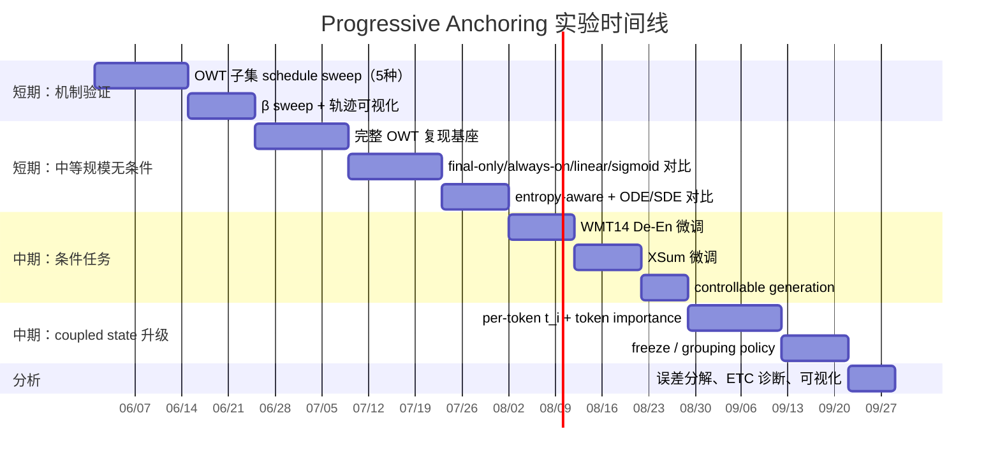

# Annealed Lexical Commitment: A Unified Framework for Text Diffusion

> **最终融合 Proposal**，综合自四份 deep-research report。

---

## 执行摘要

当前文本扩散文献真正分裂的，不只是"状态空间选 token / simplex / embedding / latent 哪一个"，而是**模型何时、如何把连续语义状态承诺为离散词元**。D3PM、MDLM、SSD-LM、TESS、Duo 等方法把词汇结构放在轨迹中心；ELF 则把绝大多数中间过程留在连续 contextual embedding 空间，只在最后一步离散化；CoDAR 进一步指出，连续路线的长期瓶颈之一正是最后的 rounding / token projection。本质上，这些方法都在做同一件事的不同极端：**调度 lexical commitment 的发生时机与强度**。

因此，一个更自然的统一框架不是简单"混合连续与离散"，而是把离散化重写为**调度问题**：每个位置 $i$ 同时维护连续状态 $z_i$ 与离散 belief $p_i$，再用锚点矩阵 $E$ 把两者耦合，并允许每个位置拥有自己的扩散时间 $t_i$。ELF 提供了"final-only discretization"的强基线；Diffusion Forcing 提供了"independent per-token noise levels"的直接先例；NeoDiff 与 ADLM 则说明，在文本里做 token-level 异步时间或 anchor-aware noising 是可行且有效的。

本文给出的核心命题：

$$\boxed{\text{在文本扩散中，final-only 与 all-step discreteness 都可能次优；存在更好的、可学习的、位置级的 lexical commitment schedule。}}$$

这个框架能把 ELF、LangFlow、FLM/FMLM、MDLM、D3PM、TESS、CoDAR、Diffusion Forcing、NeoDiff、ADLM 等方法放到同一坐标系中，也能自然解释为什么"全程强离散"与"直到最后才离散"可能都不是最优。

### 与 Diffusion Forcing 的关系

本工作与 Diffusion Forcing 共享"schedule 不必固定"的思想，但调度对象根本不同：

| 方法 | 核心问题 | 调度对象 | 处理 continuous-discrete 接口 |
|---|---|---|---|
| ELF | 连续 flow 能不能最后一步再离散化 | final-only discretization | 是，偏连续极端 |
| Diffusion Forcing | 序列不同位置能不能有不同去噪进度 | per-token noise level / time | 不直接处理 |
| **本文（Progressive Anchoring）** | 连续状态何时、多强地贴近 token anchors | **lexical coupling / commitment strength** | 是，核心就在这里 |

最精确的区别：**Diffusion Forcing asks *when* each token is denoised; we ask *how strongly* the continuous state is pulled toward the discrete token manifold.**

---

## 问题陈述与研究命题

### 统一视角

把"continuous vs. discrete"改写成"continuous state 与 token anchors 的 coupling schedule"，不仅能保留现有方法的可比性，还能让很多看似对立的论文落到一个连续谱上：

```
全程离散 ←——————————————————————————→ 最后一步离散
MDLM / Duo / TESS / FLM                      ELF / CoDAR
  α(t) ≈ 1（全程强词汇监督）               α(t<1) ≈ 0（终点才跳变）
         ↑                                           ↑
词汇一致性强，但轨迹被过早束缚            连续自由度最大，但 CoDAR 指出
                                           最后一步的 rounding 是主要瓶颈

                     ▲
           空白：Progressive Anchoring
           把耦合强度本身作为中心变量
```

现有文献大多在比较**固定设计点**，而没有把 coupling schedule 本身作为中心变量来系统研究。

### 精确研究命题

给定序列 $s_{1:L}$，学习一个位置级耦合生成过程 $\{(z_i(t_i), p_i(t_i))\}_{i=1}^L$，其中 $z_i$ 负责连续语义输运，$p_i$ 负责离散词汇承诺，$t_i$ 控制位置 $i$ 当前处于多"连续"还是多"离散"的阶段；目标是在不破坏连续路径优势的前提下，逐步、异步、可校准地完成 lexical commitment。

### 四条可检验假设

1. **调度假设**：在固定主干与固定 compute 下，late-only 或 annealed 离散监督会优于 final-only 和 all-step 两个极端。
2. **异步假设**：允许 per-token $t_i$ 的模型，会优于全局同步 $t$ 的模型，尤其在 exact-match、实体一致性、低熵条件生成任务上。
3. **几何假设**：显式加入 $z_i \leftrightarrow E^\top p_i$ 对齐项，会减轻 CoDAR 所指的 rounding shock，并降低 final-step projection 的不稳定性。
4. **策略假设**：confidence-adaptive freeze 与 dependency-aware grouping，将优于纯全局同步更新。

---

## 形式化模型

### 状态定义

令词表大小为 $|V|$，序列长度为 $L$，嵌入维度为 $d$。对每个位置 $i$，定义状态为

$$y_i = (z_i, p_i), \qquad z_i \in \mathbb{R}^d, \quad p_i \in \Delta^{|V|-1}.$$

$z_i$ 是连续语义状态，$p_i$ 是词表 simplex 上的离散 belief。再定义**锚点矩阵**

$$E \in \mathbb{R}^{|V| \times d},$$

其最简单做法是把 $E$ 设为 tied token embedding / unembedding；更强做法是冻结 pretrained embedding 或加一个小 adapter。

**连续—离散耦合通过残差分解**：

$$z_i = E^\top p_i + r_i,$$

其中 $r_i \in \mathbb{R}^d$ 是当前连续状态中尚未被 token belief 解释掉的残差。若 $r_i \to 0$，则状态已贴近 token anchors；若 $r_i$ 较大，则保留了超出词汇 belief 的连续语义不确定性。

对 clean target，定义 $q_i^\star = \mathrm{onehot}(s_i)$。clean embedding $x_i$ 有两种同样合理的选择：

$$x_i = E^\top q_i^\star \quad \text{（基础版）}$$
$$x_i = A_\phi(s)_i \quad \text{（增强版，使用 contextual encoder）}$$

两种做法均应做实验。ELF 与 TEncDM 的经验表明，contextual encodings 往往更强，但也会让 anchor 对齐难度更高。

### 连续 Corruption

对每个位置独立采样时间 $t_i \in [0,1]$。连续前向过程写为

$$z_i(t_i) = \alpha(t_i)\, x_i + \sigma(t_i)\, \epsilon_i, \qquad \epsilon_i \sim \mathcal{N}(0, I).$$

Rectified-flow 特例可取 $\alpha(t) = t$，$\sigma(t) = 1 - t$，即

$$z_i(t_i) = t_i x_i + (1 - t_i)\epsilon_i.$$

若要使用 VP/DDPM 或更一般的 stochastic interpolant，只需替换 $\alpha, \sigma$ 的参数化。

### 离散 Corruption Kernel

离散分支可写为一个位置级 kernel：

$$\tilde{p}_i(t_i) \sim K^\mathrm{disc}_{t_i}(\cdot \mid q_i^\star).$$

统一的混合 kernel 族：

$$K^\mathrm{disc}_t(q^\star) = (1 - \rho_t - \nu_t)\, q^\star + \rho_t\, u + \nu_t\, m,$$

其中 $u$ 是 uniform 分布，$m$ 是 mask / absorbing state。这样，D3PM 的 structured transitions、MDLM 的 mask diffusion、Duo 的 uniform-state discrete diffusion 都可视为不同特例。若走 simplex/logit route，则也可以在 logits 上进行连续扰动，再通过 softmax 投回 simplex。

### 网络与预测头

共享 Transformer / DiT 风格网络 $f_\theta$，输入为 $(z_i, \tilde{p}_i, t_i)$ 及条件信息 $c$，输出为 $\hat{x}_i$ 与 logits $\hat{\ell}_i$：

$$(\hat{x}_i, \hat{\ell}_i) = f_\theta(z_i, \tilde{p}_i, t_i, c).$$

再定义

$$\hat{p}_i = \mathrm{softmax}\!\left(\frac{\hat{\ell}_i}{\tau(t_i)}\right), \qquad \hat{r}_i = \hat{x}_i - E^\top \hat{p}_i.$$

其中 $\tau(t)$ 是 temperature schedule，控制后期是否更尖锐地靠近离散顶点。

定义**词汇承诺系数** $\eta_t \in [0,1]$，使

$$P_{t+\Delta} = (1 - \eta_t) P_t + \eta_t \hat{P}_t,$$

令 $\lambda_t = 1 - \eta_t$，则 $\lambda_t$ 越大越偏向 continuous branch，$\lambda_t$ 越小模型越倾向把当前语义压到词汇 belief 上。这使主要方法都成为特例：ELF 近似对应 $\eta_t = 0$ 直到最后一步；MDLM/Duo 对应根本不维护 $Z_t$；TESS、FLM、LangFlow 对应较大的全程 lexical pull。

```mermaid
flowchart LR
    A[clean tokens s] --> B[q* = one-hot]
    A --> C[x_i = E^T q*_i 或 contextual encoder]
    B --> D[离散 corruption K_disc(t_i)]
    C --> E[连续 corruption z_i(t_i)]
    D --> F[tilde p_i]
    E --> G[Coupled Transformer f_theta]
    F --> G
    G --> H[x_hat_i]
    G --> I[logits_hat_i]
    I --> J[p_hat_i = softmax(logits/tau)]
    J --> K[E^T p_hat_i]
    H --> L[alignment / residual]
    K --> L
```

### 损失函数

$$\mathcal{L} = \sum_{i=1}^L \lambda(t_i)\, \mathcal{L}_{\text{cont},i} + \mu(t_i)\, \mathcal{L}_{\text{disc},i} + \beta(t_i)\, \mathcal{L}_{\text{align},i} + \gamma(t_i)\, \mathcal{L}_{\text{res},i}.$$

四项分别是：

$$\mathcal{L}_{\text{cont},i} = \|\hat{x}_i - x_i\|_2^2$$

（$x$-prediction 风格的连续重建损失，与 ELF 的 MSE 训练一致）

$$\mathcal{L}_{\text{disc},i} = \mathrm{CE}(\hat{p}_i, s_i) \quad \text{或} \quad \mathrm{KL}(q_i^\star \| \hat{p}_i)$$

$$\mathcal{L}_{\text{align},i} = \|\hat{x}_i - E^\top \hat{p}_i\|_2^2$$

（直接约束 continuous prediction 与 token belief 的几何一致性；推荐 stop-gradient 双向增强版：）

$$\mathcal{L}_{\text{align},i}^{\text{sg}} = \|\hat{x}_i - \mathrm{sg}(E^\top \hat{p}_i)\|_2^2 + \kappa\, \|\mathrm{sg}(\hat{x}_i) - E^\top \hat{p}_i\|_2^2$$

也可用 KL 对称版本：

$$\mathcal{L}_{\text{align}}^{\mathrm{KL}} = \mathrm{KL}\!\left(\hat{p}_t \| \mathrm{softmax}(E \hat{x}_t / \tau_a)\right) + \mathrm{KL}\!\left(\mathrm{softmax}(E \hat{x}_t / \tau_a) \| \hat{p}_t\right)$$

$$\mathcal{L}_{\text{res},i} = \|\hat{r}_i\|_2^2 \quad \text{（可选残差正则，简洁实现可取 } \gamma \equiv 0\text{）}$$

**这个写法的映射关系：**
- $\mu(t) \approx 0$ 为 all $t < 1$，终点跃升 → ELF
- $\lambda(t) \equiv 0$，不维护 $Z_t$ → MDLM / Duo
- $\lambda(t), \mu(t)$ 均非零且恒定 → LangFlow / FLM / per-step CE
- $\lambda(t)$ 从 1 退火到 0，$\mu(t)$ 从 0 退火到 1 → **本文 Progressive Anchoring**

### 时间权重调度

建议用 sigmoid 参数化：

$$s(t; \kappa, \tau) = \sigma(\kappa(t - \tau)),$$

$$\lambda(t) = 1 - s(t;\kappa,\tau), \quad \mu(t) = s(t;\kappa,\tau), \quad \beta(t) = \beta_0 + \beta_1 s(t;\kappa,\tau)^2.$$

其中 $\tau$ 控制"开始承诺离散词元"的拐点，$\kappa$ 控制切换陡峭程度。

同时对比的备选调度：

| Schedule 家族 | $\mu(t)$ 形式 | 直观意义 | 对应现有文献 |
|---|---|---|---|
| final-only | $0$ for $t<1$，终点跃升 | 最大化连续自由度 | ELF |
| always-on | 常数 $c$ | 全程 token-aware | LangFlow / FLM / per-step CE |
| linear | $t$ | 最简单渐进承诺 | **新方向基础版** |
| sigmoid | $\sigma(\kappa(t-\tau))$ | 中后期快速 lexicalization | **新方向强化版** |
| cosine | $(1-\cos(\pi t))/2$ | 平滑退火 | 平滑备选 |
| late-only piecewise | $0$ for $t<\tau_1$，线性 for $\tau_1 \leq t < \tau_2$，$1$ for $t \geq \tau_2$ | 后期突然承诺 | 非连续版备选 |
| entropy-aware | $\alpha_{\max}(1 - \bar{H}_t / \log|V|)$ | 置信度高时更快贴近 anchors | Diffusion Forcing 启发 |

两个极端（final-only 与 always-on）均有实证代表；真正缺乏系统比较的是中间的渐进方案。

---

## 两个模型变体

**PACD-Base**：只用一个静态 token anchor 矩阵 $E$，让 $\hat{x}_t$ 与 $\hat{p}_t$ 通过 $\mathcal{L}_\text{align}$ 和 $\alpha(t)$ 耦合。这一版最容易对比 ELF、LangFlow、MDLM 等基线。

**PACD-Residual**：把连续目标分解为

$$\hat{x}_t = E^\top \hat{p}_t + \hat{r}_t,$$

即"anchor 部分 + residual 部分"，并让 residual 的权重在后期逐渐减小：

$$\mathcal{L}_\text{res} = \rho(t)\|\hat{r}_t - r\|_2^2, \qquad \rho(t) \downarrow.$$

这个版本适合 contextual embeddings，允许模型把"词是什么"与"上下文如何扭曲这个词的表示"分开建模。

---

## 训练策略

### $t_i$ 采样

最基础方案：

$$t_i \sim \mathrm{Uniform}(0,1) \quad \text{或} \quad t_i \sim \mathrm{Beta}(a,b).$$

更重要的是**相关结构**，建议至少研究三类：

1. **Span-correlated**：同一子词 span、实体 span、数字 span 共享基础时间 $\bar{t}_g$，再加小扰动 $\delta_i$。
2. **Dependency-correlated**：依存边或高注意力边把相关位置放入同一组 $G$，令 $t_i = \bar{t}_G + \delta_i$。
3. **Curriculum**：先做全局同步时间训练，再逐步提高位置间异步方差，最后加入 confidence-adaptive freeze teacher。

**三阶段课程学习**：

- **阶段一**：只用全局同步 $t$，先把 continuous–discrete 接口训稳（MSE 为主，弱 CE）。
- **阶段二**：50% batch 切换到 i.i.d. per-token $t_i$，其余保留同步；引入离散 kernel 的 mask/uniform 插值。
- **阶段三**：加入 span/dependency correlated schedules 与 confidence-adaptive freeze teacher，同时把晚期 $\mu(t)$ 权重拉高。

### Self-conditioning

同时接在两条支路上。上一步的 $\hat{x}_i^{(k-1)}$ 与 $\hat{p}_i^{(k-1)}$ 都可以 stop-gradient 后拼回输入：

$$\mathrm{SC}_i^{(k)} = \big[\mathrm{sg}(\hat{x}_i^{(k-1)}),\; \mathrm{sg}(E^\top \hat{p}_i^{(k-1)})\big].$$

比 ELF 的单分支 self-conditioning 多了一条 lexical self-conditioning 支路，给模型"上一轮认为这个位置像哪个 token"的记忆。

### CFG

对两条输出同时做线性组合：

$$\hat{x}^{\mathrm{cfg}} = \hat{x}^{\emptyset} + \omega(\hat{x}^c - \hat{x}^{\emptyset}), \qquad \hat{\ell}^{\mathrm{cfg}} = \hat{\ell}^{\emptyset} + \omega(\hat{\ell}^c - \hat{\ell}^{\emptyset}),$$

再令 $\hat{p}^{\mathrm{cfg}} = \mathrm{softmax}(\hat{\ell}^{\mathrm{cfg}} / \tau)$。先做标准双前向 coupled CFG，成熟后改 training-time single-pass CFG（参考 ELF 的 training-time CFG 做法）。

---

## 采样器与推理策略

### 采样器对比

| 采样器 | 更新形式 | 优点 | 风险 | 建议 |
|---|---|---|---|---|
| ODE | $z_i^{k+1} = z_i^k + \Delta t\, v_\theta$ | 可重复、易分析 | few-step 误差累积 | 第一轮基线 |
| SDE | $z_i^{k+1} = z_i^k + \Delta t\, v_\theta + \eta_k \xi_i^k$ | 更鲁棒、保留多样性 | 方差更大 | **few-step 默认** |
| Rectified Flow | 线性路径 $z_t = tx+(1-t)\epsilon$，$x$-prediction | 公式最简、与 ELF 兼容 | 线性路径未必契合所有离散几何 | 连续分支默认 |
| Flow-map distillation | 学 $F_\Delta : (z,p) \mapsto (z', p')$ 的少步映射 | 极大降延迟 | 容易牺牲校准 | 主模型成熟后二阶段加速 |

离散分支不必随机化，用 logits 增量更新：

$$\ell_i^{k+1} = \ell_i^k + \Delta t\, g_\theta(\cdot), \qquad p_i^{k+1} = \mathrm{softmax}(\ell_i^{k+1}).$$

### 四类推理 Policy

**Policy 1：全局同步**

$$t_i^{(k)} = t^{(k)}, \quad \forall i.$$

最接近 ELF 的基线，最有利于第一轮干净消融。

**Policy 2：左到右**

$$t_i^{(k)} = \min\{1,\; t^{(k)} + \delta b_i\}, \qquad b_1 > b_2 > \cdots > b_L.$$

前缀更早 commitment，形成 AR 与 diffusion 之间的连续谱。

**Policy 3：置信度自适应冻结**

定义每步诊断量：

$$c_i^{(k)} = \max_v \hat{p}_i^{(k)}(v), \quad h_i^{(k)} = H(\hat{p}_i^{(k)}), \quad a_i^{(k)} = \|\hat{x}_i^{(k)} - E^\top \hat{p}_i^{(k)}\|_2^2.$$

当

$$c_i^{(k)} > \theta_c, \quad h_i^{(k)} < \theta_h, \quad a_i^{(k)} < \theta_a$$

持续 $m$ 步时，将位置 $i$ 冻结（`stable_i` 计数器机制）。这避免了只看 softmax confidence 导致的误冻：高置信但几何错位的位置不会被提前冻结。

**Policy 4：依赖感知分组**

设分组 $\mathcal{G} = \{G_1, \ldots, G_M\}$（依存树、实体 span、copy span 或 attention-cluster）。定义组级统计量：

$$\bar{c}_G = \frac{1}{|G|}\sum_{i \in G} c_i, \quad \bar{h}_G = \frac{1}{|G|}\sum_{i \in G} h_i, \quad \bar{a}_G = \frac{1}{|G|}\sum_{i \in G} a_i.$$

仅当组内整体满足阈值时才共同 freeze；否则共同推进 $\Delta t_G$。

### 推理伪代码

```
Input: condition c, anchor matrix E, steps K, policy π
Init:
    z_i ~ N(0, I),   p_i = Uniform(V),   frozen_i = False,   stable_i = 0

for k = 1..K:
    # 1) 按 policy 分配位置级时间
    t_i <- π(k, i, p, z, c)

    # 2) 前向（含 self-conditioning）
    x_hat_i, logits_hat_i = f_theta(z_i, p_i, t_i, c, [sg(x_hat_prev), sg(E^T p_hat_prev)])
    p_hat_i = softmax(logits_hat_i / tau(t_i))

    # 3) 计算诊断量
    conf_i  = max(p_hat_i)
    entr_i  = H(p_hat_i)
    align_i = ||x_hat_i - E^T p_hat_i||^2

    # 4) 冻结判断（stable_i 计数器）
    if conf_i > θ_c and entr_i < θ_h and align_i < θ_a:
        stable_i += 1
    else:
        stable_i = 0
    if stable_i >= m:
        frozen_i = True

    # 5) 更新 active 位置
    for i where not frozen_i:
        z_i <- ODE_or_SDE_update(z_i, x_hat_i, t_i)
        p_i <- (1 - η(t_i)) * p_i + η(t_i) * p_hat_i

return argmax_v p_i(v)   # 或 final decoder
```

---

## 文献综述与方法分类

### 理论基础

| 论文 | 方法与关键对象 | 与本框架的关系 |
|---|---|---|
| Flow Matching | 回归给定概率路径的速度场 $v_\theta(x,t)$，仿真自由 | 为连续分支提供最自然训练原则 |
| Rectified Flow | 线性插值 $z_t = tx+(1-t)\epsilon$，强调直线路径 | 给 $z_i(t_i)$ 线性插值与 few-step 提供依据 |
| Stochastic Interpolants | 统一 flow 与 diffusion 到同一随机插值框架 | 支持同一模型同时比较 ODE/SDE 采样器 |
| Generator Matching | 把 diffusion、flow matching、discrete diffusion 统一为连续时间 Markov 生成过程 | 为"连续—离散统一"提供最上层理论语言 |
| Classifier-Free Guidance | 条件/无条件模型线性组合 | 连续分支天然适用，是关键控制手段 |
| Analog Bits | 连续状态建模离散 bit，引入 self-conditioning | 说明"连续状态+离散对象+self-conditioning"是可行范式 |
| Fisher Flow Matching | 离散数据上通过连续 reparameterization 做 flow matching | 支持 simplex / statistical-manifold 几何不可忽略 |

### 文本扩散代表方法

| 方法 | 状态空间 | 离散化调度 | Per-token $t_i$ | Decoder | 主要优点 | 主要短板 |
|---|---|---|---|---|---|---|
| D3PM | token | 全程离散 | 否 | 无 | 离散建模严谨 | few-step 差，连续技巧复用弱 |
| MDLM | token / mask | 全程离散 | 否 | 无 | 强基线，简单 | 连续 guidance 不自然 |
| Duo | token / uniform | 全程离散 | 否 | 无 | 迁移连续技巧 | 仍是离散主导 |
| SSD-LM | simplex | 全程 soft lexical | 否 | 无 | 控制强，几何清楚 | 高维 simplex 成本高 |
| TESS | logit simplex | 全程 soft lexical | 否 | text-to-text head | NAR 条件生成强 | 仍非异步时间 |
| Diffusion-LM | embedding | 中间多有 token coupling | 否 | rounding | controllability 强 | rounding 重，步数大 |
| Difformer | embedding | 全程 anchor/CE 约束 | 否 | 常规头 | 训练稳定 | 仍靠持续锚定 |
| LD4LG | latent | 末端离散 | 否 | **单独 decoder** | 轨迹自由 | 额外 decoder 成本 |
| TEncDM | contextual encoding | 末端离散 | 否 | **单独 Transformer decoder** | contextual 表示强 | 系统更复杂 |
| CoDAR | embedding + AR | 连续到底，末端强离散 | 否 | **单独 AR decoder** | 诊断 rounding 清楚 | 最重、最复杂 |
| LangFlow | embedding + FM | 全程中高 lexical pull | 否 | 常规 token head | 连续路线首次逼近离散 | 仍偏全局同步 |
| FLM / FMLM | one-hot 连续化 / simplex-aware | 全程 lexical，可蒸馏 | 否 | 可蒸馏 flow map | 速度极强 | 不直接解决异步策略 |
| ELF | contextual embedding | **最后一步**离散 | 否 | 共享权重 decoder mode | 连续轨迹最自由，CFG 自然 | 结尾承诺可能过晚 |
| NeoDiff | continuous + token-specific time | 非同时离散/连续 | **是** | 常规头 | 最接近异步文本扩散 | 文本验证仍较新 |
| ADLM | masked discrete + anchors | anchor token 更晚 mask | 部分支持 | anchor net + denoiser | 词汇重要性建模强 | 仍以离散 mask 为主 |
| **本文框架** | **coupled $(z_i, p_i)$** | **annealed / asynchronous** | **是** | 共享主干，双 head，可选 decoder | 统一度最高，解释力最强 | 实现最复杂，变量最多 |

### 方法定位图（两轴谱系）

| 方法 | 状态空间 | $\alpha(t)$ 轴抽象位置 | 外部 decoder |
|---|---|---|---|
| D3PM / MDLM / Duo | token | $\approx 1$ 恒定 | 否 |
| SSD-LM / TESS / FLM | simplex | 高位恒定 | 否 |
| Diffusion-LM / CDCD / Difformer | embedding | 中高位恒定 | 否 |
| LangFlow | embedding + FM | 中高位恒定 | 否 |
| LD4LG / TEncDM | latent | 低位→终点跃迁 | **是** |
| CoDAR | embedding | 低位→终点强离散器 | **是** |
| ELF | frozen contextual embedding | $t<1$ 近 0，终点跃迁 | 否 |
| NeoDiff / ADLM | mixed | per-token 差异化 | 否 |
| **本文** | **coupled** | **可调渐进 → 目标是找最优中间点** | **否（基础版）** |

**空白在哪里**：现有文献大多在比较固定设计点，而没有把 coupling schedule 本身作为中心变量来系统研究。这正是本文的切入位置。

---

## 评估指标体系

### 质量类
- Gen. PPL（GPT-2 Large 评估 1,000 个生成样本，沿用 ELF 协议）
- BLEU（WMT14 De-En）
- ROUGE-1/2/L（XSum）
- 验证 NLL / ODE-based NLL bound（LangFlow 协议）

### 多样性类
- Unigram entropy（与 Gen. PPL 联合画 Pareto 前沿，沿用 ELF 协议）
- Distinct-1/2/3

### 结构与准确性类
- Token accuracy、span exact-match
- Entity consistency、copy accuracy
- Constraint-following accuracy（controllable generation，对比 Diffusion-LM）

### 效率类
- Sampling steps / NFE（function evaluations）
- 端到端延迟、吞吐、冻结比例

### 接口专属指标（本文新增）

**ETC（Embedding-Token Consistency）**：

$$\mathrm{ETC} = 1 - \frac{1}{L}\sum_{i=1}^L \frac{\|\hat{x}_{i,t} - E^\top \hat{p}_{i,t}\|_2}{\|\hat{x}_{i,t}\|_2 + \varepsilon},$$

在不同 $t$ 上画出 $\mathrm{ETC}(t)$ 曲线。若 Progressive Anchoring 真在起作用，早期 ETC 较低但逐渐上升，最终在不显著损害 entropy 的前提下高于 ELF/final-only，同时比 always-on 更不牺牲 diversity。

**Commitment metrics**：$p_i$ 的 token-level entropy、top-1 confidence、冻结率的时间演化。

**Calibration metrics**（adaptive commitment 专用）：ECE、Brier score、confidence–correctness 曲线。不校准的 confidence 会直接把 schedule 学坏。

---

## 实验设计

### 数据集

| 任务 | 数据集 | 主要指标 | 对应基线 |
|---|---|---|---|
| 无条件生成 | OpenWebText（主）、LM1B（副） | Gen. PPL + entropy Pareto | ELF、MDLM、Duo、LangFlow |
| 机器翻译 | WMT14 De-En | BLEU | ELF、MDLM、Duo、E2D2 |
| 摘要 | XSum | ROUGE-1/2/L | ELF、SeqDiffuSeq、CDCD |
| 结构化 exact-match | 复制、模板填充、实体一致性构造任务（合成） | Token accuracy、exact-match | NeoDiff、ADLM 风格比较 |

### 模型规模

至少三档：**100M**（机制验证）、**300M**（稳定性检验）、**650M**（与 ELF-B/M/L 对齐）。

### 核心消融（8 个轴，均应作为主实验，不只放附录）

| 消融轴 | 设定 | 判断重点 |
|---|---|---|
| 离散监督时序 | final-only / all-step / late-only / annealed | **核心假设验证** |
| 时间采样 | global $t$、i.i.d. per-token $t_i$、Beta $t_i$ | 异步是否带来收益 |
| 结构相关 schedule | span-correlated、dependency-correlated | 结构耦合是否优于独立异步 |
| 推理 policy | global、left-to-right、confidence-adaptive、dependency-aware | exact-match / consistency 是否改善 |
| 对齐项 $\beta$ | $0$、固定 $\beta$、annealed $\beta(t)$ | rounding shock 是否被缓解 |
| Clean embedding | $E^\top$ one-hot、frozen contextual encoder | contextual target 是否必要 |
| Self-conditioning | 无、仅 $\hat{x}$-SC、$\hat{x}+\hat{p}$-SC | 双分支自条件是否更稳 |
| Sampler | ODE、SDE、few-step distill | 质速 Pareto 是否明显移动 |

**最关键消融的成功判据**：在 matched entropy band $H \in [5.1, 5.3]$ 内，annealed / adaptive 相比 final-only 至少改善 5% Gen. PPL，且 entropy 下降不超过 0.05。

### 建议可视化（五类）

1. **Gen. PPL vs. NFE 曲线**：直接看 schedule 是否把 Pareto 前沿推向左下。
2. **Per-token commitment heatmap**：横轴位置、纵轴步数、颜色为 $t_i$ 或 $1-H(p_i)/\log|V|$，看冻结是否沿实体 span 或依存子树成组发生。
3. **Alignment error 曲线**：$\|\hat{x} - E^\top \hat{p}\|^2$ 随时间变化，直观看接口何时收紧。
4. **Exact-match vs. entropy 散点图**：观察是否出现"质量高但词汇不稳定"的伪改进。
5. **ETC(t) 曲线**：画不同 schedule 下的接口一致性时间演化，是最能支撑中心论点的新图。

### 资源预算

| 阶段 | 规模 | 建议训练 tokens | 设备 | H100 等效 GPU-hours 估算 | 继续条件 |
|---|---|---|---|---|---|
| 机制验证 | 100M | 8–15B（OWT 子集） | 8×H100 | 200–600 | schedule 无收益则先停 |
| 中等规模无条件 | 100M（完整） | 40–60B | 8–16×H100 | 400–1200 | 100M 验证通过后 |
| 中型扩展 | 300M | 80–120B | 32×H100 | 3k–7k | 已有稳定正信号 |
| 条件生成微调 | 基于 100M ckpt | WMT14 全量 + XSum 全量 | 8×H100 | 30–120 | 随时可并行 |
| Scale-up | 650M | 200–400B | 64×H100 | 20k–50k | 需前两阶段清晰信号 |

---

## 三阶段推进路线图

### 短期最优先：Global Progressive Anchoring

在 ELF 类 backbone 上加入 $p_i$ 分支、$\mathcal{L}_\text{align}$、和 $\mu(t)$ / $\lambda(t)$ schedule，对比 final-only、all-step、late-only、annealed 四种设计。全局时间 $t$，不引入 per-token 异步。

**原因**：这是最容易证明"discretization is a scheduling problem"的版本，因果归因最清楚，也最贴近当前最成熟的叙事。

### 中期扩展：Coupled State + Token Importance

显式维护 $z_i, p_i, r_i$，加入 ADLM / NeoDiff 风格的 token importance 或异步 noising 先验，但仍先保持全局 $t$ 或弱异步。目标是把"coupled state + anchoring schedule"做成有清晰 ablation 的稳定模型。

### 长期规模化：Diffusion-Forced Unified Language Flow

在前两阶段已经证明 schedule 价值的前提下，上 per-token $t_i$、confidence-adaptive freeze、dependency-aware grouping，再视效率需求决定是否做 flow-map distillation。



---

## 风险与失败模式

| 失败模式 | 症状 | 可能原因 | 缓解手段 |
|---|---|---|---|
| 词汇过早塌缩 | entropy 过快下降，文本重复 | $\tau(t)$ 太低、$\eta_t$ 太大、CFG 过强 | 提高早期 $\tau(t)$，限制 early commitment |
| 连续漂移 / off-anchor | $\|Z_t - P_tE\|$ 长期高，最终 tokenization 不稳 | $\beta_t$ 太小、anchor $E$ 质量差 | 提高中后期 $\beta_t$，冻结更强 anchor |
| 双头冲突 | $\hat{x}_t$ 好但 $\hat{p}_t$ 差（或反之） | 共享 trunk 表达不足、loss 比例失衡 | 调整 trunk 深度，做 $\beta$ sweep |
| Rounding bottleneck 再现 | 最终一步大幅退化 | 词汇头太弱，最终 sharpness 不足 | 引入 contextual lexical head，必要时小型 decoder |
| Critical interval 失稳 | few-step 时质量突然崩 | 连续分支跨入低密度多峰区 | 用 SDE re-injection 修正（参考 "Why Gaussian Diffusion Fails"） |
| Confidence 失真 | adaptive schedule 反而更差 | 置信度未校准 | 加 ECE/Brier 监控，temperature calibration |
| Scheduler–sampler confounding | 收益来自更好步长而非 anchoring | 控制变量不足 | 所有 schedule 比较在 matched sampler budget 下做 |
| Anchor–state 空间不匹配 | alignment loss 学成无意义折衷 | contextual target $x$ 与静态 $E$ 语义空间差异大 | 先用 frozen encoder-derived anchors，再考虑 learned $E$ |

### 三大开放问题

1. **Per-token 异步时间在文本上的直接成功先例仍少**：NeoDiff / ADLM 是最接近的先行工作，但规模和验证深度与图像/视频领域仍有差距，需要更谨慎地做机制验证。
2. **可辨识性问题**：$z_i = E^\top p_i + r_i$ 中，$\beta$ 太小会让一切躲进 $r_i$，太大又会过早塌缩到 anchors。需要 $\beta$ sweep + alignment error 监控联合约束。
3. **Framing 边界**：本工作的核心贡献不应写成"we use Diffusion Forcing"，而应写成：
   > *Inspired by Diffusion Forcing's view that diffusion schedules need not be globally uniform, we study a different scheduling problem: how strongly a continuous language flow should be coupled to discrete lexical anchors over time.*

---

## 基线选择建议

**低耦合端（必须）**：ELF、LD4LG / CoDAR

**高耦合端（必须）**：MDLM、Duo、TESS / SSD-LM、FLM / FMLM 或 LangFlow

**条件生成**：SeqDiffuSeq、E2D2（必须）；SeqDiffuSeq + CDCD（推荐）

**异步/锚定相邻**：NeoDiff、ADLM（至少纳入文献对比 + 小规模复现）

**Controllability baseline**：Diffusion-LM（验证约束成功率优势）

---

## 一句话概括

> **先做全局的 Progressive Anchoring，证明离散化是 schedule 问题；再升级到 per-token 的 Diffusion-Forced Unified Language Flow。** 故事的核心永远是：**文本扩散中的 discreteness 不是二元设计选择，而是一个应当被调度的锚合过程。**
