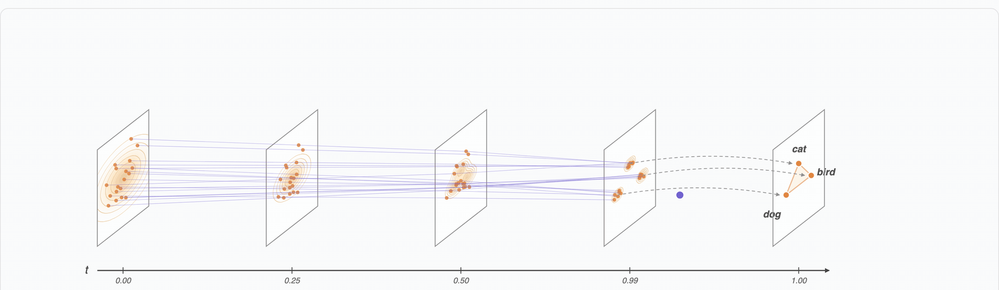
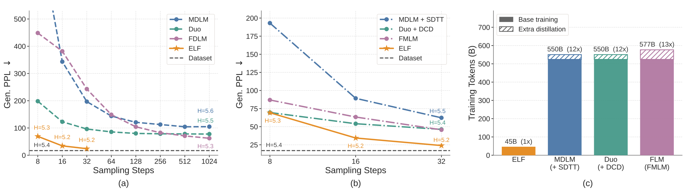

# ELF: Embedded Language Flows

[](https://arxiv.org/abs/2605.10938)&nbsp;
[](https://opensource.org/licenses/MIT)&nbsp;
[](https://huggingface.co/embedded-language-flows)&nbsp;

This is the official JAX implementation for the paper *ELF: Embedded Language Flows*. This code is written and tested on TPUs. A PyTorch version is available on the [`pytorch_elf`](https://github.com/lillian039/ELF/tree/pytorch_elf) branch.

ELF is a class of continuous diffusion language models based on continuous-time Flow Matching. Unlike existing DLMs, ELF predominantly stays within the continuous embedding space until the final time step, where it maps to discrete tokens using a shared-weight network. This formulation makes it straightforward to adapt established techniques from image-domain diffusion models, e.g., classifier-free guidance (CFG).

<p align="center">
  
</p>
<p align="left">
  <em><strong>Conceptual illustration of ELF.</strong> Orange points denote data represented in continuous embedding space, and purple lines show denoising trajectories from Gaussian noise to clean embeddings. Discretization is applied only at the final time step (t=1) using a shared-weight network.</em>
</p>

<p align="center">
  
</p>
<p align="left">
  <em><strong>Denoising trajectory</strong> of ELF-B. As t increases from 0 to 1, ungrammatical sentences are progressively refined into fluent and grammatical text.</em>
</p>

<p align="center">
  
</p>
<p align="left">
  <em><strong>System-level comparison.</strong> ELF-B outperforms both discrete and continuous DLMs trained under similar settings (a) and distilled variants of other baselines that require additional rounds of training (b), and uses substantially fewer training tokens (c).</em>
</p>

## Initialization

Install the dependencies (JAX+TPUs) and log in to WandB to track your experiments if needed.

```bash
pip install -r requirements.txt
wandb login YOUR_WANDB_API_KEY
```

## Inference

You can quickly verify your setup with our provided checkpoint.

<table><tbody>
<td valign="bottom">OpenWebText (unconditional)</td>
<td valign="bottom" align="center">ELF-B (105M)</td>
<td valign="bottom" align="center">ELF-M (342M)</td>
<td valign="bottom" align="center">ELF-L (652M)</td>
<tr><td align="left">pre-trained checkpoint</td>
<td align="center"><a href="https://huggingface.co/embedded-language-flows/ELF-B-owt">ELF-B-owt</a></td>
<td align="center"><a href="https://huggingface.co/embedded-language-flows/ELF-M-owt">ELF-M-owt</a></td>
<td align="center"><a href="https://huggingface.co/embedded-language-flows/ELF-L-owt">ELF-L-owt</a></td>
</tr>
<tr><td align="left">Sampling steps (SDE)</td>
<td align="center">32</td>
<td align="center">64</td>
<td align="center">64</td>
</tr>
<tr><td align="left">Gen. PPL ↓ (paper)</td>
<td align="center">24.1</td>
<td align="center">21.7</td>
<td align="center">23.3</td>
</tr>
<tr><td align="left">Entropy ↑ (paper)</td>
<td align="center">5.15</td>
<td align="center">5.18</td>
<td align="center">5.28</td>
</tr>
</tbody></table>

<table><tbody>
<td valign="bottom">Conditional generation (ELF-B)</td>
<td valign="bottom" align="center">WMT14 De-En</td>
<td valign="bottom" align="center" colspan="3">XSum</td>
<tr><td align="left">pre-trained checkpoint</td>
<td align="center"><a href="https://huggingface.co/embedded-language-flows/ELF-B-de-en">ELF-B-de-en</a></td>
<td align="center" colspan="3"><a href="https://huggingface.co/embedded-language-flows/ELF-B-xsum">ELF-B-xsum</a></td>
</tr>
<tr><td align="left">Metric</td>
<td align="center">BLEU ↑</td>
<td align="center">ROUGE-1 ↑</td>
<td align="center">ROUGE-2 ↑</td>
<td align="center">ROUGE-L ↑</td>
</tr>
<tr><td align="left">Score (paper)</td>
<td align="center">26.4</td>
<td align="center">36.0</td>
<td align="center">12.2</td>
<td align="center">27.8</td>
</tr>
</tbody></table>

Slight differences in metrics may arise from different compute setups. Our results were computed on TPU v5p-64.

#### Sanity Check

1. **Get the checkpoint.** All pre-trained checkpoints are on HuggingFace under [`embedded-language-flows`](https://huggingface.co/embedded-language-flows) and are pulled automatically via `--checkpoint_path <hf-repo-id>` — no manual download needed. To use a locally trained checkpoint, pass the path to the specific checkpoint file, e.g. `--checkpoint_path outputs/elf_b-owt/checkpoint_19000`.

2. **(Optional) Tweak the config.** The provided `configs/training_configs/train_owt_ELF-{B,M,L}.yml` already point at the correct HuggingFace data + T5 encoder, so they run as-is. You may want to edit:
    - `output_dir` — where samples and logs are written
    - `wandb_entity` — set to your entity, or set `use_wandb: false` to disable
    - `sampling_configs_path` — defaults to `configs/sampling_configs/uncond_sampling_configs.yml` (32-step SDE + 64-step SDE, both with self-conditioning CFG); swap for your preferred schedule if needed

3. **Launch evaluation.**

**Unconditional generation:**
```bash
cd src/

  # ELF-B (105M)
  python eval.py \
      --config configs/training_configs/train_owt_ELF-B.yml \
      --checkpoint_path embedded-language-flows/ELF-B-owt

  # ELF-M (342M) — smaller batch to fit the bigger model
  python eval.py \
      --config configs/training_configs/train_owt_ELF-M.yml \
      --checkpoint_path embedded-language-flows/ELF-M-owt \
      --config_override global_batch_size=64

  # ELF-L (652M)
  python eval.py \
      --config configs/training_configs/train_owt_ELF-L.yml \
      --checkpoint_path embedded-language-flows/ELF-L-owt \
      --config_override global_batch_size=64
```
The evaluator generates 1,000 samples and reports Gen. PPL (under a pretrained GPT-2 Large) and unigram entropy. Expected: Gen. PPL ≈ 24 and entropy ≈ 5.15 for ELF-B at 32 SDE steps.

**Conditional generation:**
```bash
cd src/

# XSum (summarization)
python eval.py \
    --config configs/training_configs/train_xsum_ELF-B.yml \
    --checkpoint_path embedded-language-flows/ELF-B-xsum

# WMT14 De-En (translation)
python eval.py \
    --config configs/training_configs/train_de-en_ELF-B.yml \
    --checkpoint_path embedded-language-flows/ELF-B-de-en
```
The evaluator runs on each task's **validation** set and reports BLEU for WMT14 De-En and ROUGE-1/2/L for XSum. Expected: BLEU ≈ 26.7 on De-En; ROUGE-1/2/L ≈ 36.3 / 12.5 / 28.1 on XSum. Note that the paper numbers are computed on the **test** sets, so validation scores here may differ slightly.

## Data Preparation

Three task settings: unconditional generation on **OpenWebText**, machine translation on **WMT14 De-En**, and summarization on **XSum**. All use a frozen T5 encoder for text-to-embedding mapping.

#### Pre-tokenized splits

We provide pre-tokenized splits (T5 tokenizer) and the JAX T5-small encoder on HuggingFace under [`embedded-language-flows`](https://huggingface.co/embedded-language-flows). They are loaded directly via `datasets.load_dataset` — no manual download needed. Defaults wired into the configs:

| Task | `data_path` / `eval_data_path` |
| --- | --- |
| OpenWebText | `embedded-language-flows/openwebtext-t5` |
| WMT14 De-En | `embedded-language-flows/wmt14_de-en_{train,validation}_t5` |
| XSum | `embedded-language-flows/xsum_{train,validation}_t5` |
| T5 encoder | `embedded-language-flows/t5_small_encoder_jax/t5_small_encoder_jax.pkl` |

To use a local copy, point `data_path` at a directory saved with `datasets.save_to_disk` — the loader falls back to `load_from_disk`.

#### Prepare your own data

To train on a custom dataset, pre-tokenize it with the tokenizer and save it as a HuggingFace `Dataset` (Arrow).

**Unconditional generation** (e.g., OWT): each example needs only `input_ids` — the token ids of the text to be generated.

**Conditional generation** (e.g., translation, summarization): each example needs both `input_ids` (target/output text) and `condition_input_ids` (source/input text, e.g., the German sentence or the article). The collator prepends `condition_input_ids` to `input_ids` and builds the appropriate attention masks automatically.

Minimal recipe:

```python
from datasets import Dataset
from transformers import T5Tokenizer

tok = T5Tokenizer.from_pretrained("google-t5/t5-small")

# Unconditional
def encode_uncond(ex):
    return {"input_ids": tok(ex["text"], add_special_tokens=False)["input_ids"]}

# Conditional (translation / summarization)
def encode_cond(ex):
    return {
        "condition_input_ids": tok(ex["source"], add_special_tokens=False)["input_ids"],
        "input_ids": tok(ex["target"], add_special_tokens=False)["input_ids"],
    }

ds = Dataset.from_list(my_examples).map(encode_uncond, remove_columns=...)  # or encode_cond
ds.save_to_disk("/path/to/my_dataset")
```

Then point your config at it:

```yaml
data_path: /path/to/my_dataset
eval_data_path: /path/to/my_eval_dataset   # optional
```

For evaluation-only JSONL inputs (raw text, tokenized at load time), see `load_jsonl_dataset` in [data_utils.py:110-130](src/utils/data_utils.py#L110-L130) — set `eval_data_path` to a `.jsonl` file with one `{"input": ..., "output": ...}` example per line.

## Training

Run the following command to launch training:

```bash
python train.py --config configs/training_configs/train_owt_ELF-B.yml
```

Available training configs:

- `configs/training_configs/train_owt_ELF-B.yml` — unconditional generation on OpenWebText, ELF-B (default)
- `configs/training_configs/train_owt_ELF-M.yml` — unconditional generation on OpenWebText, ELF-M
- `configs/training_configs/train_owt_ELF-L.yml` — unconditional generation on OpenWebText, ELF-L
- `configs/training_configs/train_de-en_ELF-B.yml` — WMT14 De-En machine translation
- `configs/training_configs/train_xsum_ELF-B.yml` — XSum abstractive summarization

Default ELF-B training uses Muon at blr=0.001 (base learning rate; effective lr = blr × batch_size / 256 = 0.002 at the default batch size of 512), global batch size 512, and runs 5 epochs on OWT (~95K steps) on TPU v5p-64 (~1.5 h per epoch).

#### Config System

The training system uses two config layers:

- **`configs/config.py`** — base `Config` dataclass with all default hyperparameters
- **`configs/training_configs/*.yml`** — task-specific overrides loaded by `load_config_from_yaml()`

The system merges these, allowing you to customize only the parameters you need.

#### Customizing Training

To create a custom experiment:

1. **Create a new config file** (e.g., `configs/training_configs/my_exp.yml`)
2. **Launch with your config:**
   ```bash
   python train.py --config configs/training_configs/my_exp.yml
   ```

**Example custom config:**

```yaml
model: ELF-M                # Use ELF-M model (342M)

epochs: 4
global_batch_size: 512
blr: 0.002
optimizer: muon

denoiser_p_mean: -1.5       # Logit-normal time schedule
denoiser_p_std: 0.8
denoiser_noise_scale: 2.0
self_cond_prob: 0.5
decoder_prob: 0.2           # 20% decoding (CE) / 80% denoising (L2)
```

For more details on configuration options, refer to `config.py` and the YAML files under `configs/training_configs/`.

#### Sampling Configuration

Sampling is decoupled from training and is controlled by a separate YAML in `configs/sampling_configs/`, referenced from each training config via `sampling_configs_path`:

- `uncond_sampling_configs.yml` — unconditional generation: two SDE schedules, 32-step (γ=1.5) and 64-step (γ=1.0), both with SC-CFG=3
- `cond_sampling_configs.yml` — conditional generation (translation / summarization): one 64-step ODE schedule with CFG=2 and SC-CFG=1

Each list entry specifies a sampler (`ode` / `sde`), `num_sampling_steps`, `cfgs`, `self_cond_cfg_scales`, and `time_schedule`. The evaluator iterates through all entries.

## Checkpointing

Checkpoints are saved at the end of each epoch (or at fractional intervals if `save_freq < 1`) to `output_dir/checkpoint_<step>`, keeping up to 10 recent checkpoints. Only process 0 writes to disk.

If `hf_repo_id` is set in the config, the entire `output_dir` is uploaded to HuggingFace after each save.

**Auto-resume:** if `--resume` is not specified, training automatically detects and resumes from the latest checkpoint in `output_dir`.

**Loading:** `load_checkpoint` accepts a local path or an HF repo ID (e.g., `embedded-language-flows/ELF-B-owt`). For a directory, it uses the latest checkpoint inside.

The T5 encoder weights (`encoder_checkpoint`) are stored separately as a `.pkl` file and loaded once at startup. They can also be specified as an HF path (default: `embedded-language-flows/t5_small_encoder_jax/t5_small_encoder_jax.pkl`).

## License

This repo is under the MIT license. See [LICENSE](LICENSE) for details.

## Citation

If you find this work useful in your research, please consider citing our paper :)

```bib
@article{elf2026,
  title={ELF: Embedded Language Flows},
  author={Hu, Keya and Qiu, Linlu and Lu, Yiyang and Zhao, Hanhong and Li, Tianhong and Kim, Yoon and Andreas, Jacob and He, Kaiming},
  journal={arXiv preprint arXiv:2605.10938},
  year={2026}
}
```

## Acknowledgement

We gratefully acknowledge the Google TPU Research Cloud (TRC) for granting TPU access.
We hope this work will serve as a useful resource for the open-source community.
